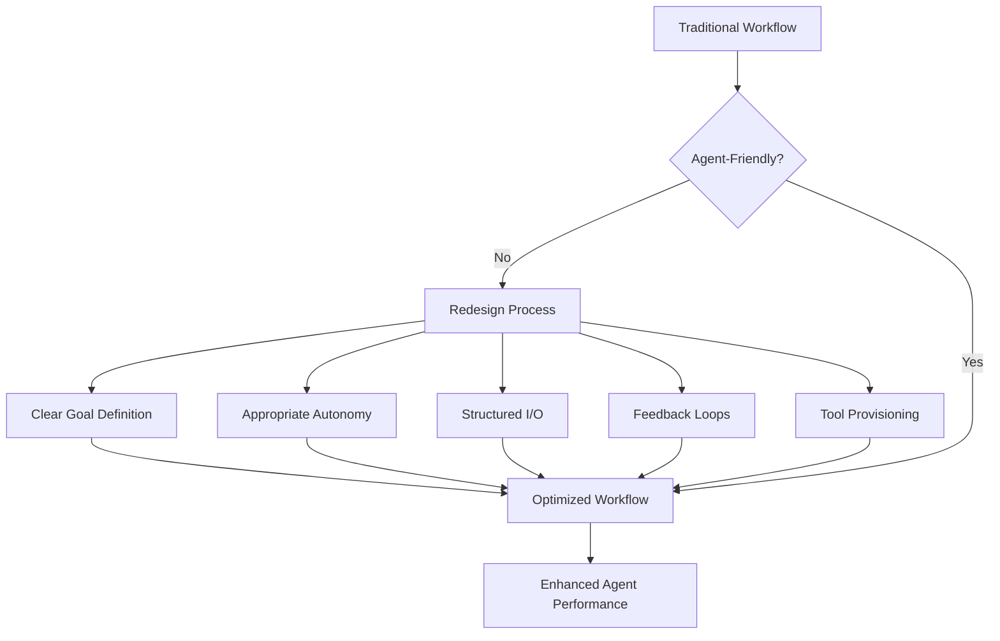

## Problem
Simply providing an AI agent with a task is often not enough for optimal performance. If workflows are too rigid, or if humans micromanage the agent's technical decisions, the agent may struggle or produce suboptimal results. Agents perform best when given some degree of freedom and when the tasks are structured in a way that aligns with their strengths.

## Solution
Consciously design and adapt workflows, task structures, and human-agent interaction points to be "agent-friendly." This involves:
- **Clear Goal Definition:** Provide clear, high-level goals rather than overly prescriptive, step-by-step instructions for every detail.
- **Appropriate Autonomy:** Grant the agent sufficient freedom to make its own implementation choices and explore solutions, especially if it has been programmed for such freedom.
- **Structured Input/Output:** Define clear interfaces for how the agent receives information and delivers results.
- **Iterative Feedback Loops:** Establish mechanisms for the agent to present intermediate work and for humans to provide corrective feedback without stifling the agent.
- **Tool Provisioning:** Ensure the agent has access to the necessary tools and understanding of how to use them for the given workflow.

This approach aims to create a collaborative environment where the agent's capabilities are maximized by a thoughtfully designed process.

## Example (workflow adaptation)

## References
- Derived from insights in "How AI Agents Are Reshaping Creation," such as: "If you become a little too technical, they actually start to struggle to use the agent, because they're trying to force it to do certain technical decisions, whereas Replit agent is sort of programmed in a way to have more freedom." And the concluding point: "Focus on agent-friendly workflows - Creating environments where humans and AI agents can collaborate effectively."

[Source](https://www.nibzard.com/ampcode)