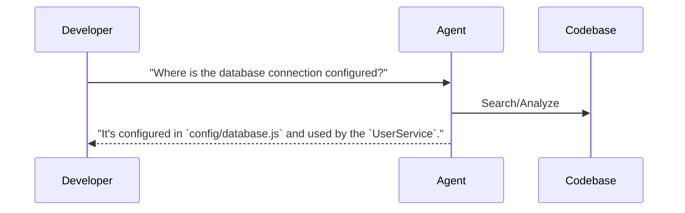

## Problem
Understanding a large or unfamiliar codebase can be a significant challenge for developers, especially when onboarding to a new project or trying to debug a complex system. Manually searching and tracing code paths is time-consuming.

## Solution
Leverage an AI agent with strong retrieval, search, and question-answering capabilities to assist developers in understanding a codebase. The agent can:
1.  Index the codebase (or parts of it).
2.  Respond to natural language queries about how specific parts of the code work (e.g., "How does user authentication work in this module?").
3.  Identify where certain functions are called or how different components interact.
4.  Summarize the purpose or functionality of specific files or modules.
5.  Help developers quickly find relevant information and get oriented within a new or complex codebase.

This pattern accelerates developer onboarding and understanding by providing an intelligent interface to query the codebase's structure and behavior.

## Example

## References
- Lukas Möller (Cursor) at 0:03:58: "...when initially getting started with a codebase that one might not be too knowledgeable about, that's using kind of the QA features a lot, using a lot of search... doing research in a codebase and figuring out how certain things interact with each other."
- Aman Sanger (Cursor) at 0:05:50: "...as you got to places where you're really unfamiliar, like Lucas was describing when you're kind of coming into a new codebase, it's just there's this massive step function that you get from using these models."