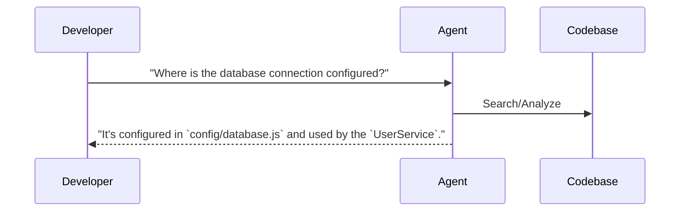

## Problem

Understanding a large or unfamiliar codebase can be a significant challenge for developers, especially when onboarding to a new project or trying to debug a complex system. Manually searching and tracing code paths is time-consuming.

## Solution

Leverage an AI agent with retrieval, search, and question-answering capabilities to assist developers in understanding a codebase. The agent can:

- **Index the codebase** using semantic embeddings, AST parsing (e.g., Tree-sitter), and code graphs that capture symbol relationships
- **Respond to natural language queries** about code behavior, location of features, and component interactions
- **Support multiple query types**: location ("Where is X implemented?"), behavioral ("What happens when Y?"), impact ("What modules are affected?"), and relationship queries
- **Generate documentation** and summaries automatically from code analysis

Effective systems combine semantic search (embeddings) with structural understanding (code graphs) for repository-scale context, not just file-level analysis.

## Example

```mermaid
sequenceDiagram
    Developer->>Agent: "Where is the database connection configured?"
    Agent->>Codebase: Search/Analyze
    Agent-->>Developer: "It's configured in `config/database.js` and used by the `UserService`."
```

## How to use it

- Use for onboarding to new codebases, exploring legacy systems, and answering repository-wide questions
- Provide configuration files (e.g., CLAUDE.md) with project-specific instructions to guide agent behavior
- Consider MCP (Model Context Protocol) integration for standardized tool and data source connectivity
- Combine single-agent approaches (simpler, lower cost) with multi-agent systems for specialized roles (navigation, QA, documentation)

## Trade-offs

* **Pros:** Accelerates onboarding and codebase understanding; enables natural language exploration of complex systems; scales from single-file to repository-wide context.
* **Cons:** Indexing quality directly impacts answer accuracy; requires ongoing maintenance of code graphs and embeddings as codebases evolve.

## References

- Lukas Möller (Cursor) at 0:03:58: "...when initially getting started with a codebase that one might not be too knowledgeable about, that's using kind of the QA features a lot, using a lot of search... doing research in a codebase and figuring out how certain things interact with each other."
- Aman Sanger (Cursor) at 0:05:50: "...as you got to places where you're really unfamiliar, like Lucas was describing when you're kind of coming into a new codebase, it's just there's this massive step function that you get from using these models."
- Luo, Q., et al. (2024). "RepoAgent: An LLM-Powered Open-Source Framework for Repository-level Code Documentation Generation." [arXiv:2402.16667](https://arxiv.org/abs/2402.16667) - EMNLP 2024
- Yang, J., et al. (2024). "SWE-agent: Agent-Computer Interfaces Enable Automated Software Engineering." [arXiv:2405.15793](https://arxiv.org/abs/2405.15793) - arXiv preprint
- Primary source: https://www.youtube.com/watch?v=BGgsoIgbT_Y
