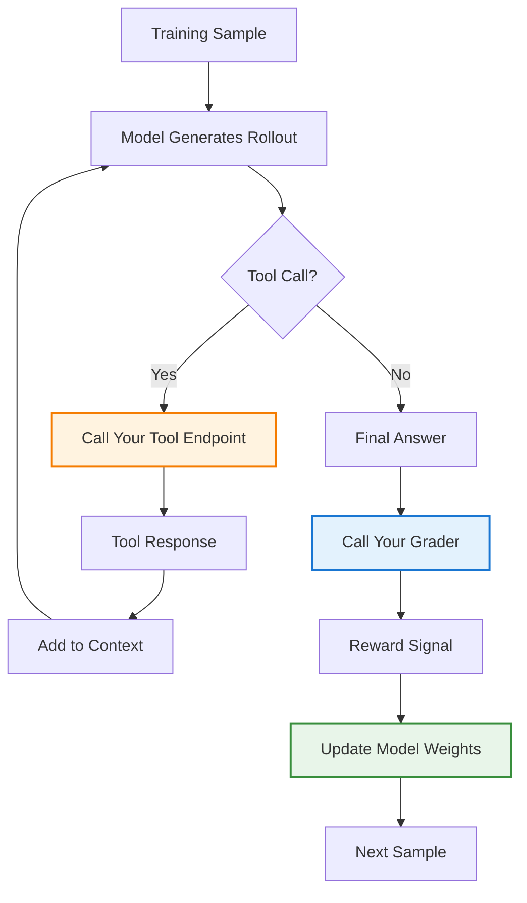

## Problem

After optimizing prompts and task design, agents may still underperform on your specific business tasks because:

- **Domain shift**: Your tools and business context differ from what the base model was trained on
- **Inefficient tool use**: Agents make too many tool calls or use wrong tools, leading to high latency
- **Suboptimal reasoning**: The model doesn't reason well across your specific tool outputs
- **Sample scarcity**: Some domains (e.g., new GPU hardware, specialized finance) lack training data

Traditional fine-tuning approaches don't work well because they can't train the agent end-to-end on multi-step tool interactions with your environment.

## Solution

**Agent Reinforcement Fine-Tuning (Agent RFT)** trains the model weights end-to-end on agentic tasks by allowing the model to:

1. **Explore via actual tool calls**: During training rollouts, the agent calls your real tool endpoints, learning from actual responses
2. **Receive custom reward signals**: You define what "good" looks like via flexible graders (model-based, endpoint-based, or string-based)
3. **Learn multi-step reasoning**: The agent learns to reason across tool outputs in the context window
4. **Optimize for your metrics**: Reduce tool calls, improve accuracy, or balance both based on your reward function

**Key Components:**

- **Tool Endpoints**: Host your tools (same as production) that the model calls during training
- **Grader Endpoint**: Define custom reward logic that evaluates final answers and/or tool call traces
- **Unique Rollout IDs**: Each training rollout gets a unique ID for state management across tool calls
- **Compute Multiplier**: Controls exploration breadth (higher = more rollouts per sample)

```python
# Agent RFT Training Setup
from openai import OpenAI

client = OpenAI()

# 1. Define your tools with hosted endpoints
tools = [
    {
        "name": "search",
        "url": "https://your-tools.modal.run/search",
        "headers": {"Authorization": "Bearer YOUR_TOKEN"}
    },
    {
        "name": "read_file",
        "url": "https://your-tools.modal.run/read_file",
        "headers": {"Authorization": "Bearer YOUR_TOKEN"}
    }
]

# 2. Define your grader (model-based or endpoint-based)
grader = {
    "type": "model",  # or "endpoint" for custom grading logic
    "model": "gpt-4o",
    "response_format": {
        "type": "json_schema",
        "json_schema": {
            "name": "grader_response",
            "schema": {
                "type": "object",
                "properties": {
                    "score": {"type": "number"},  # 0.0 to 1.0
                    "reasoning": {"type": "string"}
                }
            }
        }
    },
    "prompt": """
    Evaluate the agent's answer based on:
    1. Correctness vs ground truth
    2. Completeness of reasoning

    Ground truth: {ground_truth}
    Agent answer: {final_answer}

    Provide score (0-1) and reasoning.
    """
}

# 3. Start fine-tuning job
job = client.fine_tuning.jobs.create(
    training_file="file-abc123",
    model="gpt-4o-2024-08-06",
    method="rft",
    rft={
        "tools": tools,
        "grader": grader,
        "hyperparameters": {
            "n_epochs": 3,
            "batch_size": 16,
            "compute_multiplier": 1  # Exploration factor
        }
    }
)
```

## How to use it

**Prerequisites:**

- Well-specified, constrained task with consensus on correct answers
- Non-zero baseline performance (model sometimes gets it right)
- Quality training data (100-1000 samples, quality over quantity)
- Hosted tool endpoints that mirror production behavior

**Training Process:**

1. **Baseline evaluation**: Run your base model multiple times per sample to measure variance
2. **Host tools**: Deploy tool endpoints (FastAPI, Modal, etc.) that handle bursty traffic
3. **Design grader**: Create reward function that's hard to game, provides gradient (not just binary)
4. **Monitor training**: Watch reward curves, tool call distributions, and reasoning token counts
5. **Evaluate results**: Compare fine-tuned model on validation set for accuracy and latency

**What Agent RFT Optimizes:**

- **ML Performance**: Better final answer quality through improved reasoning and tool use
- **Latency**: Fewer tool calls and reasoning tokens (e.g., 50% reduction common)
- **Sample Efficiency**: Can achieve strong results with as few as 100 quality samples



## Real-World Examples

**Cognition (Devon AI)**

- Task: File planning agent to identify which files to edit
- Tools: `read_file`, `shell` (grep, find)
- Results:
  - Reduced planning time by 50% (8-10 tool calls → 4 tool calls)
  - Learned to parallelize tool calls automatically
  - Improved F1 score on file identification

**Ambience Healthcare**

- Task: ICD-10 medical coding from transcripts
- Tools: Semantic search over 70K medical codes
- Results:
  - F1 score: 0.52 → 0.57 (significant given 0.75 human ceiling)
  - 18% latency reduction
  - 50% reduction in samples exceeding latency threshold

**Rogo Finance**

- Task: Financial reasoning and summarization from filings
- Tools: Document retrieval, analysis tools
- Results:
  - 21% ML performance improvement
  - Reduced hallucinations and missing citations
  - Required hardening grader against reward hacking

**Modular (Mojo GPU Kernels)**

- Task: Write performant GPU kernels for new hardware
- Tools: Compiler, kernel execution environment
- Results:
  - 72% improvement in correct + performant kernels
  - Only 100 PyTorch prompts needed (sample efficient)
  - No code examples required in training data

## Trade-offs

**Pros:**

- **End-to-end optimization**: Trains the entire agent loop, not just final outputs
- **Sample efficient**: Can work with 100-1000 samples vs millions for pre-training
- **Flexible rewards**: Support for complex, multi-criteria grading logic
- **Natural speedups**: Models learn to use fewer tokens and tool calls organically
- **Domain adaptation**: Closes distribution gap between base model and your business context

**Cons:**

- **Infrastructure complexity**: Must host robust tool and grader endpoints
- **Bursty traffic**: Training sends 100s of simultaneous requests at training step boundaries
- **Grader design effort**: Requires careful reward engineering to avoid gaming
- **Training cost**: More expensive than supervised fine-tuning due to exploration
- **Debugging difficulty**: Hard to trace why model learned certain behaviors

## References

- [OpenAI Build Hour: Agent RFT (November 2024)](https://youtu.be/1s_7RMG4O4U)
- [OpenAI Fine-tuning Guide](https://platform.openai.com/docs/guides/fine-tuning)
- [Cognition Devon Case Study](https://www.cognition-labs.com/)
- Related patterns: RLAIF, Tool Use Incentivization via Reward Shaping, Inference-Healed Code Review Reward
