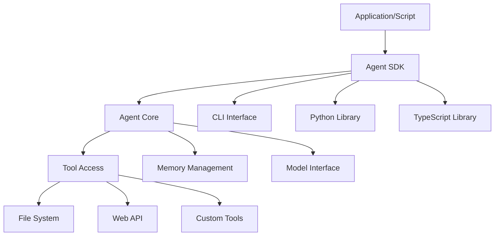

## Problem

Interactive terminal or chat interfaces are suitable for many agent tasks, but not for all. Integrating agent capabilities into automated workflows (e.g., CI/CD pipelines, scheduled jobs, batch processing) or building more complex applications on top of core agent functionalities requires a programmatic interface.

## Solution

Provide a Software Development Kit (SDK) that exposes the agent's core functionalities for programmatic access. This SDK allows developers to:

-   Invoke agent actions (e.g., process a prompt, use a tool, access memory) from code (e.g., Python, TypeScript).
-   Configure agent behavior and tool access in a non-interactive manner.
-   Integrate agent logic into larger software systems.
-   Automate repetitive tasks that involve the agent.
-   Build custom user interfaces or applications powered by the agent's backend.
-   Control resource limits (token budgets, execution time, cost caps).
-   Implement fine-grained permission management and authorization scopes.

The SDK typically includes libraries, command-line interfaces (CLIs) for scripting, and documentation for headless or embedded use of the agent.

## Example (SDK integration)



## Example CLI Usage (Conceptual, from Claude Code SDK info):

```bash
$ claude -p "what did i do this week?" \
  --allowedTools Bash(git log:*) \
  --output-format json
```

## How to use it

**When to use:**

- CI/CD pipeline integration and automated workflows
- Batch processing across multiple files or projects
- Building custom applications or UIs powered by agent backends
- High-performance requirements where caching and reduced overhead matter
- External developer integration and standardization needs

**When to avoid:**

- Microservices architecture (prefer REST/gRPC APIs)
- Language and framework independence is critical
- High-frequency calls (>100/sec) or real-time streaming

**Implementation guidance:**

- Start with a narrow tool surface and explicit parameter validation
- Add observability around tool latency, failures, and fallback paths
- Implement sandbox isolation for code execution

## Trade-offs

* **Pros:** Enables automation and CI/CD integration; provides fine-grained control over permissions, resources, and observability; supports batch processing and custom UIs.
* **Cons:** Introduces integration coupling and environment-specific upkeep; loses conversational interactivity and clarification; requires programmatic error handling with robust retry/fallback logic.

## References

-   Based on the description of the Claude Code SDK in "Mastering Claude Code: Boris Cherny's Guide & Cheatsheet," section VI.
-   OpenAI Agents SDK (Swarm framework): https://github.com/openai/openai-agents-python
-   Google Agent Development Kit (ADK): https://github.com/google/adk-python

[Source](https://www.nibzard.com/claude-code)
