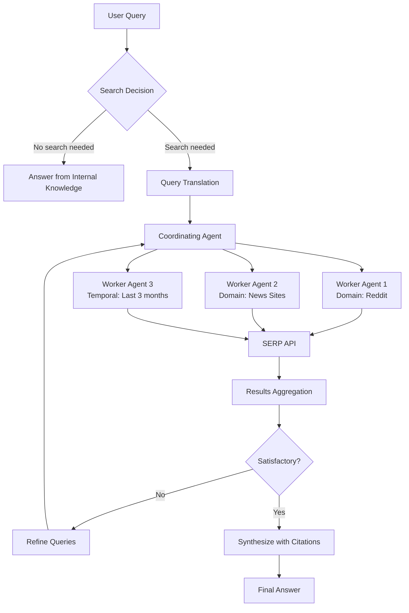

## Problem

Traditional LLMs have a training cutoff date, meaning they don't know recent facts or real-time information. Simply connecting a model to a search API isn't enough - the model needs to:

- Decide when searching is necessary versus using internal knowledge
- Translate conversational context into effective search queries
- Find diverse, long-tail results rather than just popular pages
- Iterate and refine searches based on intermediate results
- Cite sources properly to build user trust and reduce hallucination concerns

## Solution

Implement an iterative web search agent loop where a coordinating agent manages multiple parallel worker agents to comprehensively research a topic.

**Core components:**

1. **Search Decision Layer**: A trained classifier that determines when web search is appropriate (using SFT, RLHF, or RL training)

2. **Query Translation**: Convert conversational context into effective search queries and operators:
   - Keyword extraction (SERP APIs have 32 keyword limits)
   - Domain-specific searches (e.g., only instagram.com, only Reddit)
   - Temporal operators (e.g., results from last 3 months)

3. **Parallel Worker Agent Spawning**: The coordinating agent creates multiple specialized worker agents that:
   - Search different domains/angles simultaneously
   - Use different operators and query variations
   - Aggregate results back to the coordinator

4. **Iterative Refinement**: Based on initial results, the coordinator:
   - Identifies new questions raised by the findings
   - Spawns additional workers with more specific searches
   - Repeats until satisfied with result quality

5. **Citation & Indexing**: Maintain an ephemeral index per search session with proper source attribution

## How to use it

**When to implement:**

- Building AI assistants that need real-time information
- Applications requiring factual accuracy and source attribution
- Research tools that need diverse, long-tail web content
- Reducing hallucination in domain-specific queries

**Implementation considerations:**

- **SERP API limitations**: Current SERP APIs (Google, Bing, DuckDuckGo) are optimized for humans, not AI. They curate top 10 results rather than providing breadth/diversity
- **Caching strategy**: Consider maintaining a cached web index for performance, using SERP APIs only for search algorithms
- **Operator support**: Some SERP APIs have deprecated advanced operators, limiting refinement capabilities
- **Parallelization**: Web search is easily parallelizable - spawn multiple workers for speed

**Query strategy:**

Models should emulate human search behavior:

- Don't just take the first result
- Check multiple sources (Reddit, news sites, specialized domains)
- Iterate with refined queries based on findings
- Use operators to filter by domain, recency, content type

## Trade-offs

**Pros:**

- Access to real-time information beyond training cutoff
- Reduced hallucinations through source grounding
- Increased user confidence through citations
- Can find niche, long-tail information through iterative search
- Parallelizable for performance

**Cons:**

- SERP APIs are not optimized for AI agents (keyword limits, curation bias)
- Complex system with multiple moving parts and external dependencies
- Higher latency and cost than internal knowledge retrieval
- Requires training models to make reliable tool calls
- Some SERP operators deprecated, limiting refinement options

## References

* [How AI web search works | Amplify Partners](https://www.amplifypartners.com/blog-posts/how-ai-web-search-works)
