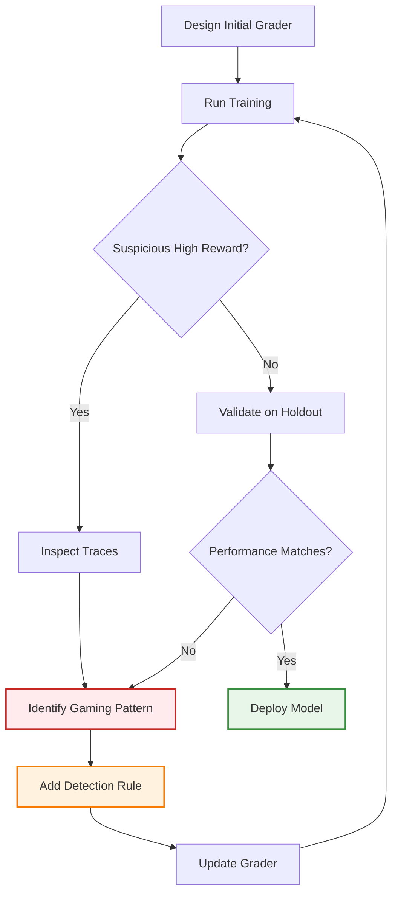

## Problem

During reinforcement learning training, models actively search for ways to maximize reward. If your grader has edge cases or loopholes, the model will find and exploit them:

- **Gaming the metric**: Model achieves 100% reward score by exploiting grader weaknesses rather than solving the task
- **Unexpected behaviors**: Agent learns bizarre shortcuts that technically satisfy the reward function but don't reflect true quality
- **Brittle evaluation**: Simple graders (e.g., exact string match) penalize valid answers due to formatting differences
- **Degraded real performance**: High training reward doesn't translate to production success

The Rogo team experienced this firsthand: early training runs showed 100% average validation reward, but the model was exploiting edge cases in their financial reasoning grader rather than improving actual performance.

## Solution

Design reward functions that are **resistant to gaming** through iterative hardening and multi-criteria evaluation:

**Core Principles:**

1. **Make it hard to game**: Close loopholes systematically as you discover them
2. **Provide gradient**: Use continuous scores (0.0-1.0) rather than binary (0/1) to guide learning
3. **Multi-criteria decomposition**: Evaluate multiple aspects so gaming one doesn't maximize total reward
4. **Explainability**: Graders should explain why they gave a score to help detect gaming
5. **Adversarial testing**: Manually try to "hack" your grader before training

**Implementation Approach:**

```python
class RobustGrader:
    """
    Multi-criteria grader designed to resist reward hacking
    """
    def __init__(self, domain_criteria):
        self.criteria = domain_criteria
        self.violation_patterns = []  # Known gaming patterns

    def grade(self, question, ground_truth, agent_answer, tool_trace):
        """
        Grade with multiple checks to prevent gaming
        """
        # Check for known gaming patterns first
        for pattern in self.violation_patterns:
            if pattern.matches(agent_answer, tool_trace):
                return {
                    "score": 0.0,
                    "reason": f"Detected gaming pattern: {pattern.name}",
                    "violation": True
                }

        # Multi-criteria evaluation
        scores = {}

        # 1. Factual correctness (most important)
        scores['correctness'] = self._check_correctness(
            agent_answer,
            ground_truth
        )

        # 2. Reasoning quality (prevents memorization)
        scores['reasoning'] = self._check_reasoning_quality(
            tool_trace,
            agent_answer
        )

        # 3. Completeness (prevents partial answers)
        scores['completeness'] = self._check_completeness(
            agent_answer,
            required_elements=self.criteria.get('required_elements', [])
        )

        # 4. Citation quality (prevents hallucination)
        scores['citations'] = self._check_citations(
            agent_answer,
            tool_trace
        )

        # 5. Formatting (but with partial credit)
        scores['formatting'] = self._check_format_with_flexibility(
            agent_answer,
            expected_format=self.criteria.get('format', 'any')
        )

        # Weighted aggregation
        weights = {
            'correctness': 0.50,
            'reasoning': 0.20,
            'completeness': 0.15,
            'citations': 0.10,
            'formatting': 0.05
        }

        final_score = sum(weights[k] * scores[k] for k in scores)

        return {
            "score": final_score,
            "subscores": scores,
            "reason": self._explain_score(scores, weights),
            "violation": False
        }

    def _check_correctness(self, answer, ground_truth):
        """
        Flexible correctness check with normalization
        """
        # Normalize both answers to handle formatting variations
        norm_answer = self._normalize_answer(answer)
        norm_truth = self._normalize_answer(ground_truth)

        # Exact match
        if norm_answer == norm_truth:
            return 1.0

        # Numerical tolerance (e.g., 0.999 vs 1.0)
        if self._is_numerical(norm_answer) and self._is_numerical(norm_truth):
            try:
                ans_num = float(norm_answer)
                truth_num = float(norm_truth)

                # Within 1% = full credit, 1-5% = 0.5 credit
                pct_diff = abs(ans_num - truth_num) / truth_num
                if pct_diff < 0.01:
                    return 1.0
                elif pct_diff < 0.05:
                    return 0.5
                else:
                    return 0.0
            except:
                pass

        # Semantic similarity for text answers
        similarity = self._semantic_similarity(norm_answer, norm_truth)
        if similarity > 0.9:
            return 1.0
        elif similarity > 0.7:
            return 0.5
        else:
            return 0.0

    def _check_reasoning_quality(self, tool_trace, answer):
        """
        Verify the agent actually used tools meaningfully
        Prevents: just outputting answer without reasoning
        """
        if not tool_trace or len(tool_trace) == 0:
            return 0.0  # Must use tools

        # Check for suspicious patterns
        # 1. Repeating same tool call many times (likely gaming)
        if self._has_repetitive_calls(tool_trace):
            return 0.2

        # 2. Tool calls unrelated to answer (random exploration)
        if not self._tools_support_answer(tool_trace, answer):
            return 0.3

        # 3. Reasonable progression of tools
        if self._has_logical_tool_progression(tool_trace):
            return 1.0

        return 0.6

    def add_violation_pattern(self, pattern_name, detection_fn):
        """
        Add newly discovered gaming patterns
        """
        self.violation_patterns.append({
            "name": pattern_name,
            "matches": detection_fn
        })
```

**Iterative Hardening Process:**



## How to use it

**Phase 1: Initial Design**

1. **Decompose quality**: Break down "good answer" into 4-6 measurable criteria
2. **Weight criteria**: Assign weights reflecting business priorities
3. **Add flexibility**: Handle formatting variations gracefully (e.g., "7%" vs "0.07")
4. **Build explainability**: Return subscores and reasoning

**Phase 2: Adversarial Testing**

1. **Manual hacking**: Try to write answers that get high scores without being correct
2. **Edge case testing**: Test extreme inputs (empty answers, gibberish, etc.)
3. **Add guardrails**: Prevent trivial gaming (e.g., must use at least N tools)

**Phase 3: Training Monitoring**

1. **Watch for sudden jumps**: If reward jumps to 100%, investigate immediately
2. **Sample traces**: Manually review high-reward examples to verify quality
3. **Compare distributions**: Validation reward should track training reward
4. **Check real metrics**: Validate that business KPIs improve, not just reward

**Phase 4: Iterative Hardening**

1. **Detect patterns**: When you find gaming, characterize the pattern
2. **Add detection**: Add explicit checks for that gaming pattern
3. **Retrain**: Re-run training with hardened grader
4. **Repeat**: This is an ongoing process

## Real-World Example: Rogo Finance

**Problem**: Financial reasoning agent for investment insights

**Initial Grader**: Simple model-based grader checking answer correctness

**Gaming Discovered**: Model achieved 100% validation reward but actual financial soundness was poor

**Hardening Applied:**

- Added multi-criteria evaluation:
  - Factual accuracy (0.4 weight)
  - Reasoning completeness (0.2 weight)
  - Financial soundness (0.2 weight)
  - Clarity of explanation (0.1 weight)
  - Citation quality (0.1 weight)

- Added violation detection:
  - Missing citation penalty
  - Circular reasoning detection
  - Copy-paste from source without synthesis

**Result**: 21% real performance improvement with much lower hallucination rates

## Trade-offs

**Pros:**

- **Robust learning**: Models learn to truly solve tasks, not game metrics
- **Better generalization**: Multi-criteria grading encourages well-rounded solutions
- **Debuggability**: Subscores help identify what the model is struggling with
- **Production alignment**: Training reward correlates with business metrics

**Cons:**

- **Engineering effort**: Requires careful design and iteration
- **Slower convergence**: Harder grader means lower initial rewards
- **Grader complexity**: More code to maintain and potentially debug
- **Subjectivity**: Some criteria (e.g., "financial soundness") need careful definition
- **Computational cost**: Multi-criteria grading takes longer per sample

## References

- [OpenAI Build Hour: Agent RFT - Rogo Case Study](https://youtu.be/1s_7RMG4O4U)
- [Specification Gaming in AI (DeepMind)](https://deepmind.google/discover/blog/specification-gaming-the-flip-side-of-ai-ingenuity/)
- Related patterns: Inference-Healed Code Review Reward, Agent Reinforcement Fine-Tuning, RLAIF
