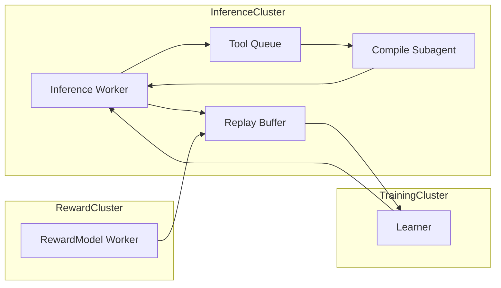

## Problem

Synchronous execution of coding tasks—where the agent must wait for compilation, testing, linting, or static analysis—creates **compute bubbles** and **idle resources**. When a coding agent issues a tool call (e.g., `run_tests()`), it blocks further reasoning until that tool returns, leading to underutilized GPUs/TPUs and slower RL rollouts.

- RL agents must push hard on **async RL** "so everything is happening in parallel without blowing up bubbles".
- For coding agents, each I/O-bound tool call (compilation, test runs) can take seconds to minutes.
- Industry benchmarks show **67% performance improvement** with parallel execution (3.2s vs 9.8s for 3 agents).

## Solution

Decouple the **inference**, **tool execution**, and **learning** into **parallel, asynchronous components**, communicating via message queues:

**1. Inference Workers (GPU)**
- Continuously sample from the latest policy.
- Output "actions" that are either low-compute (e.g., "suggest next line") or external tool calls (e.g., "CompileSubagent(serviceA)").

**2. Tool Executors (CPU / Container Hosts)**
- Listen to a queue of tool call requests (`compile`, `run_tests`, `lint`).
- Run each tool in an isolated environment, then push the results (success/failure, logs) back to the **Inference Workers**.

**3. Reward Modeling Units (GPU/CPU)**
- Consume completed trajectories (series of `(state, action, tool_output)`), compute turn-level or final rewards (e.g., via `inference_healed_reward`).
- Push `(trajectory_id, reward)` to the **Learner**.

**4. Learner / Parameter Server (GPU)**
- Periodically aggregates gradients from recent trajectories, updates policy weights, and publishes new checkpoints.
- Completely decouples generation and training, addressing synchronous bottlenecks in large-scale RL systems (up to 2.77x acceleration).

**5. Replay & Buffer System**
- **Experience Replay:** Stores recent `(state, action, reward)` tuples, allowing the Learner to sample minibatches.
- **Priority Queues:** If certain coding episodes show high variance (e.g., intermittent compile successes), re-evaluate them with updated reward models.

## Example

## How to use it

- **Message Broker:** Use Redis streams or RabbitMQ topics to queue tool calls (`compile_requests`, `test_requests`).
- **Autoscaling Policies:** Monitor queue lengths: if `compile_requests` > threshold, spin up additional `CompileSubagent` containers.
- **Failure Handling:** If a tool executor crashes or a network error occurs, send a "retry" or "skip" message; mark that trajectory as "stale" if too many retries.
- **Checkpoint Frequency:** Decide at what interval the Learner should publish new policy weights (e.g., every 1,000 episodes) to avoid excessive network traffic.

## Trade-offs

- **Pros:**
  - **High Utilization:** GPUs remain busy running inference or learning while CPU-bound tasks run in parallel.
  - **Scalable Compute:** Can independently scale inference, tool execution, and reward modeling.
  - **Performance Gains:** Producer-consumer async workflows achieve 1.59-2.03x throughput improvement; parallel tool calls reduce latency by up to 90%.
- **Cons/Considerations:**
  - **Complex System Maintenance:** Requires robust monitoring, logging, and alerting across multiple services.
  - **Staleness Management:** Policies may train on slightly outdated data; hyperparameters must account for acceptable staleness windows (e.g., 5–20 minutes).

## References

- Will Brown's emphasis on "everything being async and overlapped" to hide latencies in multi-hour RL tasks.
- "IMPALA: Scalable Distributed Deep-RL" for a precedent in actor-learner pipelines.
- AsyncFlow (arXiv:2507.01663, 2025): Producer-consumer async workflows with TransferQueue for distributed data transfer.
- AREAL (arXiv:2505.24298, 2025): Asynchronous RL achieving 2.77x training acceleration on math and code reasoning tasks.

- Primary source: https://www.youtube.com/watch?v=Xkwok_XXQgw
