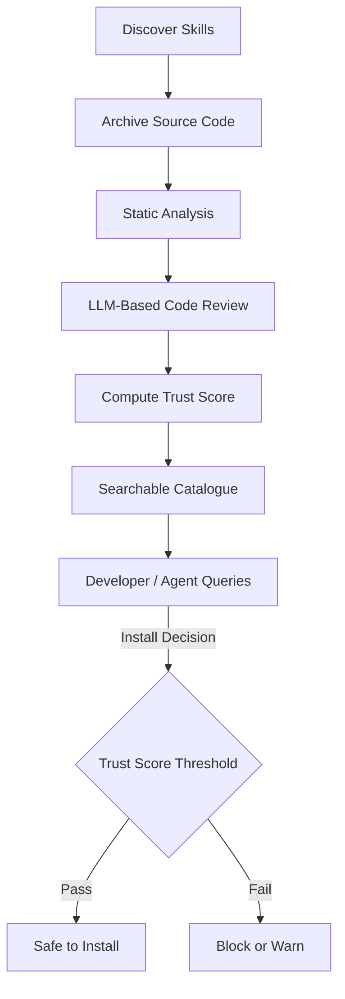

## Problem

AI agents increasingly rely on third-party MCP servers and skills discovered from registries, GitHub, and package managers. Each skill can execute arbitrary code, access files, make network requests, and interact with sensitive systems. Manually reviewing every skill before installation does not scale, and developers often skip security checks entirely.

## Solution

Implement an automated multi-tier security audit pipeline that continuously discovers, downloads, and analyzes AI skills and MCP servers:

1. **Discovery** — Crawl multiple sources (registries, GitHub, package managers) to build a comprehensive catalogue of available skills.
2. **Archival** — Download and version-control each skill's source code for reproducible analysis.
3. **Automated Audit** — Run a multi-tier analysis combining static analysis with LLM-based code review to detect permission overreach, data exfiltration, prompt injection vectors, and unsafe patterns.
4. **Trust Scoring** — Compute a composite trust score based on audit results, author reputation, code quality, and community signals.
5. **Safe Discovery** — Expose the audited catalogue through a search API so developers and agents can discover skills filtered by trust score.

## Evidence

- **Evidence Grade:** `medium`
- **Most Valuable Findings:**
  - Multi-tier audit (static + LLM review) catches categories of issues that either approach misses alone — static analysis finds known patterns while LLM review catches novel or context-dependent risks.
  - Trust scores correlate with real-world incident rates when combining audit results with author and community signals.
- **Unverified / Unclear:** Optimal number of audit tiers and whether LLM-based review generalizes across all skill types without domain-specific tuning.

## How to use it

- **Pre-install gate:** Query the audit API before installing any MCP server. Block installations below a trust threshold.
- **CI integration:** Add a pre-install hook (e.g., `clawsearch-guard`) that checks trust scores in your package install pipeline.
- **Continuous monitoring:** Re-audit skills when new versions are published to catch supply-chain attacks via updates.
- **Agent self-protection:** Give agents access to the search API so they can verify skills before recommending or using them.

## Trade-offs

**Pros:**
- Scales security review to thousands of skills without human bottleneck
- Catches both known vulnerability patterns and novel risks via LLM review
- Trust scores give developers a quick signal for install decisions
- Continuous re-audit detects supply-chain attacks on updates

**Cons:**
- LLM-based review has inherent non-determinism; results may vary between runs
- False positives may block legitimate skills, requiring appeal/override mechanisms
- Crawler coverage depends on source availability; private or unlisted skills are missed
- Maintaining the audit engine requires ongoing tuning as attack patterns evolve

## References

- [ClawSec — Automated security audit for MCP servers and AI skills](https://clawsec.cc)
- [ClawSearch — Safe discovery of audited MCP servers](https://clawsearch.cc)
- [SLSA Supply-chain Levels for Software Artifacts](https://slsa.dev)
- [Deterministic Security Scanning Build Loop pattern](./deterministic-security-scanning-build-loop.md) — complementary pattern for build-time enforcement
