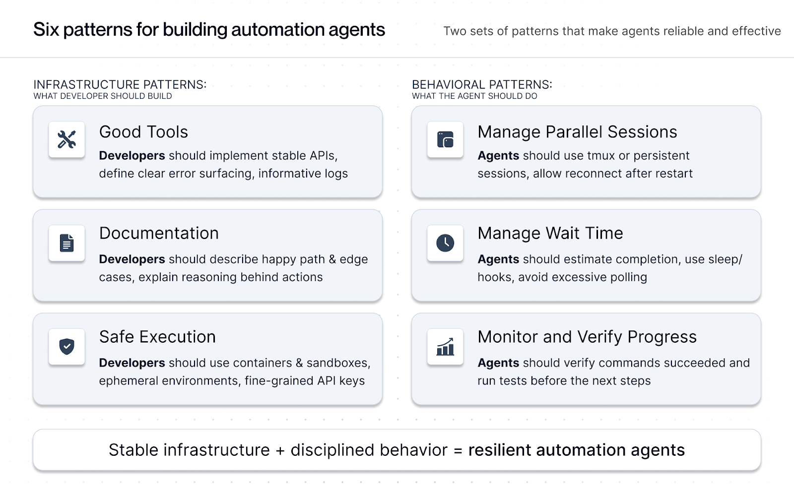
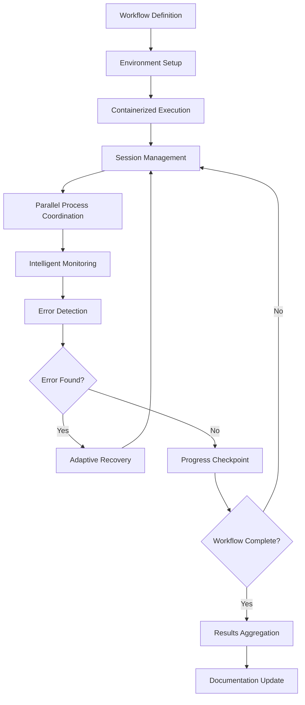

## Problem

Complex, long-running engineering workflows traditionally require extensive human oversight and intervention. Tasks like model training pipelines, infrastructure configuration, and multi-step deployment processes involve:

- Manual coordination of multiple tools and systems
- Constant monitoring for errors and edge cases  
- Time-consuming context switching between different workflow stages
- Risk of human error in repetitive tasks
- Difficulty scaling engineering processes across teams

Engineers spend significant time on operational overhead rather than core development work, and workflows often fail at intermediate steps requiring manual debugging and restart.

## Solution

Autonomous Workflow Agent Architecture creates AI agents with sophisticated workflow management capabilities that can handle multi-step engineering processes with minimal human intervention. The architecture combines:

**Core Components:**

- **Containerized Execution Environments**: Isolated, reproducible environments for safe workflow execution
- **Session Management**: tmux-based parallel process coordination
- **Intelligent Monitoring**: Adaptive wait/sleep mechanisms and progress tracking  
- **Error Recovery**: Robust error handling with context-aware retry strategies
- **Documentation Integration**: Comprehensive logging and workflow documentation

**Architecture Pattern:**



The system operates through several key phases:



**Implementation Patterns:**

1. **Infrastructure Setup**: Create containerized environments with necessary tools and dependencies
2. **Process Orchestration**: Use tmux sessions to manage parallel execution streams
3. **Adaptive Monitoring**: Implement intelligent wait mechanisms that adapt to process completion times
4. **Checkpoint Management**: Regular state preservation for recovery scenarios
5. **Context-Aware Recovery**: Error analysis with appropriate retry or alternative path selection

## How to use it

**Ideal Use Cases:**

- Model training and evaluation pipelines
- Infrastructure provisioning and configuration
- Multi-stage deployment workflows  
- Automated testing and quality assurance processes
- Data processing and ETL pipelines

**Prerequisites:**

- Containerization platform (Docker/Podman)
- Agent framework with tool use capabilities (OpenHands, Claude Code)
- Workflow definition and documentation system
- Monitoring and logging infrastructure

**Implementation Steps:**

1. **Define Workflow Stages**: Break complex processes into discrete, monitorable steps
2. **Create Execution Environment**: Set up containerized environment with all required tools
3. **Implement Session Management**: Configure tmux or similar for process coordination
4. **Add Monitoring Hooks**: Insert checkpoints and progress indicators throughout workflow
5. **Design Recovery Strategies**: Plan fallback approaches for common failure modes
6. **Test and Iterate**: Run workflows with increasing complexity to validate robustness

**Example Implementation:**

```python
# Workflow agent with containerized execution
class WorkflowAgent:
    def __init__(self, container_image, workflow_config):
        self.container = self.setup_container(container_image)
        self.sessions = {}
        self.checkpoints = []
    
    def execute_workflow(self, workflow_steps):
        for step in workflow_steps:
            session_id = self.create_session(step.name)
            try:
                result = self.execute_step(step, session_id)
                self.create_checkpoint(step.name, result)
            except Exception as e:
                self.handle_error(step, e, session_id)
    
    def handle_error(self, step, error, session_id):
        # Context-aware error recovery
        if self.can_retry(error):
            self.retry_with_backoff(step, session_id)
        else:
            self.escalate_to_human(step, error)
```

## Trade-offs

**Pros:**

- **Significant Speedup**: 1.22x-1.37x improvement in token processing and workflow execution
- **Reduced Human Intervention**: Agents can handle most routine workflow steps autonomously
- **Consistent Execution**: Eliminates human error in repetitive tasks
- **Scalability**: Can run multiple workflows in parallel across different environments  
- **Comprehensive Logging**: Automatic documentation of all workflow steps and decisions
- **Recovery Capability**: Intelligent error handling reduces workflow failures

**Cons:**

- **Limited Novel Failure Handling**: Agents may struggle with completely unprecedented error scenarios
- **Context Window Constraints**: Long-running workflows may exceed agent context limits
- **Setup Complexity**: Initial configuration of containers and monitoring requires significant investment
- **Documentation Dependency**: Requires continuously updated workflow documentation for optimal performance
- **Resource Intensive**: Container orchestration and parallel processing increase infrastructure costs
- **Human Oversight Still Needed**: Critical workflows may still require human validation checkpoints

## References

* [AI Agents to Automate Complex Engineering Tasks - Together AI Blog](https://www.together.ai/blog/ai-agents-to-automate-complex-engineering-tasks)
* [OpenHands Agent Framework](https://github.com/All-Hands-AI/OpenHands)
* [Claude Code Documentation](https://docs.anthropic.com/en/docs/claude-code)