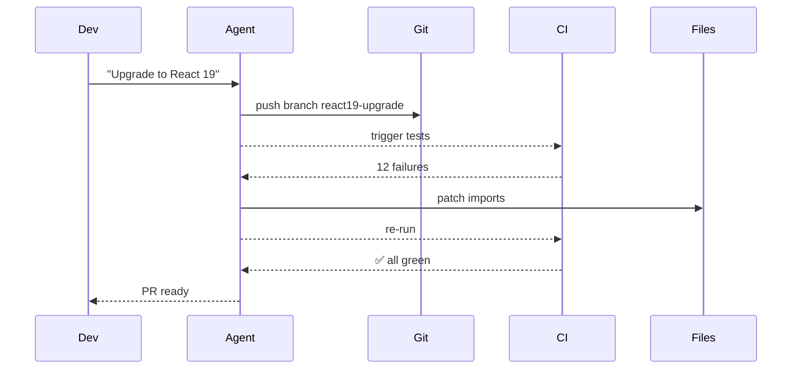

## Problem
Long-running tasks tie up the editor and require developers to babysit the agent.

## Solution
Run the agent **asynchronously**; it pushes a branch, waits for CI, ingests pass/fail output, iterates, and pings the user when green. Perfect for mobile kick-offs (“fix flaky test while I'm at soccer practice”).

## Example (flow)

## References

* Raising An Agent - Episode 6: Background agents use existing CI as the feedback loop.

[Source](https://ampcode.com/manual#background)