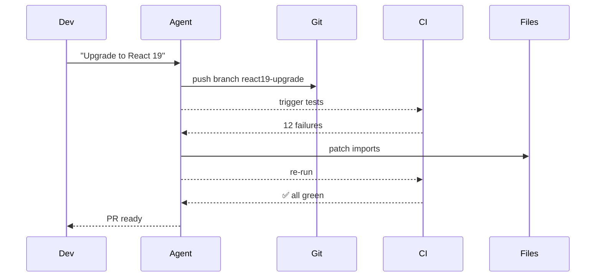

## Problem

Long-running refactors and flaky-fix cycles force developers into synchronous supervision. When the agent must wait on tests, build jobs, and deployment checks, human attention gets wasted on polling instead of decision-making. This bottleneck is worse in distributed teams where CI feedback arrives minutes later and context-switch cost is high.

## Solution

Run the agent asynchronously in the background with CI as the objective feedback channel. The agent pushes a branch, waits for CI results, patches failures, and repeats until policy-defined stopping conditions are met. Users are only pulled back in for approvals, ambiguous failures, or final review.

Production implementations include GitHub Agentic Workflows, Cursor Background Agent, and OpenHands.

Key mechanics:
- Branch-per-task isolation (often via cloud-based execution or git worktrees).
- CI log ingestion into structured failure signals.
- Retry budget and stop rules to avoid infinite churn.
- Notification on terminal states (`green`, `blocked`, `needs-human`).

## Example (flow)

```mermaid
sequenceDiagram
  Dev->>Agent: "Upgrade to React 19"
  Agent->>Git: push branch react19-upgrade
  Agent-->>CI: trigger tests
  CI-->>Agent: 12 failures
  Agent->>Files: patch imports
  Agent-->>CI: re-run
  CI-->>Agent: ✅ all green
  Agent-->>Dev: PR ready
```

## How to use it

- Start with deterministic tasks: dependency upgrades, lint migrations, flaky test triage.
- Define retry budgets (`max_attempts`, `max_runtime`) and escalation triggers.
- Use safe defaults: read-only permissions where possible, draft PRs for AI-generated changes.
- Keep artifact links in notifications so humans can review failures quickly.
- Gate merge on CI plus at least one human approval for high-risk repos.
- Consider durable execution mechanisms (Temporal, LangGraph) for long-running tasks.

## Trade-offs

* **Pros:** Better developer focus, lower waiting time, and tighter CI-driven iteration loops.
* **Cons:** Requires robust task lifecycle management, failure triage logic, and notification discipline.

## References

* Raising An Agent - Episode 6: Background agents use existing CI as the feedback loop.
* GitHub Agentic Workflows (2026) - Agents run within GitHub Actions with safety controls.
* OpenHands - Open-source platform achieving 72% on SWE-bench Verified.

[Source](https://ampcode.com/manual#background)
