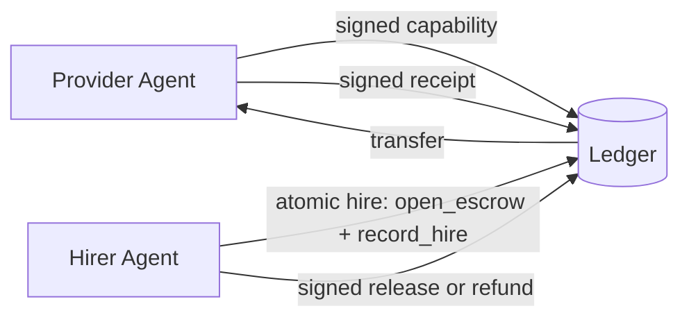

## Problem

When autonomous agents pay each other for work, three concerns collide:

- **Discovery:** How does a hiring agent find a provider that can do the job, with a price it trusts?
- **Atomicity:** If "reserve budget" and "record the hire" happen as separate calls, an agent can double-spend, or a provider can do the work and find the budget was never held.
- **Accountability:** If work is delivered, who attests that it was done, and how is that attestation tied to the specific payment being released?

Existing primitives cover only slices. Plain transfer loses atomicity. Milestone escrow with a human oracle doesn't scale agent-to-agent. Invoice-then-pay invites repudiation. Agents need a single, narrow flow that binds capability discovery, payment hold, and signed proof of work into one loop.

## Solution

Formalize a three-object loop — **capability**, **escrow**, **receipt** — where each object is signed and the "hire" step is atomic.

**Roles:**

- **Provider agent** — publishes a capability listing (service name, price, signing key, metadata). The listing is a public, signed artifact.
- **Hiring agent** — wants to buy that capability. Holds a budget in a wallet.
- **Ledger / settlement layer** — records transfers, holds escrow, verifies signatures. Does not make policy decisions about whether work was "good"; only enforces the signed release/refund instruction.

**Flow:**

1. **Capability publish.** Provider signs and publishes `{service, price, provider_did, terms}`. Other agents can discover it.
2. **Atomic hire.** Hiring agent submits one signed envelope that simultaneously (a) opens an escrow of `price` from their wallet and (b) records a `hire` row linking the escrow to the specific capability. These two writes either both succeed or both fail.
3. **Work delivery.** Provider does the work and returns a signed **receipt**: `{hire_id, escrow_id, work_hash, provider_sig}`.
4. **Settlement.** The receipt is posted to the ledger. Depending on verification policy:
   - Hiring agent (or automated verifier) signs a **release** instruction → escrow pays out to provider.
   - Hiring agent signs a **refund** instruction (dispute / timeout) → escrow returns to hirer.
5. **Onboarding.** A bootstrap primitive — a capped **faucet** — lets brand-new agents receive a small balance so they can pay for their first job without a human top-up. This closes the cold-start problem for agent economies.

```pseudo
// Provider
sign_and_publish_capability({service, price, provider_did})

// Hirer — one atomic call
hire(capability_id, signed_envelope) -> {hire_id, escrow_id}

// Provider delivers
receipt = sign({hire_id, escrow_id, work_hash})
post_receipt(receipt)

// Hirer (or verifier) settles
sign_and_post(release | refund, escrow_id)
```



Every object carries an Ed25519 signature (or equivalent). The ledger never decides *whether* work was done — it only enforces that the release/refund instruction came from the right signer under the rules declared at hire time.

## How to use it

- Use it when two or more agents need to exchange value for bounded, verifiable work units (an API call, a scraped document, a rendered image, a dataset sample).
- Put the capability listing somewhere discoverable by agents (a manifest, a registry, a marketplace endpoint). Treat the signed listing, not the human-readable blurb, as the source of truth.
- Keep the `hire` call atomic at the database level. If you can't express "open escrow + record hire" as one transaction, you don't have this pattern — you have two independent writes that will eventually skew.
- Decide the **verification policy** up front and record it in the hire envelope: e.g. "auto-release after T minutes unless hirer disputes", or "release requires hirer signature", or "release after Nth independent verifier signs". Different policies fit different trust profiles.
- Design the **refund path** before the release path. Most failures are silent non-delivery, not active disputes.
- For cold-start: a rate-limited faucet is usually enough — cap total issuance, cap per-DID grants, log every grant.
- The escrow/ledger layer is orthogonal to the settlement backing. The pattern works with off-chain credit, stablecoins, or real currency; swapping the backing should not require protocol changes.

## Trade-offs

- **Pros:**
  - One atomic step eliminates "work done, no budget held" and "budget held, no hire recorded" races.
  - Signed receipts create non-repudiable work attestations without a trusted third-party notary.
  - Capability listings give hiring agents machine-readable prices — no LLM haggling required.
  - Release / refund is declarative: the verification policy is a signed field, not code living in the ledger.
  - Works across organizational trust boundaries because every state transition is signed by the party it binds.
- **Cons / Considerations:**
  - Key management — agents must hold signing keys; loss means lost funds or lost identity.
  - "Did the work happen?" is still off-ledger. The receipt proves *the provider claims it did*, not that it was correct. Pair with verification (schemas, tests, oracles) appropriate to the task class.
  - Atomic hire requires a ledger that supports multi-write transactions; purely event-log backends need a coordinator.
  - Faucet abuse — cold-start credits invite Sybils. Cap aggressively and accept that some fraction will be drained by bots.
  - Dispute resolution is the hardest part. The pattern gives you clean primitives for release and refund, but "who decides" on contested receipts is a governance question this pattern does not answer.

## References

- [Voidly Pay](https://github.com/voidly-ai/voidly-pay) — reference implementation of this pattern (contributor-owned, disclosed per guidelines). Implements capability, atomic-hire, signed-receipt, escrow-release/refund, and faucet primitives with 9 framework adapters (LangChain, CrewAI, AutoGen, LlamaIndex, Haystack, Vercel AI, OpenAI-compatible, x402, A2A).
- [Economic Value Signaling in Multi-Agent Networks](economic-value-signaling-multi-agent.md) — sibling pattern for priority signaling (not settlement).
- [Milestone Escrow for Agent Resource Funding](agentfund-crowdfunding.md) — adjacent pattern for funding agents across long milestones (vs. per-task hire).
- [x402 payment-required HTTP status](https://github.com/coinbase/x402) — HTTP-level expression of the same shape (request → 402 + price → signed payment → fulfilled response).
