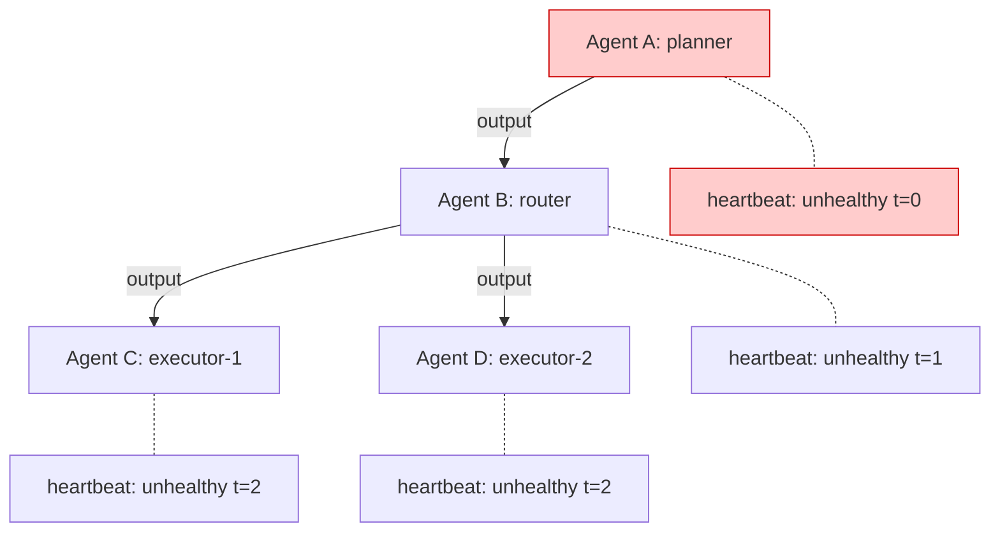

## Problem

In multi-agent systems, agents pass outputs to each other. When Agent A fails or returns degraded output, downstream agents B, C, and D receive corrupted input and fail in sequence. Standard per-agent monitoring reports N independent failures. Engineers investigate each one separately, wasting time before realizing they all share a single root cause.

The MAST taxonomy paper (arXiv 2503.13657) analyzed 1,600 failure traces across 7 multi-agent frameworks and identified inter-agent misalignment as a distinct failure category. The pattern gets worse as fleet size grows: a 7-agent system with chained dependencies can turn 1 failure into 4-6 alerts.

## Solution

Record agent heartbeats and execution events with enough metadata to reconstruct the dependency graph at query time. When failures occur, walk the graph backward from any failing agent to find the originating fault.

**Core components:**

1. **Heartbeat registration** - Each agent periodically reports status, creating a timeline of health per agent
2. **Cross-agent correlation** - Tag each agent's input with the upstream agent ID and trace ID so failures can be linked
3. **Backward chain walk** - Given a failing agent, traverse upstream dependencies to find the first agent that degraded
4. **Cascade replay** - Reconstruct the full timeline of a cascade for post-mortem analysis



```typescript
// Register heartbeats from each agent
watch.heartbeat({ agentId: 'planner', status: 'healthy', metadata: { task: 'decompose' } });
watch.heartbeat({ agentId: 'router', status: 'healthy', metadata: { upstream: 'planner' } });

// When failures appear, correlate backward
const chain = watch.correlate('executor-3');
// Returns: executor-3 <- router <- planner (root cause identified)
```

## How to use it

**When to apply this pattern:**

- You run 3+ agents where at least some consume another agent's output
- Post-mortems have revealed "cascading" failures more than once
- Your alerting system fires multiple independent alerts for what turns out to be one problem

**Implementation steps:**

1. Instrument each agent with a heartbeat call that includes agent ID, status, and upstream dependency info
2. Store heartbeats in a time-series structure (SQLite, Postgres, or in-memory for small fleets)
3. Build a correlation query that, given any agent ID, walks the dependency graph backward to find the first failure
4. Add cascade replay to your post-mortem tooling so you can see the full failure timeline

**Known implementations:**

- [AgentWatch](https://github.com/nicofains1/agentwatch) (`@nicofains1/agentwatch` on npm) - TypeScript library with heartbeats, cascade detection, cross-agent correlation, and forensic replay via CLI

## Trade-offs

**Pros:**

- Reduces N alerts to 1 root cause, cutting mean-time-to-diagnosis
- Forensic replay makes post-mortems concrete instead of speculative
- Heartbeat overhead is minimal (one small write per agent per cycle)

**Cons:**

- Requires agents to report upstream dependencies, which means instrumenting each agent
- Dependency graph accuracy depends on agents correctly tagging their inputs
- Adds a storage requirement that grows with fleet size and heartbeat frequency
- Does not prevent cascades, only detects them faster

## References

- [MAST: Multi-Agent System Failure Taxonomy](https://arxiv.org/abs/2503.13657) - 1,600 failure traces across 7 frameworks, documenting inter-agent failure modes
- [AgentWatch](https://github.com/nicofains1/agentwatch) - TypeScript implementation of this pattern
- Related pattern in this repo: [LLM Observability](../patterns/llm-observability.md) - broader observability; cascade detection is a specialized sub-problem
