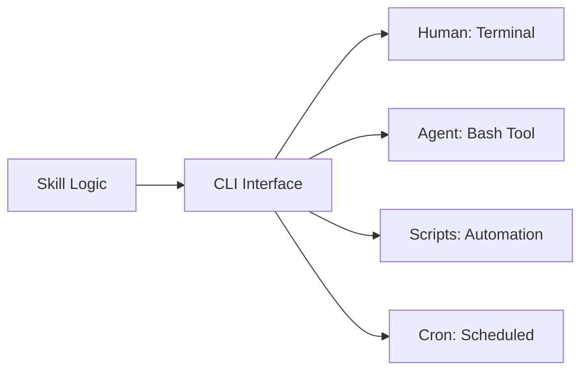

## Problem

When building agent skills (reusable capabilities), there's tension between:
- **API-first design**: Skills as functions/classes—great for programmatic use, but hard to debug and test manually
- **GUI-first design**: Skills as visual tools—easy for humans, but agents can't invoke them

Teams end up building two interfaces or choosing one audience over the other.

## Solution

Design all skills as **CLI tools first**. A well-designed CLI is naturally dual-use: humans can invoke it from the terminal, and agents can invoke it via shell commands.



**Core principles:**

1. **One script, one skill**: Each capability is a standalone executable
2. **Subcommands for operations**: `skill.sh list`, `skill.sh get <id>`, `skill.sh create`
3. **Structured output**: JSON for programmatic use, human-readable for TTY
4. **Exit codes**: 0 for success, non-zero for errors (enables `&&` chaining)
5. **Environment config**: Credentials via env vars, not hardcoded

```bash
# Example: Trello skill as CLI
trello.sh boards                    # List all boards
trello.sh cards <BOARD_ID>          # List cards on board
trello.sh create <LIST_ID> "Title"  # Create card
trello.sh move <CARD_ID> <LIST_ID>  # Move card

# Human usage
$ trello.sh boards
{"id": "abc123", "name": "Personal", "url": "..."}
{"id": "def456", "name": "Work", "url": "..."}

# Agent usage (via Bash tool)
Bash: trello.sh cards abc123 | jq '.[0].name'
```

## How to use it

**Skill structure:**

```
~/.claude/skills/
├── trello/
│   └── scripts/
│       └── trello.sh          # Main CLI entry point
├── asana/
│   └── scripts/
│       └── asana.sh
├── honeybadger/
│   └── scripts/
│       └── honeybadger.sh
└── priority-report/
    └── scripts/
        └── priority-report.sh  # Composes other skills
```

**CLI design checklist:**

- [ ] Standalone executable with shebang (`#!/bin/bash`)
- [ ] Help text via `--help` or no-args
- [ ] Subcommands for CRUD operations
- [ ] JSON output (pipe to `jq` for formatting)
- [ ] Credentials from `~/.envrc` or environment
- [ ] Meaningful exit codes
- [ ] Stderr for errors, stdout for data

**Composition example:**

```bash
# priority-report.sh composes multiple skill CLIs
#!/bin/bash
echo "## GitHub"
gh pr list --search "review-requested:@me"

echo "## Trello"
~/.claude/skills/trello/scripts/trello.sh cards abc123

echo "## Asana"
~/.claude/skills/asana/scripts/asana.sh tasks personal
```

## Trade-offs

**Pros:**

- **Dual-use by default**: Same interface for humans and agents
- **Debuggable**: Run manually to test, inspect output
- **Composable**: Pipe, chain, and combine with Unix tools
- **Portable**: Works in any shell, no runtime dependencies
- **Transparent**: Agent's tool calls are visible shell commands
- **Testable**: Easy to write integration tests

**Cons:**

- **Shell limitations**: Complex data structures awkward in bash
- **Error handling**: Less structured than exceptions
- **Performance**: Process spawn overhead vs function calls
- **State management**: No persistent state between invocations
- **Windows compatibility**: Requires WSL or Git Bash

**When to use something else:**

- High-frequency calls (>100/sec): Use in-process functions
- Complex object graphs: Use structured API
- Real-time streaming: Use WebSocket/SSE

## References

* Unix Philosophy: "Write programs that do one thing and do it well"
* Dual-Use Tool Design pattern
* Claude Code skills directory structure
* 12-Factor App: Config via environment
