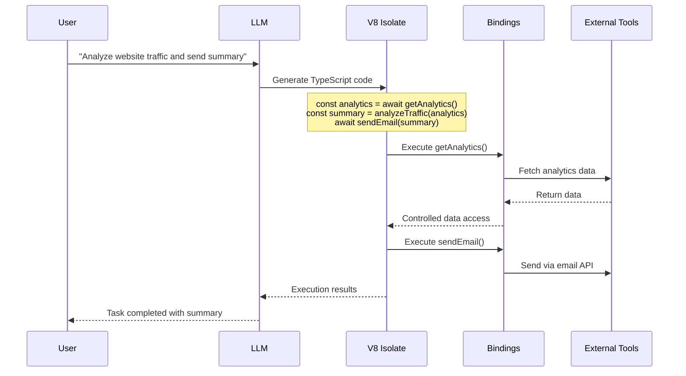

## Problem

Traditional Model Context Protocol (MCP) approaches of directly exposing tools to Large Language Models have significant limitations:

- LLMs struggle to effectively use complex tool interfaces
- Limited training data on "tool calls" compared to abundant code training
- Multi-step tool interactions become cumbersome with direct API calls
- Complex tool compositions require multiple back-and-forth exchanges

The fundamental issue: **LLMs are better at writing code to call MCP, than at calling MCP directly.**

## Solution

Transform tool interfaces into programmable APIs that LLMs can code against, rather than requiring direct tool invocation:

1. **API Transformation**: Convert MCP tools into TypeScript API interfaces
2. **Code Generation**: Allow the LLM to generate code that calls these APIs to solve tasks
3. **Sandboxed Execution**: Use V8 isolates as lightweight, secure execution environments
4. **Controlled Bindings**: Provide predefined bindings that give access to specific resources without general network access

This approach leverages LLMs' strength in code generation while maintaining security and control.

## Example

## How to use it

1. **Design Tool APIs**: Create TypeScript interfaces for your tools that are intuitive for code generation
2. **Implement Bindings**: Develop secure bindings that control access to external resources
3. **Sandbox Setup**: Configure V8 isolates with appropriate security constraints
4. **Code Execution Flow**:
   - LLM generates TypeScript code using the provided APIs
   - Code runs in isolated V8 environment
   - Bindings provide controlled access to tools
   - Results return to the agent for further processing

## Trade-offs

**Pros:**
- LLMs can handle significantly more complex tool interactions
- More efficient multi-step operations in single code blocks
- Better security through controlled execution environments
- No API keys or secrets exposed to the LLM
- Leverages LLMs' strong code generation capabilities

**Cons/Considerations:**
- Requires more sophisticated infrastructure than direct tool calling
- Adds complexity to agent architecture and deployment
- Depends on LLM's code generation quality and debugging capabilities
- Need to design intuitive APIs for code generation
- Additional overhead of code compilation and execution

## References

- [Cloudflare Code Mode Blog Post](https://blog.cloudflare.com/code-mode/) - Original announcement and technical details
- [Model Context Protocol](https://modelcontextprotocol.io/) - Background on traditional tool calling approaches