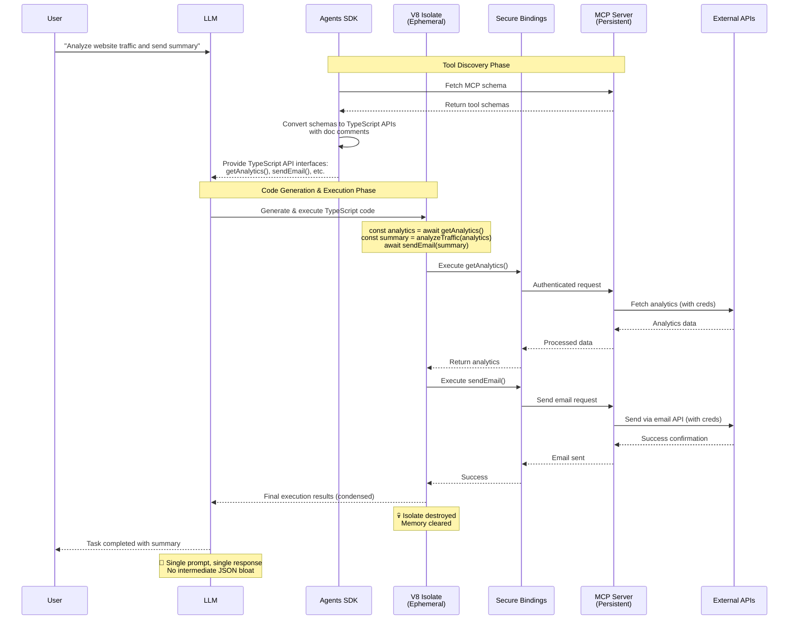

## Problem

Traditional Model Context Protocol (MCP) approaches of directly exposing tools to Large Language Models create significant token waste and complexity issues. We've moved from telling LLMs what to do, to teaching them to write instructions for themselves—it's **turtles writing code all the way down** for all domains.

### Token Waste in Multi-Step Operations
Classic MCP forces this inefficient pattern:
```
LLM → tool #1 → large JSON response → LLM context
LLM → tool #2 → large JSON response → LLM context
LLM → tool #3 → large JSON response → LLM context
→ final answer
```

Every intermediate result must ride back through the model's context, burning tokens and adding latency at each step. For complex workflows requiring 5-10 tool calls, this becomes extremely expensive.

### Fan-Out Inefficiency at Scale
The traditional approach breaks down dramatically with bulk operations:

**Processing 100 emails for personalized outreach:**
- Traditional MCP: 100 separate tool calls, each requiring round-trip through LLM context
- Each email fetch dumps potentially 1000+ tokens of metadata into context
- Total context bloat: 100k+ tokens before any actual work begins
- Result: Context overflow, degraded performance, or outright failure

**Code Mode alternative:** Simple `for` loop over 100 entries, processing entirely within the sandbox with only final results surfaced to LLM context.

### Core Interface Limitations
- LLMs struggle to effectively use complex tool interfaces
- Limited training data on "tool calls" compared to abundant code training
- Multi-step tool interactions become cumbersome with direct API calls
- Complex tool compositions require multiple back-and-forth exchanges
- Fan-out scenarios (processing many items) exceed context limits or become prohibitively expensive

The fundamental insight: **LLMs are better at writing code to orchestrate MCP tools than calling MCP tools directly.**

## Solution

Code Mode complements (not replaces) MCP servers by adding an ephemeral execution layer that eliminates token-heavy round-trips:

### The Division of Responsibilities

**MCP Servers Handle (Persistent Layer):**

- Credential management and authentication
- Rate limiting and quota enforcement
- Webhook subscriptions and real-time events
- Connection pooling and persistent state
- API secrets and security policies

**Code Mode Handles (Ephemeral Layer):**

- Multi-step tool orchestration in a single execution
- Complex data transformations and business logic
- Eliminating intermediate JSON bloat from LLM context
- "Write once, vaporize immediately" execution model

### Core Architecture

1. **Schema Discovery**: Agents SDK fetches MCP server schemas dynamically at runtime
2. **API Transformation**: Convert MCP tool schemas into TypeScript API interfaces with doc comments
3. **LLM Tool Awareness**: LLM receives complete TypeScript API documentation for available tools
4. **Ephemeral Code Generation**: LLM generates code that orchestrates multiple tool calls in one script
5. **V8 Isolate Execution**: Lightweight, secure sandbox that dies after execution (no persistent state)
6. **Controlled Bindings**: Secure bridges to MCP servers that own the real credentials and logic

**Key Insight**: The LLM knows what code to write because it receives the complete TypeScript API generated from MCP server schemas, not because it guesses - it's provided with strongly-typed interfaces and documentation.

### Enhanced Capabilities Through Typed APIs

**Verification Before Execution:**

Converting MCP schemas to TypeScript APIs enables compile-time verification—code can be validated before execution, catching errors that would otherwise fail at runtime. This dramatically improves reliability compared to raw tool calls.

**Semantic Caching Opportunities:**

When you see the same input for the second time, you don't need to invent the flow again—just reuse something that worked in the past. Typed APIs make it possible to:
- Hash function signatures and inputs for cache keys
- Safely reuse previously successful code patterns
- Build libraries of verified workflow components

**Idempotency and Partial Failure Recovery:**

Code Mode enables sophisticated error handling patterns:
- **Checkpoint/Resume**: Use KV stores (like Cloudflare KV/D1) to maintain execution state
- **Partial failure handling**: Resume from specific points rather than restarting entire workflows
- **Retry logic**: Built-in retry patterns for transient failures

This creates a "best of both worlds" approach: MCP servers handle the operational complexity while Code Mode eliminates the chatty, token-expensive parts of multi-step workflows.

## When to Use Code Mode

### Ideal Use Cases

**Workflow-like Problems with Known Flow:**

Code Mode excels when you have clear sequences of operations:
- **Infrastructure provisioning**: "Please provision an EC2 instance of m4 class that I can SSH to, place that in public SG and attach an IPGW, make sure it's tagged nicely"
- **Data pipeline orchestration**: Extract from API A, transform according to rules B, load into system C
- **Bulk operations**: Processing 100+ items where traditional MCP would exceed context limits

**Fan-Out Scenarios:**

Much easier to one-shot code with a `for` loop over 100 entries instead of expecting an LLM to nail 100 tool calls, either in parallel or sequentially. Performance only gets worse with bigger N, but Code Mode stays fast.

**CaMeL-Style Self-Debugging:**

Enables approaches where agents literally debug their own homework—the generated code can include error handling, logging, and retry logic that allows agents to understand and fix their own execution issues.

**Operations Benefiting from Verification:**

MCP schemas become typed TypeScript APIs, enabling:
- Compile-time verification before execution
- Semantic caching opportunities (reuse flows that worked before)
- Clear interfaces that reduce execution errors

### Anti-Patterns (When Not to Use)

**Open-Ended Research Loops:**

Code Mode struggles with problems where you decide at each step what to even do next. You can try to account for each edge case, but it defeats the purpose.

**Intelligence Required Mid-Execution:**

Right now, Code Mode especially fails at cases where intelligence needs to be _inserted in the middle of code_. Example: A spreadsheet with 100 emails where you want to write a *personalized* email for each entry. The `body` argument for that `send_email` call must be computed using LLM for personalization.

**Sub-Agent Patterns:**

You can shim intelligence mid-execution with sub-agents ("call llm() inside the loop"), but then you're back to traditional agenting, just wrapped in TypeScript—defeating the core benefits.

**Highly Dynamic Workflows:**

When the sequence of operations depends heavily on intermediate results in unpredictable ways, traditional MCP's step-by-step approach may be more appropriate.

## Example



## How to use it

1. **Design Tool APIs**: Create TypeScript interfaces for your tools that are intuitive for code generation
2. **Implement Bindings**: Develop secure bindings that control access to external resources
3. **Sandbox Setup**: Configure V8 isolates with appropriate security constraints
4. **Code Execution Flow**:
   - LLM generates TypeScript code using the provided APIs
   - Code runs in isolated V8 environment
   - Bindings provide controlled access to tools
   - Results return to the agent for further processing

## Traditional MCP vs Code Mode Comparison

### Traditional MCP Flow
```
User Request → LLM
↓
Tool Call #1 → JSON Response (1000+ tokens) → LLM Context
↓
Tool Call #2 → JSON Response (1000+ tokens) → LLM Context
↓
Tool Call #3 → JSON Response (1000+ tokens) → LLM Context
↓
Final Answer (Context bloated with intermediate data)
```

**Cost:** High token usage, multiple round-trips, latency accumulation

### Code Mode Flow
```
User Request → LLM → Generated Code → V8 Isolate
                                    ↓
                                    All tool calls internally
                                    ↓
                                    Condensed results → LLM
                                    ↓
                                    Final Answer
```

**Cost:** Single round-trip, minimal token usage, faster execution

## Trade-offs

**Pros:**

- **Dramatic token savings** on multi-step workflows (10x+ reduction)
- **Faster execution** through elimination of round-trips
- **Enhanced security** - credentials stay in MCP servers, never in LLM
- **Complex orchestration** - LLMs excel at writing orchestration code
- **Maintained MCP benefits** - existing servers work without modification

**Cons/Considerations:**

- **Infrastructure complexity** - requires V8 isolate runtime infrastructure
- **Code quality dependency** - execution success depends on LLM's code generation
- **Debugging challenges** - runtime errors in generated code need handling
- **API design overhead** - need intuitive TypeScript interfaces for code generation

## References

- [Cloudflare Code Mode Blog Post](https://blog.cloudflare.com/code-mode/) - Original announcement and technical details
- [Model Context Protocol](https://modelcontextprotocol.io/) - Background on traditional tool calling approaches
- [Rafal Wilinski's Code Mode Analysis](https://x.com/rafalwilinski/status/1972362720579035146) - Real-world insights on Code Mode strengths and limitations