## Problem

Traditional Model Context Protocol (MCP) approaches of directly exposing tools to Large Language Models create significant token waste and complexity issues:

### Token Waste in Multi-Step Operations
Classic MCP forces this inefficient pattern:
```
LLM → tool #1 → large JSON response → LLM context
LLM → tool #2 → large JSON response → LLM context
LLM → tool #3 → large JSON response → LLM context
→ final answer
```

Every intermediate result must ride back through the model's context, burning tokens and adding latency at each step. For complex workflows requiring 5-10 tool calls, this becomes extremely expensive.

### Core Interface Limitations
- LLMs struggle to effectively use complex tool interfaces
- Limited training data on "tool calls" compared to abundant code training
- Multi-step tool interactions become cumbersome with direct API calls
- Complex tool compositions require multiple back-and-forth exchanges

The fundamental insight: **LLMs are better at writing code to orchestrate MCP tools than calling MCP tools directly.**

## Solution

Code Mode complements (not replaces) MCP servers by adding an ephemeral execution layer that eliminates token-heavy round-trips:

### The Division of Responsibilities

**MCP Servers Handle (Persistent Layer):**
- Credential management and authentication
- Rate limiting and quota enforcement
- Webhook subscriptions and real-time events
- Connection pooling and persistent state
- API secrets and security policies

**Code Mode Handles (Ephemeral Layer):**
- Multi-step tool orchestration in a single execution
- Complex data transformations and business logic
- Eliminating intermediate JSON bloat from LLM context
- "Write once, vaporize immediately" execution model

### Core Architecture

1. **API Transformation**: Convert MCP tools into TypeScript API interfaces
2. **Ephemeral Code Generation**: LLM generates code that orchestrates multiple tool calls in one script
3. **V8 Isolate Execution**: Lightweight, secure sandbox that dies after execution (no persistent state)
4. **Controlled Bindings**: Secure bridges to MCP servers that own the real credentials and logic

This creates a "best of both worlds" approach: MCP servers handle the operational complexity while Code Mode eliminates the chatty, token-expensive parts of multi-step workflows.

## Example

```mermaid
sequenceDiagram
    participant User
    participant LLM
    participant V8Isolate as V8 Isolate<br/>(Ephemeral)
    participant Bindings as Secure Bindings
    participant MCPServer as MCP Server<br/>(Persistent)
    participant ExternalAPIs as External APIs

    User->>LLM: "Analyze website traffic and send summary"
    LLM->>V8Isolate: Generate & execute TypeScript code
    Note over V8Isolate: const analytics = await getAnalytics()<br/>const summary = analyzeTraffic(analytics)<br/>await sendEmail(summary)

    V8Isolate->>Bindings: Execute getAnalytics()
    Bindings->>MCPServer: Authenticated request
    MCPServer->>ExternalAPIs: Fetch analytics (with creds)
    ExternalAPIs-->>MCPServer: Analytics data
    MCPServer-->>Bindings: Processed data
    Bindings-->>V8Isolate: Return analytics

    V8Isolate->>Bindings: Execute sendEmail()
    Bindings->>MCPServer: Send email request
    MCPServer->>ExternalAPIs: Send via email API (with creds)
    ExternalAPIs-->>MCPServer: Success confirmation
    MCPServer-->>Bindings: Email sent
    Bindings-->>V8Isolate: Success

    V8Isolate-->>LLM: Final execution results (condensed)
    Note over V8Isolate: 💀 Isolate destroyed<br/>Memory cleared
    LLM-->>User: Task completed with summary

    Note over LLM: 🎯 Single prompt, single response<br/>No intermediate JSON bloat
```



## How to use it

1. **Design Tool APIs**: Create TypeScript interfaces for your tools that are intuitive for code generation
2. **Implement Bindings**: Develop secure bindings that control access to external resources
3. **Sandbox Setup**: Configure V8 isolates with appropriate security constraints
4. **Code Execution Flow**:
   - LLM generates TypeScript code using the provided APIs
   - Code runs in isolated V8 environment
   - Bindings provide controlled access to tools
   - Results return to the agent for further processing

## Traditional MCP vs Code Mode Comparison

### Traditional MCP Flow
```
User Request → LLM
↓
Tool Call #1 → JSON Response (1000+ tokens) → LLM Context
↓
Tool Call #2 → JSON Response (1000+ tokens) → LLM Context
↓
Tool Call #3 → JSON Response (1000+ tokens) → LLM Context
↓
Final Answer (Context bloated with intermediate data)
```

**Cost:** High token usage, multiple round-trips, latency accumulation

### Code Mode Flow
```
User Request → LLM → Generated Code → V8 Isolate
                                    ↓
                                    All tool calls internally
                                    ↓
                                    Condensed results → LLM
                                    ↓
                                    Final Answer
```

**Cost:** Single round-trip, minimal token usage, faster execution

## Trade-offs

**Pros:**
- **Dramatic token savings** on multi-step workflows (10x+ reduction)
- **Faster execution** through elimination of round-trips
- **Enhanced security** - credentials stay in MCP servers, never in LLM
- **Complex orchestration** - LLMs excel at writing orchestration code
- **Maintained MCP benefits** - existing servers work without modification

**Cons/Considerations:**
- **Infrastructure complexity** - requires V8 isolate runtime infrastructure
- **Code quality dependency** - execution success depends on LLM's code generation
- **Debugging challenges** - runtime errors in generated code need handling
- **API design overhead** - need intuitive TypeScript interfaces for code generation

## References

- [Cloudflare Code Mode Blog Post](https://blog.cloudflare.com/code-mode/) - Original announcement and technical details
- [Model Context Protocol](https://modelcontextprotocol.io/) - Background on traditional tool calling approaches