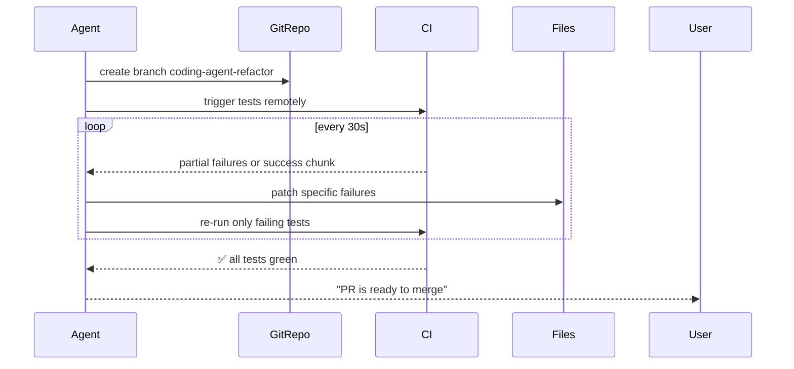

## Problem

When a coding agent tackles multi-file refactors or feature additions, running tests and waiting for test feedback **synchronously** ties up compute and prevents the agent from working on parallel tasks. The agent cannot easily improve code if it must halt until the entire suite finishes.

- Traditional CI loops block further edits; the agent "babysits" the build until tests pass.
- Long test suites introduce idle periods, leading to underutilized GPUs and inflated RL training times.

## Solution

Run the coding agent **asynchronously** against CI (local or remote), allowing it to:

**1. Push a Branch & Trigger Tests**
- When the agent proposes a patch, it commits to a branch and triggers the CI pipeline (e.g., `git push && github_action_run`).

**2. Ingest Partial CI Feedback**
- As tests begin, the agent periodically polls CI results.
- **Failed Tests Partial Report:** Receive a small subset of failures (e.g., 10% of failures flagged first).

**3. Iterative Patch Refinement**
- Use test failure outputs (stack traces, error messages) as **machine-readable feedback**.
- Agent autonomously applies fixes to specific files or functions without human intervention.

**4. Ping on Final Green**
- When all tests pass, send a notification (e.g., chat or pull request comment) that the PR is ready for review.

## Example

## How to use it

- **CI Integration:** Provide the agent with a CLI or API key to push branches and trigger tests (e.g., via GitHub Actions or Jenkins).
- **Error Parsing Modules:** Implement a small parser that translates CI logs into structured diagnostics (e.g., `{file: "auth.py", line: 42, error: "Expected status 200"}`).
- **Prioritized Test Runs:** When re-running, only run tests in files that were patched, to reduce CI time.

## Trade-offs

- **Pros:**
  - **Compute Efficiency:** Overlaps code generation and test runs across multiple agents or branches.
  - **Faster Iteration:** Agent spends less time waiting and more time generating code.
  - **Autonomy:** Reduces need for human intervention until final green.
- **Cons/Considerations:**
  - **CI Flakiness:** Intermittent test failures can mislead the agent into unnecessary patches unless flakiness detection is in place.
  - **Security:** Agent requires permission to push and read CI logs, which may expose sensitive data if misconfigured.

## References

- Inspired by "Background Agent with CI Feedback" pattern, adapted for coding-specific workflows.
- Will Brown's emphasis on **asynchronous pipelines** to avoid idle compute bubbles.