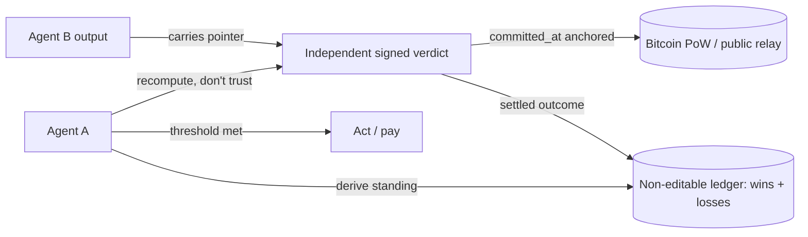

## Problem

When agent A acts on (or pays for) agent B's output, A is exposed to a risk that identity and authorization don't cover: **B can be perfectly authentic, fully authorized, and still wrong.** "Authentic and authorized" is a different claim from "this output is sound," and the latter is usually what A is on the hook for.

The common answers each fall short on their own:

- **Self-verification** (B checks its own output): the analyst grading its own homework — non-independent.
- **Reputation scores**: a stored number a trusted scorer assigns — gameable, and you must trust the scorer.
- **Audit trails / signed logs**: tamper-evident records of *what happened*, written *after* the fact — they prove an action occurred, not that a verdict about it was *committed before the outcome was known*. A log the issuer controls can still be back-dated relative to the outcome.

So A is left choosing between blind trust and re-doing B's work.

## Solution

Insert a **verdict handshake** before A acts: A requires B's output to carry a pointer to an **independent, third-party signed verdict** with three structural properties, then A *recomputes* it rather than trusting anyone.

1. **Independent issuer.** The verdict comes from a party that is neither A nor B (a verifier), so it isn't self-graded.
2. **Committed before the outcome.** The verdict is signed and its timestamp is **anchored** so its pre-outcome timing is checkable without trusting the issuer — e.g. published to public relays at issue time and/or its hash committed to Bitcoin proof-of-work via OpenTimestamps. This is what makes back-dating non-viable: you can't forge a verdict *after* seeing the result and claim you called it early.
3. **Recomputable, not a stored score.** The issuer's track record is a deterministic function of public, signature-verified, settled outcomes (wins **and** losses) — A derives it itself; there is no score to trust and nothing to game.

The verdict is a signed event (BIP-340 Schnorr over a Nostr/NIP-01-style payload) binding `verdictHash`, `artifactHash`, and `committedAt`. A verifies it with any standard library: recompute the event id, check the signature against the issuer's *published* key, confirm the anchor, and confirm the outcome settled where the issuer can't edit it. A free, no-auth verify endpoint is a convenience, never the trust root.



The norm runs both ways: **demand a proof on what you receive, attach one to what you ship.** Attaching pays the sender (more trust from its consumers), so adoption is incentive-compatible rather than push-driven.

## Evidence

- **Evidence Grade:** `low` — the loop runs in production on one verifier's live feed; cross-ecosystem adoption is nascent.
- A public reference implementation runs the full loop: signed verdicts committed before outcomes, anchored to Bitcoin PoW via OpenTimestamps, outcomes settled on a public on-chain account (wins and losses both published), each entry schnorr-verifiable against a published key via a free, no-auth verify endpoint.
- The three properties map onto emerging standards: ERC-8004 (identity/validation registries), ERC-8299 / WYRIWE (judgment-execution attestation), and W3C Verifiable Credentials as a transport for the pointer.

## How to use it

```pseudo
on_receive(output_from_B):
    proof = output_from_B.verification_pointer        // demanded, not optional
    v = recompute(proof)                              // do it yourself: NIP-01 + BIP-340
    require v.signature_valid
    require v.issuer_pubkey == PUBLISHED_VERIFIER_KEY // not a forgery from another key
    require v.committed_at_anchored                   // OTS / relay copy — pre-outcome, checkable
    require v.artifact_hash == hash(output_from_B)    // the proof covers THIS output
    record = recompute_track_record(v.issuer)         // wins AND losses, from settled outcomes
    if record.below_threshold: decline_or_escalate()
    else: act_on(output_from_B)
```

1. **Pick an independent verifier** whose key is published and whose outcomes settle somewhere it can't edit (a public chain/ledger).
2. **Demand the pointer** as a required field on inputs (a response header, an agent-card field, or a credential claim — transport-neutral).
3. **Recompute, don't call-and-trust:** verify the signature against the published key locally; treat any hosted verify endpoint as a convenience only.
4. **Bind the proof to the artifact** (`artifact_hash`) and check **recency** — a valid proof for a *different* or *stale* output is not a proof for yours.
5. **Set a threshold** on the recomputed track record and decline/escalate below it.
6. **Reciprocate:** attach your own verifier's proof to what you ship so your consumers can run the same check.

## Trade-offs

- **Pro:** independent + recomputable + anti-back-dating — a counterparty trusts the output without trusting A, B, or even the verifier (it recomputes).
- **Pro:** publishing losses as well as wins makes the track record a liability for the issuer to fake, which is exactly why it's credible.
- **Con:** requires an independent verifier to exist for the domain, and an anchoring mechanism (relay/OTS) with its own latency.
- **Con:** a valid proof has no inherent expiry; consumers must enforce recency and artifact-binding themselves.
- **Versus neighboring patterns:** *Output Verification Loop* verifies an agent's **own** output (self-feedback) — this is cross-agent and independent. *Cryptographic Governance Audit Trail* records **what happened** (anti-tamper) — this produces a **verdict on soundness committed before the outcome** (anti-back-dating). *Transitive Vouch-Chain Trust* propagates **identity** trust — this scores a **record of being right**, and composes with it.

## References

- Reference implementation (live verdict ledger, free `/verify-proof`): https://api.babyblueviper.com/ledger
- OpenTimestamps (Bitcoin proof-of-work anchoring): https://opentimestamps.org
- BIP-340 (Schnorr signatures): https://github.com/bitcoin/bips/blob/master/bip-0340.mediawiki
- Nostr NIP-01 (event id + signature scheme): https://github.com/nostr-protocol/nips/blob/master/01.md
- ERC-8004 (Trustless Agents — identity/validation registries): https://eips.ethereum.org/EIPS/eip-8004
