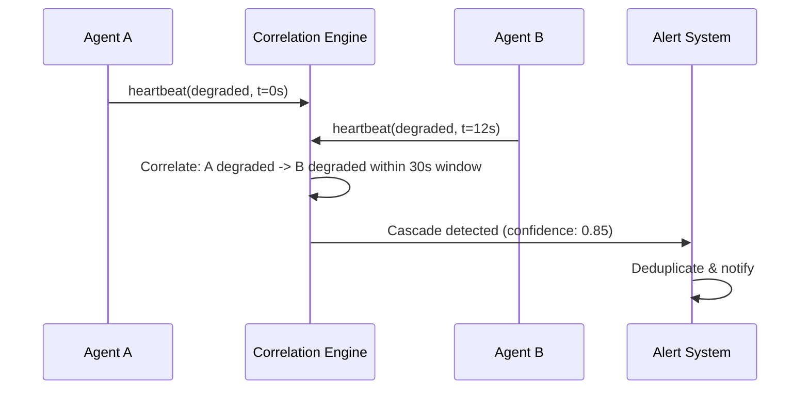

## Problem

When multiple AI agents interact (a coding agent triggers a monitoring agent triggers a remediation agent), a failure in one agent can cascade through the fleet. There is no standard way to detect these cascading failures before they spread.

Amazon had a 6-hour checkout outage in March 2026 caused by an AI agent following stale wiki data. An authentication agent locked out 22,000 users before anyone noticed. No observability layer caught the cascade as it propagated from one agent to the next.

The core issue: existing monitoring treats each agent as an isolated unit. When Agent A degrades and Agent B (which consumes A's output) degrades 30 seconds later, nothing connects those two events.

## Solution

Cross-agent heartbeat correlation. Each agent registers periodic heartbeats with status and metadata. A correlation engine detects patterns across agent boundaries using sliding time windows.

**Key components:**

- **Heartbeat registration:** Each agent emits periodic heartbeats with status (`healthy`, `degraded`, `down`), metadata (queue depth, error rate, latency), and a timestamp
- **Cross-agent dependency graph:** Built implicitly from timing correlations rather than requiring explicit dependency declarations
- **Sliding window correlation:** When Agent A's heartbeat degrades and Agent B degrades within a configurable time window, the engine flags a potential cascade
- **Cascade alert with evidence chain:** Alerts include the full sequence of agent degradations, timestamps, and confidence scores

```pseudo
function detectCascade(heartbeats, window) {
    degraded = heartbeats.filter(h => h.status !== "healthy")
    for each pair (a, b) in degraded:
        if abs(a.timestamp - b.timestamp) < window:
            if a.agentId !== b.agentId:
                flagCascade(a, b, confidence=f(timeDelta, window))
}
```



## Evidence

- **Evidence Grade:** `medium`
- Amazon March 2026: AI agent followed stale wiki data during checkout flow, cascading through authentication and payment agents. 22,000 users locked out for 6 hours before manual detection.
- NIST AI 600-1 identifies cascade failures in multi-agent systems as an open risk category, but proposes no detection mechanism.
- AgentWatch implementation validates the pattern with 16 passing tests covering heartbeat registration, cross-agent correlation, and cascade replay.

## How to use it

**When to apply:**

- Any system with 3+ interacting AI agents
- Agents that consume outputs from other agents
- Production deployments where cascade failures would be costly

**Implementation steps:**

1. Register heartbeats from each agent in your fleet (interval depends on agent criticality, typically 10-60 seconds)
2. Configure correlation windows based on your agent interaction patterns (start with 30 seconds, tune from there)
3. Set alert thresholds for cascade confidence scores (0.7 is a reasonable starting point)
4. Use forensic replay after incidents to understand the full cascade chain

**Prerequisites:**

- All agents must participate for full coverage (partial coverage still catches some cascades)
- A shared storage layer for heartbeat data (SQLite works for small fleets, Postgres for larger ones)

## Trade-offs

**Pros:**

- Catches failures before they spread across the fleet
- Provides forensic evidence chain for post-incident analysis
- Lightweight: heartbeats are small payloads, correlation is O(n) per window
- No explicit dependency graph required; correlations emerge from timing

**Cons:**

- Requires all agents to participate (incomplete coverage misses cascades)
- Correlation windows need tuning per deployment
- False positives possible with aggressive window settings
- Adds a shared dependency (the heartbeat store) that itself can fail

## References

- [AgentWatch](https://github.com/nicofains1/agentwatch) - Open-source TypeScript library implementing this pattern with heartbeat registration, cross-agent correlation, and forensic replay
- [NIST AI 600-1](https://csrc.nist.gov/pubs/ai/600/1/final) - Identifies cascade failures in multi-agent systems as an open risk
- Amazon cascade incident analysis (March 2026)
