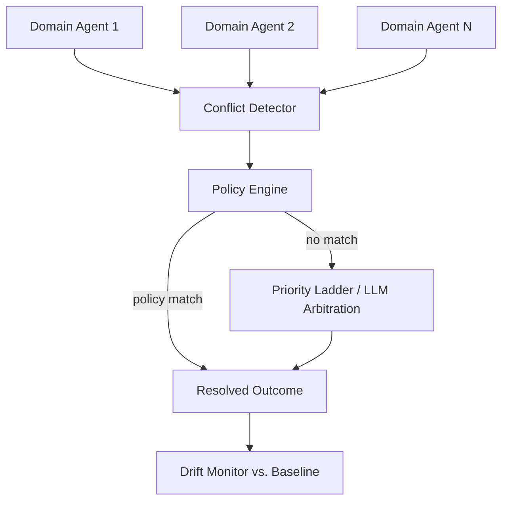

## Problem

Teams increasingly run several independent, domain-specific agents against the
same environment or dataset — e.g., a cost-optimization agent, a reliability
agent, a compliance agent, and a performance agent all assessing the same
cloud infrastructure. Each agent is individually competent within its domain,
but none of them are aware the others exist.

This produces silent, unresolved conflicts: one agent recommends deallocating
an idle resource to save cost, while another recommends adding redundancy to
the same resource for reliability, and a third recommends scaling it up for
performance. If recommendations are acted on independently (e.g., via
auto-remediation), the result is thrashing, wasted work, or actively harmful
changes — with no record of *why* the conflict happened or *which*
recommendation should have won.

## Solution

Insert a coordination/governance layer **above** the domain agents that never
does the domain-specific assessment itself, but instead:

1. **Collects** each domain agent's output as structured findings/
   recommendations keyed by a shared resource identifier.
2. **Cross-references** recommendations by resource ID to detect conflicts
   (a "mesh" evaluation step) and computes a composite priority score per
   recommendation.
3. **Resolves** conflicts through policy-as-code (e.g., OPA/Rego, or an
   embedded rule engine) rather than hardcoded if/else logic, so
   organizational governance rules (which domain wins, under which
   conditions) are explicit, versioned, and auditable — falling back to a
   domain-priority hierarchy or LLM-assisted arbitration only when no policy
   matches.
4. **Monitors drift** by comparing each new assessment against a previous
   baseline, flagging when risk levels, KPIs, or recommendation outcomes
   change materially over time.

## How to use it

**Applicable when:**

- More than one agent (or team) independently assesses/acts on the same
  resources, dataset, or environment.
- Conflicting recommendations have real cost if acted on blindly (financial,
  operational, or compliance risk).
- You need an auditable record of *why* one recommendation was chosen over
  another, not just which one "won."

**Implementation considerations:**

- Recommendations need a common resource identifier scheme across all domain
  agents — without it, conflict detection can't match records at all.
- Start with a small number of explicit policies covering your highest-risk
  conflicts (e.g., "reliability protections override cost optimizations for
  production resources") before trying to cover every case.
- Keep a fallback resolution path (priority ladder, human escalation, or
  LLM-assisted arbitration) for conflicts no policy anticipated — don't let
  the system silently drop unmatched conflicts.
- The coordination layer should stay domain-agnostic: it should not need code
  changes to support a new domain agent, only a new policy and a mapping into
  the shared schema.

## Trade-offs

**Pros:**

- Conflicts become visible and auditable instead of silently overwriting each
  other or executing in an undefined order.
- Governance logic lives in versioned, reviewable policy files rather than
  scattered application code.
- New domains can be added without changing the arbitration logic, only
  adding policies/mappings.

**Cons:**

- Adds a coordination hop and latency versus letting each agent act
  independently.
- Requires upfront investment in a shared resource-identifier scheme across
  otherwise-independent agent teams.
- Policy coverage has to be actively maintained — stale or missing policies
  fall back to weaker heuristics (priority ladder/LLM), which are less
  auditable than explicit rules.

## References

- [Open Policy Agent](https://github.com/open-policy-agent/opa) — general-purpose policy-as-code engine for explicit, versioned arbitration rules.
- [Multi-Criteria Decision Analysis](https://www.gov.uk/government/publications/multi-criteria-analysis-manual-for-making-government-policy) — guidance for making trade-offs among competing objectives explicit and reviewable.
