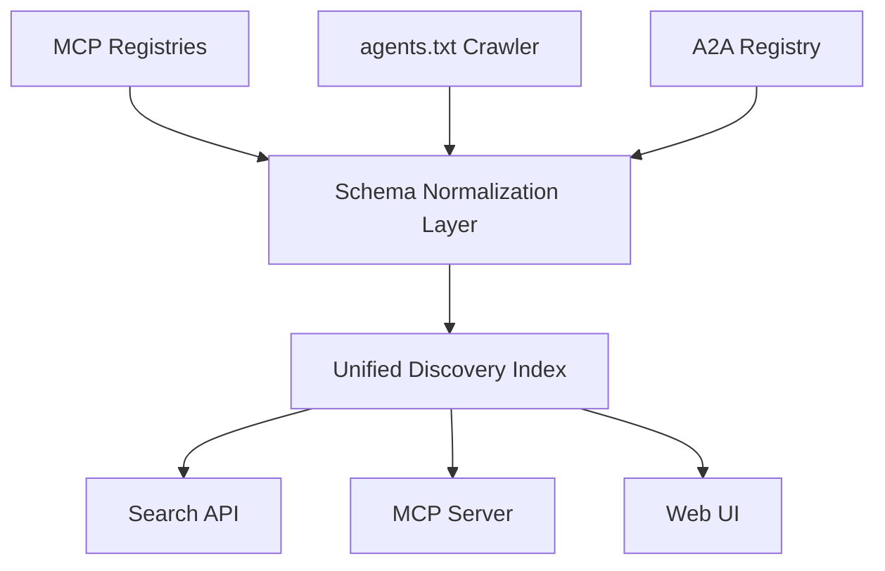

## Problem

The AI agent ecosystem is fragmented across multiple incompatible discovery protocols:

- **MCP (Model Context Protocol)**: Multiple competing registries (mcp.so, Glama.ai, Smithery, PulseMCP) each with partial coverage and no cross-referencing
- **agents.txt**: A convention for advertising agent capabilities via a well-known file, similar to robots.txt
- **Google A2A (Agent-to-Agent)**: Google's protocol for inter-agent communication and discovery
- **ACDP (Agent Communication Description Protocol)**: Standardized agent capability descriptions
- **Platform-specific directories**: OpenAI GPT Store, Claude integrations, and others each maintain their own listings

No single registry covers all protocols. An agent listed in an MCP registry won't appear in A2A directories, and vice versa. This creates a discovery problem analogous to early web search before meta-search engines.

## Solution

Aggregate agent metadata across registries and protocols into a unified, protocol-agnostic discovery layer:

1. **Registry Crawling**: Periodically ingest agent listings from each protocol-specific registry via their APIs or structured feeds
2. **Schema Normalization**: Map each registry's metadata schema to a common format (name, description, capabilities, transport, auth, endpoint)
3. **Protocol Tagging**: Label each agent with its supported protocol(s), enabling cross-protocol search and comparison
4. **Unified Search API**: Expose a single search interface that queries across all normalized data
5. **Validation**: Verify agent endpoints are reachable and metadata is accurate at crawl time

## How to use it

- **Agent platforms**: Query the aggregated index to discover the best available agent for a task regardless of its native protocol
- **Developer tooling**: Integrate cross-protocol search into IDEs and CLI tools so developers find relevant agents without knowing which registry hosts them
- **Orchestration systems**: Route tasks to agents across protocol boundaries by maintaining a unified capability index

**Implementation considerations**:

- Start with the highest-coverage registries for your use case and expand incrementally
- Implement incremental sync with per-registry rate limits rather than full re-crawls
- Cache normalized metadata with TTLs appropriate to each registry's update frequency
- Consider exposing the aggregated index as an MCP server itself, enabling agents to discover other agents programmatically

## Trade-offs

- **Pros:** Single search surface for all agent protocols; protocol-agnostic so it adapts as protocols emerge or fade; reduces vendor lock-in to any single registry; enables cross-protocol capability comparison.
- **Cons:** Aggregation introduces latency versus direct registry queries; schema normalization loses protocol-specific metadata; operational burden of maintaining crawlers for each registry; stale data risk if registries update faster than sync cycles; discovery does not equal trust — aggregation verifies listing accuracy, not agent quality.

## References

- [Model Context Protocol Specification](https://modelcontextprotocol.io) — Anthropic's protocol for LLM-tool integration
- [agents.txt Specification](https://agentsprotocol.ai) — Convention for advertising agent capabilities
- [Google A2A Protocol](https://github.com/google/A2A) — Agent-to-Agent communication protocol
- Related catalogue patterns: [Tool Search Lazy Loading](tool-search-lazy-loading.md), [Progressive Tool Discovery](progressive-tool-discovery.md), [Static Service Manifest for Agents](static-service-manifest-for-agents.md)
