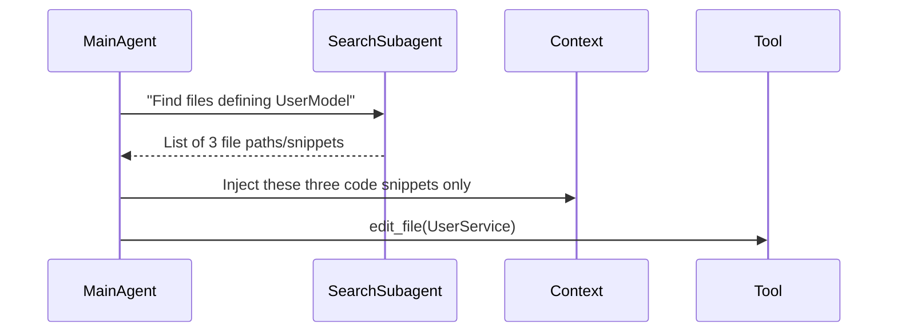

## Problem

Loading **all source files** or dumping entire repositories into the agent's context overwhelms the model, introduces noise, and slows inference. Coding agents need to focus on **only the most relevant modules** to efficiently reason about changes or generate new functionality.

- Including every file biases the agent with irrelevant code; it "loses coherence" over large contexts.
- Large contexts inflate token usage, slowing down multi-turn RL training.

## Solution

Maintain a **minimal, high-signal code context** (keeping the context "sterile") for the main coding agent by:

**1. Context Sterilization**
- Exclude unrelated modules (e.g., test utilities when working on a UI component).
- Automatically identify relevant files via a lightweight **search agent** that returns top-K matches for a function or class name.

**2. Helper Subagent for Code Discovery**
- Spawn a **SearchSubagent** (a small LLM, vector-search index, or standard tools like `grep`/`ripgrep`) that takes a file path or query (e.g., "find definitions of `UserModel`") and returns a ranked list of file snippets.
- Only top-3 snippets (each ≤ 150 tokens) are injected into the main agent's context.
- Use **progressive disclosure**: fetch file summaries first, then load full content only when needed.

**3. Context Update Cycle**
- **Main Agent:** "I need to refactor `UserService`."
- **SearchSubagent:** "Found `user_service.py`, `models/user.py`, `utils/auth.py`."
- **Context Injection:** Only those three files (or their summaries) enter the main agent's window.

## Example

```mermaid
sequenceDiagram
    MainAgent->>SearchSubagent: "Find files defining UserModel"
    SearchSubagent-->>MainAgent: List of 3 file paths/snippets
    MainAgent->>Context: Inject these three code snippets only
    MainAgent->>Tool: edit_file(UserService)
```

## How to use it

- **Indexing Stage (Offline):** Build a simple **code index** (e.g., with `ripgrep`, `tree-sitter` AST parsing, or a vector store) to map function/class names to file paths.
- **Subagent Definition:** Define `SearchSubagent` as a function that queries the code index and uses a small LLM to filter and rank matches. Modern implementations often skip vector embeddings entirely, using standard tools (`grep`, `find`, file traversal) for cleaner deployment and always-current results.
- **Context Management Library:** Create a wrapper (e.g., `CuratedContextManager`) that automatically invokes `SearchSubagent` when the main agent asks for relevant code.

## Trade-offs

- **Pros:**
  - **Noise Reduction:** Keeps the context focused on pertinent code, improving reasoning clarity.
  - **Token Efficiency:** Dramatically reduces tokens consumed per step, boosting RL throughput.
  - **Context Anxiety Mitigation:** Helps prevent [context window anxiety](context-window-anxiety-management.md) by keeping usage well below limits.
  - **Cleaner Deployment:** Agentic search using standard tools avoids vector embedding infrastructure and always reflects current code state.
- **Cons/Considerations:**
  - **Index Freshness:** If code changes frequently, the index must be updated to avoid stale results.
  - **Complexity:** Adds an extra component (SearchSubagent + index) to the training and inference pipeline.
  - **Model Adaptation Required:** Different models may have varying tolerance for curated vs. full context approaches.

## References

- "Context is sacred" principle from the Open Source Agent RL talk (May 2025).
- Will Brown's commentary on "avoiding blowing up your context length" for long-horizon tasks.
- [Thorsten Ball's "Raising An Agent - Episode 3"](https://www.nibzard.com/ampcode) - Production-validated implementation of dedicated search agent pattern.
- [Sourcegraph: "What Sourcegraph learned building AI coding agents"](https://www.nibzard.com/ampcode) (May 2025) - Enterprise-scale AST-based codebase understanding.
