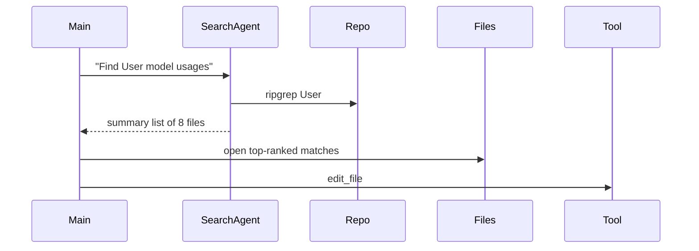

## Problem
Dumping "everything" into context introduces noise; irrelevant files bias the agent.

## Solution
Keep the primary agent's context **sterile**: only high-signal files plus the task spec.
Spawn helper agents (e.g., *search agent*) whose noisy exploration never pollutes the main window.

## Example

## References

* Raising An Agent - Episode 3's "context is sacred" + dedicated search agent pattern.

[Source](https://www.nibzard.com/ampcode)