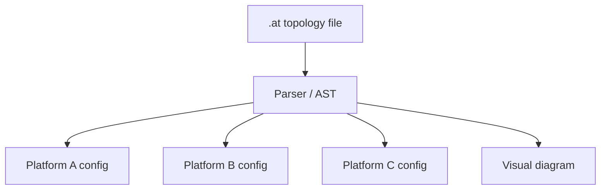

## Problem

Multi-agent systems today are wired imperatively: each framework has its own SDK, config format, and orchestration primitives. This creates several problems:

- **Vendor lock-in**: A supervisor topology built for one framework must be rewritten from scratch to run on another.
- **Implicit topology**: The agent graph — who talks to whom, what gates block progress, which flows fan out — is buried in code rather than visible at a glance.
- **No single source of truth**: When the topology lives across scattered config files, prompts, and glue code, refactoring or auditing the system requires reading everything.
- **Repeated scaffolding work**: Teams re-implement the same patterns (pipeline, fan-out, debate, human-in-the-loop gate) in every new project and every new framework.

## Solution

Define the entire multi-agent topology in a single declarative file using a purpose-built grammar. The file describes **what** the system looks like — agents, flows, gates, hooks, group chats — and a compiler generates **how** it runs on each target platform.

**Core primitives:**

1. **Agents**: Name, model, role, tools, and constraints.
2. **Flows**: Directed edges between agents — pipelines, fan-out, fan-in, cycles.
3. **Gates**: Approval checkpoints (human, automated, or conditional) positioned between flow steps.
4. **Hooks**: Lifecycle callbacks (pre-run, post-run, on-error) attached to agents or flows.
5. **Group chats**: Multi-agent conversation protocols with turn-taking rules.

```
topology code-review {
  agent reviewer {
    model "claude-sonnet"
    role "Review pull requests for correctness and style"
    tools [grep, read_file]
  }

  agent security {
    model "claude-sonnet"
    role "Check for security vulnerabilities"
    tools [grep, semgrep]
  }

  agent summarizer {
    model "claude-haiku"
    role "Produce a concise review summary"
  }

  flow fan-out {
    start -> [reviewer, security]  // parallel
    [reviewer, security] -> summarizer  // fan-in
  }

  gate human-approval {
    after summarizer
    type human
    prompt "Approve this review before posting?"
  }
}
```

A compiler parses the topology into an AST and emits platform-specific output — config files for CLI agents, runnable code for SDK targets, or visual diagrams for documentation.



## How to use it

- **Start with a common pattern**: Pipeline, fan-out/fan-in, or supervisor are good first topologies. Express the agent graph declaratively before writing any imperative glue.
- **Compile to your target**: Use a binding/compiler to emit the platform-specific configuration or code. If your framework is not yet supported, the AST is a clean compilation target.
- **Enforce gates declaratively**: Rather than sprinkling approval logic throughout your code, declare gates at specific flow positions. The compiler maps them to each platform's strongest enforcement mechanism.
- **Version the topology**: The declarative file is small, diffable, and reviewable. Check it into version control alongside your code.
- **Visualize before running**: Generate a diagram from the topology to verify the agent graph matches your intent before deploying.

## Trade-offs

**Pros:**

- **Portability**: One topology definition works across multiple frameworks — switch platforms without rewriting orchestration logic.
- **Readability**: The full agent graph is visible in one file, making review and onboarding faster.
- **Pattern reuse**: Common multi-agent patterns (pipeline, debate, supervisor) become composable building blocks rather than bespoke code.
- **Auditability**: Gates, permissions, and flows are explicit and diffable in version control.

**Cons:**

- **Abstraction cost**: A declarative layer cannot expose every platform-specific feature; escape hatches or extensions are needed for advanced cases.
- **Grammar learning curve**: Teams must learn a new syntax, though the goal is to keep it minimal and readable.
- **Compiler fidelity**: Each binding must faithfully map declarative primitives to platform capabilities, which varies across targets.
- **Early ecosystem**: The pattern is emerging; tooling and community support are still maturing.

## References

- [AgenTopology](https://github.com/agentopology/agentopology) — Open-source reference implementation: parser, validator, CLI, visualizer, and bindings for multiple platform targets. Apache-2.0.
- Jennings, N. R. (2001). "An agent-based approach for building complex software systems". Communications of the ACM. — Foundational work on multi-agent system architectures and coordination patterns.
- Wooldridge, M. (2009). *An Introduction to MultiAgent Systems*. Wiley. — Textbook covering agent communication languages, interaction protocols, and organizational structures.
