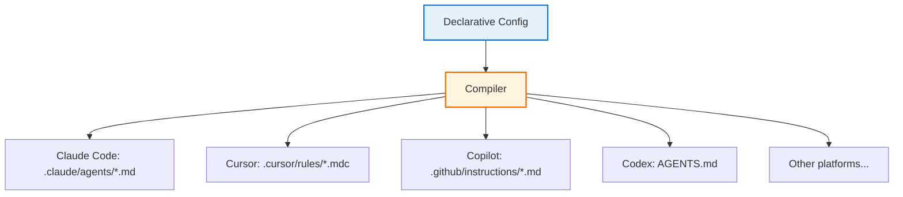

## Problem

Multi-agent pipelines are tightly coupled to whichever agent platform runs them. A team that builds a pipeline for one platform (e.g., Claude Code agents, Cursor rules, Copilot instructions) must rewrite the entire pipeline to use another. This creates several problems:

- **Vendor lock-in**: Pipeline definitions use platform-specific formats (`.claude/agents/*.md`, `.cursor/rules/*.mdc`, `.github/copilot-instructions.md`, `AGENTS.md`), making migration costly.
- **Duplicated maintenance**: Teams supporting multiple platforms maintain parallel copies of the same pipeline logic, which inevitably drift.
- **No separation of concerns**: Pipeline structure (which agents exist, how they connect, what state they share) is mixed into platform-specific formatting and frontmatter.
- **Composition is manual**: Reusing skill fragments across agents requires copy-pasting markdown blocks, with no mechanism for declaring dependencies or composing skills from smaller pieces.

## Solution

Treat agent pipeline definitions like source code: write them once in a **declarative configuration language**, then **compile** to each target platform's native format.

**Core components:**

1. **Declarative config**: A single YAML (or similar) file defines atomic skills, composed agents, typed state schemas, and execution flow with conditional routing.
2. **Skill composition**: Small, reusable skill fragments are composed into agents by reference. Composition is recursive - a composed skill can include other composed skills.
3. **Typed state schema**: Shared state between agents is declared with types, read/write permissions, and external resource locations. The compiler validates state access at build time.
4. **Execution flow graph**: A directed graph defines agent ordering, conditional transitions (when-clauses), loops, and parallel map operations.
5. **Platform-specific compilation**: A compiler transforms the canonical config into each platform's native file layout and frontmatter format.

```yaml
# Single source of truth
skills:
  atomic:
    planner: ./skills/planner
    engineer: ./skills/engineer
    reviewer: ./skills/reviewer
  composed:
    senior-engineer:
      - planner
      - engineer

state:
  plan: string
  code: string
  approved: boolean

team:
  flow:
    senior-engineer:
      reads: [plan]
      writes: [code]
      then: reviewer
    reviewer:
      reads: [code]
      writes: [approved]
      then:
        - when: "approved == false"
          goto: senior-engineer
        - when: "approved == true"
          goto: done
```



**The compilation step handles platform differences:**

- File layout (single file vs. directory tree)
- Frontmatter format (YAML vs. platform-specific keys)
- Skill/agent naming conventions
- Orchestrator rendering (step numbering, state tables)

## How to use it

**When this pattern applies:**

- Your team uses more than one agent platform, or may switch platforms in the future.
- You have reusable skill fragments shared across multiple agents.
- Your pipeline has a defined execution flow with conditional routing or parallel work.
- You want compile-time validation of state access, skill references, and graph structure.

**Implementation approach:**

1. **Define atomic skills** as standalone markdown files, each describing one capability.
2. **Compose agents** by listing which atomic skills they include, in order.
3. **Declare shared state** with types and external resource locations.
4. **Define the execution graph** with transitions, conditions, and loops.
5. **Compile** to your target platform. The compiler reads the config, resolves skills, validates the graph, and writes platform-native output.
6. **Use `--check` in CI** to verify compiled output stays in sync with the config.

**Validation the compiler can perform at build time:**

- Skill reference resolution (all referenced skills exist)
- State read/write conflict detection
- Graph cycle detection with exit-condition verification
- Transition target validation
- When-clause expression parsing against the state schema

## Trade-offs

**Pros:**

- **Platform independence**: Switch agent platforms by changing a compiler flag, not rewriting the pipeline.
- **Single source of truth**: One config file defines the entire pipeline; no parallel copies to maintain.
- **Compile-time safety**: Catch misconfigurations (missing skills, state conflicts, unreachable nodes) before runtime.
- **Reusable skills**: Atomic skills compose into agents without duplication. Shared skill libraries can be published and imported.
- **Auditable diffs**: Pipeline changes are config changes, reviewable in standard code review.

**Cons:**

- **Abstraction cost**: An intermediate config language adds a layer between the author and the platform-native format.
- **Platform feature lag**: New platform-specific features require compiler updates before they can be used.
- **Build step required**: Changes to the config require recompilation; forgetting to compile produces stale output.
- **Learning curve**: Authors must learn the config schema in addition to the underlying platform concepts.

## References

- [Skillfold](https://github.com/byronxlg/skillfold) - Open-source implementation (MIT) compiling YAML configs to 11 agent platforms including Claude Code, Cursor, Copilot, Codex, Gemini, Windsurf, Goose, Roo Code, Kiro, and Junie. Available on [npm](https://www.npmjs.com/package/skillfold). Contributor-affiliated project.
- Czarnecki, K. & Eisenecker, U. (2000). *Generative Programming: Methods, Tools, and Applications*. Addison-Wesley. - Foundational work on multi-target code generation from declarative specifications.
- Related patterns in this repository: [Team-Shared Agent Configuration as Code](team-shared-agent-configuration.md), [Specification-Driven Agent Development](specification-driven-agent-development.md), [Hybrid LLM/Code Workflow Coordinator](hybrid-llm-code-workflow-coordinator.md)
