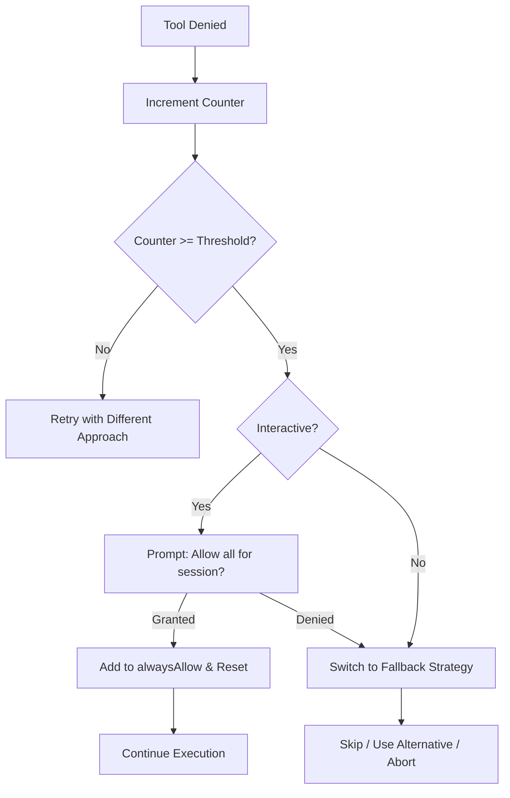

## Problem

When agents run in non-interactive contexts (background jobs, CI/CD pipelines, headless mode), every permission prompt is typically auto-denied. If the agent keeps attempting the same blocked tool, it wastes its iteration budget retrying an action that will never succeed. This leads to silent failures, stalled tasks, and burned compute with no progress.

Even in interactive mode, a user who repeatedly denies a specific tool creates the same loop: the agent tries, gets denied, tries again with a slightly different argument, and gets denied again.

## Solution

Maintain a per-tool denial counter scoped to the current conversation. After a configurable threshold of denials (typically 3), escalate instead of retrying:

- **Interactive mode:** Prompt the user for blanket permission ("Bash has been denied 3 times. Allow all Bash for this session?").
- **Non-interactive mode:** Switch to a fallback strategy (use a different tool, skip the step, or abort with a clear error).

```pseudo
class DenialTracker:
    counts: Map<string, number>   // tool_name -> denial count
    threshold: number = 3

    on_denial(tool_name):
        counts[tool_name] = (counts[tool_name] || 0) + 1
        if counts[tool_name] >= threshold:
            return ESCALATE
        return RETRY_DIFFERENT

    on_allow(tool_name):
        counts.delete(tool_name)   // reset on success
```

When escalation triggers and the user grants blanket permission, add the tool to `alwaysAllowRules` for the remainder of the session and reset the counter.



## How to use it

- **Per-conversation tracking:** Denial counters reset at session start. No state persists across conversations.
- **Subagent isolation:** Subagents maintain their own local denial tracking since their state writes may be no-ops in the parent.
- **Configurable thresholds:** Different tools may warrant different thresholds. Shell access might escalate after 2 denials; file reads after 5.
- **Combine with permission tiers:** Pair with a multi-layer permission system so that escalation grants the minimum viable scope (e.g., allow Bash but only for read-only commands).

**When to apply:**

- Background or headless agent runners where prompts are auto-denied
- CI/CD agents that need certain tools to complete their task
- Long-running interactive sessions where approval fatigue is likely

## Trade-offs

- **Pros:** Prevents wasted iteration loops; surfaces the real blocker early; reduces approval fatigue in interactive mode; trivial to implement (a counter and a branch).
- **Cons:** Blanket session permissions widen the attack surface after escalation; threshold tuning requires experimentation; fallback strategies must be defined per tool, adding configuration overhead.

## References

- [AI Agent Patterns Playbook — Pattern 70: Denial Tracking](https://github.com/muriloscigliano/ai-playbook) — production-hardened pattern catalogue covering 78 agent engineering patterns
- Related: [Human-in-the-Loop Approval Framework](/patterns/human-in-loop-approval-framework) — complementary pattern for initial approval gates
- Related: [Hook-Based Safety Guard Rails](/patterns/hook-based-safety-guard-rails) — external interceptors that can enforce denial policies
- Related: [Sandboxed Tool Authorization](/patterns/sandboxed-tool-authorization) — scoped permissions that limit what escalation can grant
