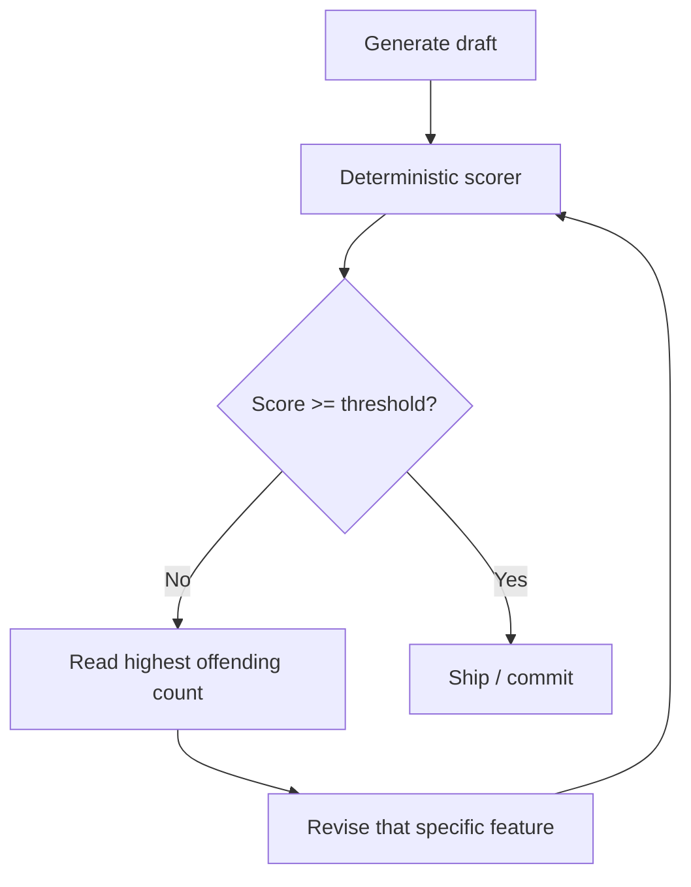

## Problem

An agent that produces text is routinely asked to judge that text before shipping it: *is this argument sound, is this copy generic, does this read as machine-written?* The default move is to ask a model — LLM-as-judge, or an off-the-shelf classifier.

Both fail the agent in the same specific way: **the verdict is not actionable and not reproducible.**

- A classifier returns `87% likely AI-generated`. There is no next move encoded in that number. The agent's only recourse is to rewrite blindly and re-roll.
- An LLM judge returns a different score for the same input across runs, and drifts with model versions, so it cannot gate a pipeline or be asserted in a test.
- Both make an *authorship* claim from *style* evidence, and are wrong in both directions.

The loop stalls because the feedback has no gradient.

## Solution

Put a **deterministic scorer** in the loop instead of a judge. The scorer counts observable, enumerated features and returns **the raw counts alongside each sub-score** — not just the aggregate.

Core properties:

- **Deterministic** — same input, same output, always. No sampling, no model call.
- **Decomposed** — the aggregate is made of named sub-scores, each traceable to a count.
- **Local and free** — no API call, so it can run on every iteration without cost or latency pressure.
- **Honest about what it measures** — it reports a *style* measurement, never an authorship verdict.

The agent loop becomes a hill-climb with an actual gradient:

```pseudo
draft = generate()
loop until score >= threshold or budget exhausted:
    report = score(draft)          // deterministic, decomposed
    worst  = argmax(report.counts) // e.g. {"hype": 5, "em_dash": 9, "specifics": 0}
    draft  = revise(draft, target=worst)
```



`"hype": 5` tells the agent to cut five specific words. `87% likely AI` tells it nothing. That difference is the whole pattern.

This is the same shape a coding agent already gets for free from a linter, a type checker, or a failing test — deterministic, decomposed, actionable. The pattern is simply noticing that non-code outputs deserve the same treatment, and that reaching for a model to grade them is usually a downgrade.

## Evidence

- **Evidence Grade:** `low`
- **Most Valuable Findings:**
  - Applying one such scorer to a corpus of 239 real product landing pages produced a stable distribution (median 79/100) and surfaced a counter-intuitive dominant feature: **82% (195/239) of hero sections contain no concrete number at all** — while the widely assumed "hype words" tell fired on only 7%, and em-dash density on a similarly small slice. A decomposed scorer finds this; a single opaque probability cannot. Open dataset and method: <https://gist.github.com/parweb/5ed569ba76c365f7b789a979ad6090e7>
  - The same corpus shows why the *style, not authorship* framing is load-bearing: `stripe.com` scores 61 and was plainly written by professionals. A low score means *reads generic*, never *was generated*.
- **Unverified / Unclear:** whether closing this loop measurably improves human-judged output quality, or mostly teaches the agent to satisfy the metric (see Goodhart risk below). No controlled comparison against an LLM-judge loop has been run.

## How to use it

1. **Enumerate the features** that make the attribute good or bad, in the narrowest domain you can get away with. This is the real work, and it is domain-specific.
2. **Write a pure function** from artifact to `{score, sub_scores, counts}`. No network, no model.
3. **Expose the counts**, not only the total. The counts are the actionable part; the total is only for gating.
4. **Expose it as a tool** the agent can call mid-task (an MCP server, a CLI, a library function) so the loop closes without a human.
5. **Gate on it** — because it is deterministic, a threshold can live in a test or a CI check.
6. **Calibrate against a real corpus** and publish the distribution, so a score has a referent. A bare 0-100 with no baseline is not interpretable.

Good fits: style and readability checks, format and schema conformance, jargon and hedging density, required-element presence, structural repetition. Poor fits: factual accuracy, novelty, and audience appropriateness — keep a model, or a human, for those.

## Trade-offs

**Pros**
- Reproducible: assertable in tests, usable as a CI gate, comparable across runs and over time.
- Actionable: names the specific thing to change, giving the revision loop a gradient.
- Cheap and offline: no token cost or latency, so it can run on every iteration.
- Auditable: anyone can read the rules and disagree with them explicitly.

**Cons**
- **Measures only what you thought to count.** Blind to failure modes outside the enumerated feature set.
- **Goodhart risk is real and direct.** An agent optimising a metric it can read will learn to satisfy the metric. Cap the iterations, and keep the threshold well below the maximum.
- Requires a calibration corpus to be interpretable, which is upfront work.
- Says nothing about meaning, truth, or fit for audience — a maximal score can still be worthless prose.
- Rules need maintenance as conventions shift.

## References

- Reference implementation, MIT, offline, no model call: <https://github.com/parweb/mcp-ai-slop-checker>
- Calibration corpus — 239 landing pages scored, open CSV plus method: <https://gist.github.com/parweb/5ed569ba76c365f7b789a979ad6090e7>
- Related in spirit: linters, type checkers and property-based tests as agent feedback — the same deterministic-signal argument, applied to code.
