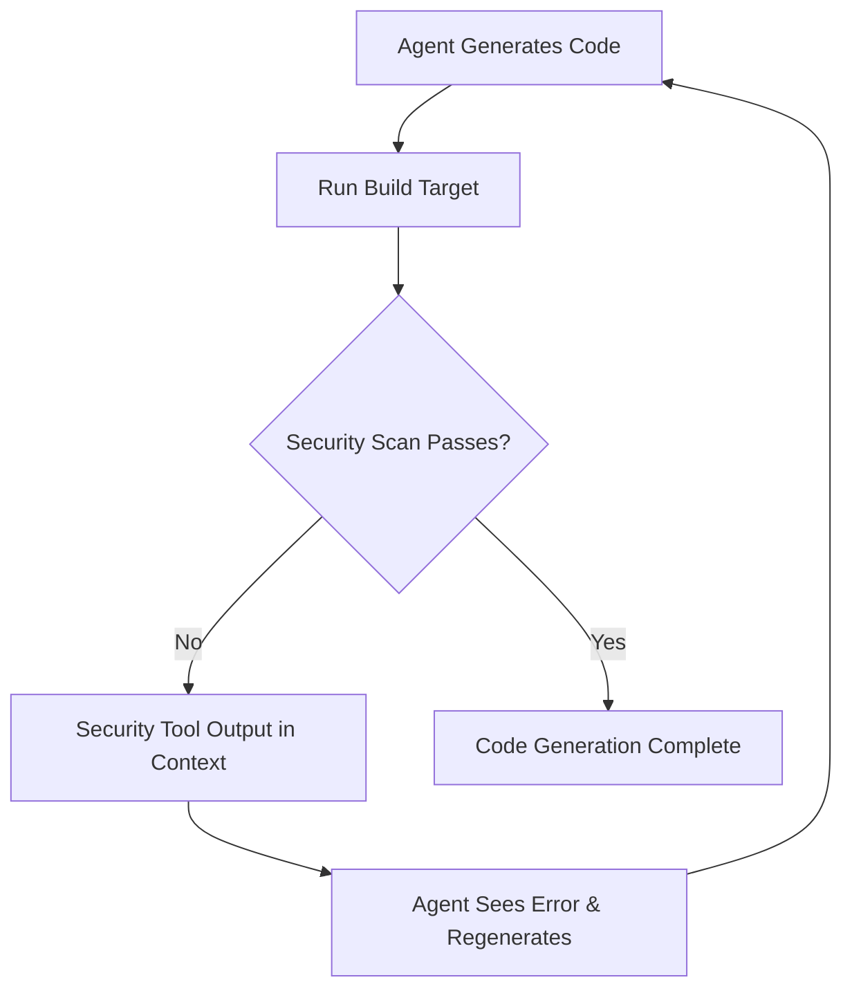

## Problem

Non-deterministic approaches to security in AI code generation (Cursor rules, MCP security tools) are fundamentally flawed because security requires absolute determinism - code is either secure or not secure, with no grey area. These approaches are merely suggestions to the LLM that may or may not be followed consistently.

## Solution

Implement **deterministic security validation** through the build loop using a two-phase approach:

1. **Generation Phase** (non-deterministic): Agent generates code based on suggestions and context
2. **Backpressure Phase** (deterministic): Security scanning tools validate the generated code

The key is integrating existing security scanning tools (SAST, DAST, PBT) directly into the build target that agents must execute after every code change.

```makefile
.PHONY: all build test security-scan

all: build test security-scan

build:
    @echo "Build completed successfully"
    @exit 0

test:
    @echo "Tests completed successfully" 
    @exit 0

security-scan:
    # Use your existing security scanning tool
    semgrep --config=auto src/
    bandit -r src/
    @exit $?
```

Configure agent instructions to mandate build execution:

```markdown
# Agent Instructions

## Code Quality 

After every code change, you MUST:

1. Run `make all` to verify that the code builds successfully and tests pass.
2. IMPORTANT: You MUST resolve any security issues identified during compilation.
```



## How to use it

1. **Inner Loop (Development)**:
   
- Integrate existing security scanning tools into your build target
   - Configure agent instructions to run build after every change
   - Let the agent see security tool output and iterate

2. **Outer Loop (CI/CD)**:
   
- Use the same security tools in your pull request checks
   - Maintain one unified rules database across both loops

3. **Implementation Steps**:
   
- Add security scanning tools to Makefile/package.json/build script
   - Update agent configuration (AGENTS.md/Cursor rules) to mandate build execution
   - Ensure security tools exit with non-zero codes on violations

## Trade-offs

**Pros:** 
- Leverages deterministic, battle-tested security tools
- Reuses existing security infrastructure and rules
- Works with any coding agent/harness
- Provides consistent security validation

**Cons:** 
- Increases build time and CI resource usage
- May produce false positives requiring human review
- Requires fast security tools for good developer experience

## References

* [Geoffrey Huntley's blog post on secure code generation](https://ghuntley.com/secure-codegen/)
* This generalizes beyond security to any code quality or pattern enforcement