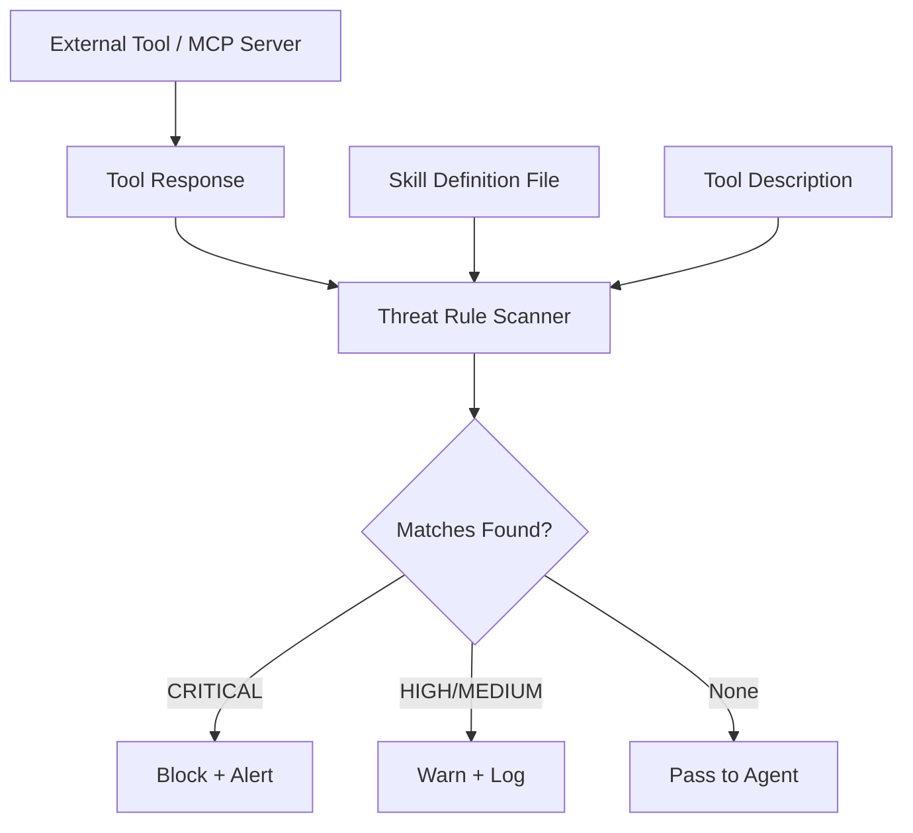

## Problem

AI agents that invoke external tools (MCP servers, function calls, skill files) are exposed to a class of attacks where malicious content is embedded in tool descriptions, responses, or skill definitions. These attacks include prompt injection via tool output, data exfiltration through encoded parameters, privilege escalation via hidden instructions, and tool poisoning through manipulated descriptions.

LLM-based detection alone is unreliable for these threats: adversaries can craft payloads that exploit the same reasoning flexibility that makes LLMs useful. Security requires a deterministic baseline that cannot be bypassed by clever prompt engineering.

## Solution

Maintain a library of deterministic regex-based rules, each targeting a specific threat pattern observed in real-world agent attacks. These rules run against tool descriptions, tool call arguments, tool responses, and skill definition files before the agent processes them.

Each rule specifies:
- A threat category (e.g., prompt injection, data exfiltration, privilege escalation)
- One or more regex patterns matching known attack signatures
- Severity level and recommended action (block, warn, log)
- Test cases for both true positives and false positives

```pseudo
function scan(content, rules):
    findings = []
    for rule in rules:
        for pattern in rule.patterns:
            matches = regex_match(pattern, content)
            if matches:
                findings.append({
                    rule_id: rule.id,
                    severity: rule.severity,
                    match: matches[0],
                    action: rule.action
                })
    return findings

// Integration point: intercept before agent processes tool output
function on_tool_response(tool_name, response):
    findings = scan(response, threat_rules)
    critical = findings.filter(f => f.severity == "CRITICAL")
    if critical:
        block_and_alert(tool_name, critical)
    return response
```

The scanning layer sits between the agent and its tools, inspecting content at well-defined interception points:



The key insight is layered defense: deterministic rules catch known patterns with near-perfect precision, while LLM-based review handles novel or ambiguous threats as a second layer. The deterministic layer provides a floor of protection that does not degrade with adversarial prompt engineering.

## How to use it

1. **Choose interception points** based on your agent framework:
   - Tool descriptions (scan when tools are registered)
   - Tool call arguments (scan before execution)
   - Tool responses (scan before agent processes output)
   - Skill/plugin definition files (scan at install time)

2. **Start with high-confidence rules** targeting well-documented attack patterns:
   - Base64-encoded payloads in tool responses
   - Hidden instructions using Unicode or whitespace tricks
   - Cross-tool data exfiltration patterns
   - Privilege escalation via `sudo`, `chmod`, or role manipulation

3. **Integrate into your agent pipeline** as a synchronous check:
   - Block on CRITICAL findings (known dangerous patterns)
   - Warn on HIGH findings (suspicious but may be legitimate)
   - Log everything for post-incident analysis

4. **Evolve rules continuously** as new attack techniques emerge. Each rule should include test cases to prevent false positives from regressing precision.

## Trade-offs

- **Pros:**
  - Deterministic and auditable: every detection decision is traceable to a specific rule
  - Near-zero latency compared to LLM-based security review
  - Cannot be bypassed by prompt injection (rules run outside the LLM context)
  - Rules are composable and independently testable
  - Complements LLM-based detection as part of a layered defense

- **Cons:**
  - Regex rules only catch known patterns; novel attacks require rule updates
  - Recall is inherently limited by the rule library's coverage
  - May produce false positives on legitimate content that resembles attack patterns
  - Requires ongoing maintenance as the threat landscape evolves
  - Pattern matching cannot understand semantic intent (e.g., distinguishing a legitimate base64 string from an exfiltration payload)

## References

- [Agent Threat Rules (ATR)](https://github.com/panguard-ai/agent-threat-rules) — Open-source rule library with 76 rules covering prompt injection, tool poisoning, data exfiltration, and privilege escalation; 62.7% recall and 99.7% precision on the PINT benchmark
- [OWASP Top 10 for Agentic Applications](https://owasp.org/www-project-top-10-for-large-language-model-applications/) — Industry framework categorizing agent-specific security risks
- [PINT Benchmark](https://arxiv.org/abs/2312.10997) — Prompt injection benchmark for evaluating detection systems
- [Deterministic Security Scanning Build Loop](patterns/deterministic-security-scanning-build-loop.md) — Related pattern applying deterministic scanning to the build loop
