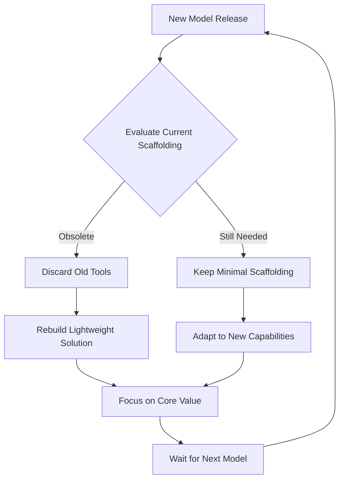

## Problem

In a field where foundation models improve dramatically every few months, investing significant engineering effort into building complex, durable features *around* the model is extremely risky. A feature that takes three months to build, such as a sophisticated context compression or a custom tool-chain for code editing, could be rendered obsolete overnight by the next model generation that performs the task natively.

## Solution

Adopt a "scaffolding" mindset when building tooling and workflows for an agent. Treat most of the code written around the core model as temporary, lightweight, and disposable—like wooden scaffolding around a building under construction.

- **Embrace "The Bitter Lesson":** Acknowledge that a lot of complex scaffolding will eventually "fall into the model" as its capabilities grow.
- **Prioritize Speed:** Build the simplest possible solution that works *now*, with the assumption that it will be thrown away later. This maximizes the team's ability to react to new models.
- **Avoid Over-Engineering:** Resist the urge to build scalable, robust, long-term solutions for problems that a better model could solve inherently. Focus engineering efforts on the unique value proposition that isn't directly tied to compensating for a model's current weaknesses.
- **Apply the 6-Month Test:** Before building complex tooling, ask: *"Will this be useful in 6 months when models improve?"* If NO, build as disposable scaffolding with explicit disposal triggers.
- **Make Disposability Explicit:** Document the temporary nature of scaffolding through clear naming, documented removal criteria, and architectural separation from durable features.

This approach keeps the product nimble and ensures that development resources are focused on adapting to the frontier of AI capabilities, rather than maintaining features that are destined for obsolescence.

## Example

## How to use it

- Apply when considering investments in model-specific workarounds like context compression, custom toolchains, or complex orchestration frameworks.
- Use the 6-month test: categorize as disposable if it compensates for current model limitations that newer models may handle natively.
- Design scaffolding for easy removal with well-defined interfaces to durable components and clear disposal triggers.
- Separate durable business value (domain knowledge, unique integrations) from temporary model workarounds.

## Trade-offs

* **Pros:** Faster development speed, lower maintenance burden, high adaptability to new models, intentional and bounded technical debt.
* **Cons:** Accepts lower code quality for temporary components, requires discipline to identify disposal triggers, can conflict with compounding engineering investments.

## References

- Described by Thorsten Ball: "What you want is... a scaffolding. Like you want to build a scaffolding around the model, a wooden scaffolding that if the model gets better or you have to switch it out, the scaffolding falls away. You know, like the bitter lesson like embrace that a lot of stuff might fall into the model as soon as the model gets better."

- Primary source: https://www.sourcegraph.com

- Cloudflare Code Mode: Ephemeral V8 isolates ("write once, vaporize immediately") for orchestrating MCP tool calls
