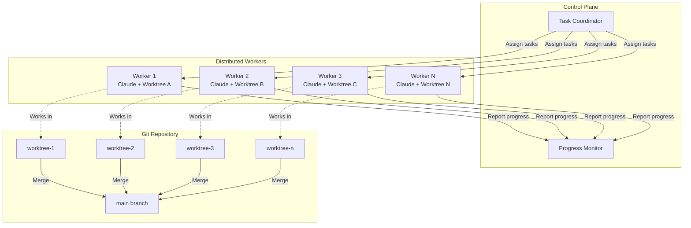

## Problem

Single-session AI agent execution cannot scale to meet enterprise team demands. Complex projects require multiple simultaneous code changes across different parts of the codebase, but coordinating multiple agents introduces challenges around communication, conflict resolution, merge coordination, and infrastructure management.

## Solution

Implement a distributed execution framework that runs multiple Claude Code sessions in parallel using git worktrees and cloud-based worker infrastructure. This enables team-scale AI code generation with proper synchronization and conflict management.

**Core architecture:**

**Git worktrees for isolation:**

- Each agent session runs in dedicated worktree
- Parallel development without checkout conflicts
- Independent file system views of the repository

**Cloud worker deployment:**

- Agent sessions execute on remote infrastructure
- Scale horizontally based on workload
- Centralized task distribution and coordination

**Synchronization layer:**

- Merge conflict detection and resolution
- Inter-agent communication protocols
- Shared state management for coordination

**Human oversight integration:**

- Approval gates for risky operations (see [Human-in-the-Loop Approval Framework](human-in-loop-approval-framework.md))
- Centralized monitoring dashboard
- Team notification channels (Slack, email)

## How to use it

**When to apply:**

- Team-wide code migrations or refactoring
- Parallel feature development across multiple services
- Large-scale testing infrastructure changes
- Framework upgrades affecting many files
- Organizations with high AI agent adoption

**Example workflow (HumanLayer's CodeLayer):**

1. **Task decomposition:**
   - Break project into parallelizable units
   - Assign each unit to worker session
   - Define dependencies and ordering constraints

2. **Worker deployment:**
   - Provision cloud workers (AWS, GCP, etc.)
   - Initialize git worktrees for each worker
   - Configure agent sessions with task contexts

3. **Parallel execution:**
   - Workers execute independently
   - Progress reported to central monitor
   - Conflicts flagged for resolution

4. **Synchronization:**
   - Coordinate merge order based on dependencies
   - Resolve conflicts with human assistance when needed
   - Integrate results into main branch

**Prerequisites:**

- Git worktree infrastructure
- Cloud compute resources
- Task coordination system
- Merge conflict resolution strategy
- Team communication channels

**Related patterns:**

Extends [Sub-Agent Spawning](sub-agent-spawning.md) and [Swarm Migration Pattern](swarm-migration-pattern.md) to cloud infrastructure with team coordination.

## Trade-offs

**Pros:**

- Massive parallelization (10x-100x speedup for suitable tasks)
- Scales to enterprise team needs
- Centralizes agent management and monitoring
- Enables team-wide AI adoption
- Reduces bottlenecks in large migrations

**Cons:**

- Significant infrastructure complexity
- Merge conflict management overhead
- Coordination logic development required
- Higher cost from parallel model usage
- Requires sophisticated orchestration system
- Network latency for cloud workers

## References

- [Building Companies with Claude Code](https://claude.com/blog/building-companies-with-claude-code) - HumanLayer's CodeLayer enables "teams run multiple Claude agent sessions in parallel"
- [HumanLayer Documentation](https://docs.humanlayer.dev/) - Framework for human-in-the-loop agent coordination
- Related patterns: [Sub-Agent Spawning](sub-agent-spawning.md), [Swarm Migration Pattern](swarm-migration-pattern.md), [Human-in-the-Loop Approval Framework](human-in-loop-approval-framework.md)
