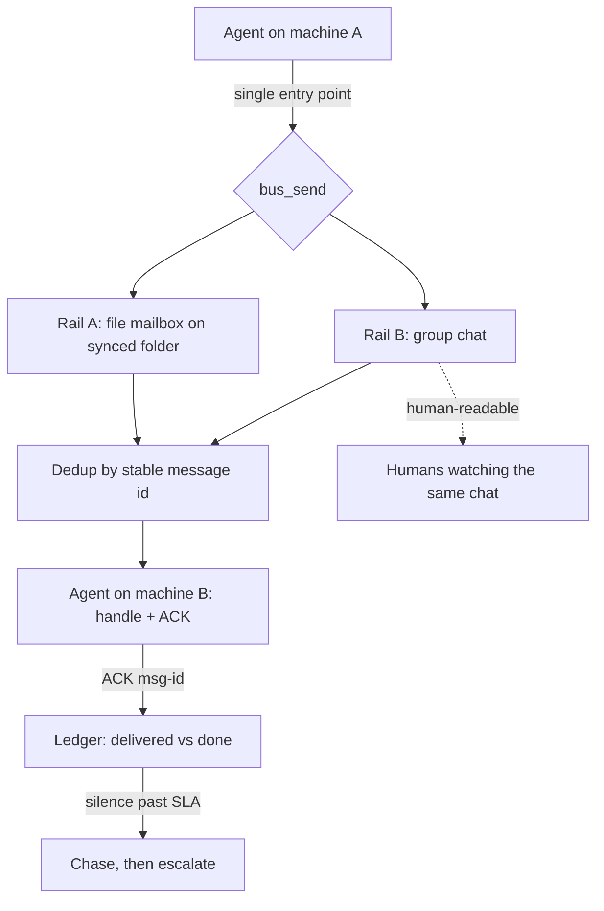

## Problem

Agents running on separate machines coordinate over a single channel: a synced folder, a queue, or a chat. That channel eventually fails, and it fails *quietly*.

The damage is not the outage itself, it is the ambiguity it creates. A dead channel and an idle channel produce exactly the same observation: nothing arrives. The sender's log says "sent" and stops there. The receiver has nothing to report, because it never learned a message existed. No exception is raised, no retry fires, and the fleet keeps behaving as if silence meant agreement. Outages are typically discovered hours later, by a human noticing that something downstream never happened.

Two properties make this failure mode expensive:

1. **"Sent" is not "delivered", and "delivered" is not "done"** — but a single channel collapses all three into one unobservable event.
2. **Machine-to-machine traffic is invisible to humans**, so the people who could intervene are the last to find out.

Retries do not fix this. Retrying on a dead rail produces more silence.

This is the practical face of a classical result: in an asynchronous system you cannot distinguish a crashed participant from a slow one by observing messages alone (Chandra & Toueg, 1996). A single channel gives the observer exactly one such source of evidence, so "no message" stays undecidable. A second, independently failing channel does not repeal the result — it supplies a second observation, which is enough to tell "the peer is quiet" from "the path is dead".

## Solution

Send every message on **two independent rails at once**, and make sending on only one rail *unrepresentable* rather than merely discouraged.

**The two rails:**

- **Rail A — a file mailbox** on a synced folder (Syncthing, Dropbox, git). Works offline, carries large payloads, survives outages of the chat provider.
- **Rail B — a group chat** (Telegram, Slack, Discord) that both the machines *and the humans* read. Survives sync-link outages, and makes traffic human-visible at zero extra cost.

**The four mechanisms that make it work:**

1. **One entry point.** All sends go through a single function that has no parameter for choosing a rail. There is no API through which a single-rail send can be expressed. This matters more than documenting the rule: before the single entry point existed, ad-hoc single-rail sends kept reappearing in our own code.
2. **A dead rail is a signal, not a silent downgrade.** If one rail fails, the message still lands via the other, *and* a degradation alert fires. Delivery and health are decoupled.
3. **Divergence is a diagnosis.** A message present on rail B but absent on rail A localises the fault to rail A within one polling interval, instead of leaving you with a fleet-wide "something is wrong".
4. **ACK discipline on top.** The receiver replies with `ACK <msg-id>`. The sender owns the *result*, not the handoff: silence past an SLA triggers a chase, then escalation to a human. This is what separates "delivered" from "done".

The rails must fail *independently*. Two cloud APIs behind the same network path are one rail wearing two hats. A local file-sync plus a hosted chat API is a good pair, because their failure modes rarely overlap.

```pseudo
send(msg):
    id = stable_id(msg)                     # SAME id on both rails - this is what makes dedup possible
    a  = try(file_rail.append(id, msg))
    b  = try(chat_rail.post(id, msg))

    if not (a or b): raise HardFailure      # both rails dead => fail loudly, never silently
    if not a: alert("rail A degraded")      # partial delivery still succeeded,
    if not b: alert("rail B degraded")      # but health is reported separately
    ledger.record(id, sent_on=[a, b], acked=False)

receive():
    for id, msg in dedupe_by_id(file_rail.poll() + chat_rail.poll()):
        handle(msg)                         # handler MUST be idempotent: both copies may arrive
        send_ack(id)

chase():                                    # "sent" is not "done"
    for id in ledger.unacked_past_sla():
        reping(id) or escalate_to_human(id)
```



## Evidence

- **Evidence Grade:** `medium`
- **Most Valuable Findings:**
  - Across ~2 months of daily operation on a 5-machine fleet, every observed coordination outage was a *silent single-channel failure*, not a message-content failure. The second rail converted those outages from "discovered hours later by a human" into an alert within one polling interval.
  - Enforcing the invariant at the API level (no way to name a rail) proved more durable than enforcing it by convention. Convention decayed; the missing parameter did not.
  - Because rail B is a chat that humans already read, humans twice noticed a stalled machine before any watchdog did — the human-visibility side effect was not the design goal but turned out to be a real detector.
- **Unverified / Unclear:**
  - Single production deployment (n=1 operation). No controlled comparison against a single-rail baseline, so the size of the improvement is not quantified — only its direction.
  - Untested at high volume. Our traffic is dozens of messages per day; the cost of unconditional duplicate delivery at thousands per day is unknown.
  - No data on whether three or more rails ever pay for themselves.

## How to use it

**Use it when:**

- Two or more agents run on separate machines, networks, or operators' laptops.
- Silence is ambiguous in your system — that is, an agent staying quiet could plausibly mean either "nothing to do" or "I never got it".
- You want humans to be able to watch the fleet without building a dashboard for it.

**Prerequisites:**

- **Stable message ids.** The receiver *will* get both copies; without a deterministic id, dedup is impossible.
- **Idempotent handlers.** Assume every message is delivered at least twice. Design for at-least-once, not exactly-once.
- **A ledger with two separate columns**, `delivered` and `acked`. Merging them re-creates the original problem in a new place.

**Do not use it when:** agents share a process or a single machine. There the channel is not the weak point, and a plain queue is the simpler correct answer.

## Trade-offs

**Pros**

- Silent failure becomes loud: the ambiguity between "dead channel" and "quiet channel" disappears.
- Degraded operation still delivers — one rail down is a warning, not an outage.
- Fault localisation is immediate: rail divergence names the broken component.
- Human visibility comes free, because one rail is a chat people already read.

**Cons**

- Every message is duplicated. A receiver that does not dedupe will double-execute — this pattern *requires* idempotency, it does not grant it.
- Two integrations to build and keep alive, and the health of each must be monitored separately.
- Chat rails impose size limits (we fall back to the file rail for payloads above ~4 KB), so the rails are not fully symmetric.
- A chat rail routes content through a third party. Secrets must never travel on it — route them on the file rail only, or not at all.

## References

- Chandra, T. D., & Toueg, S. (1996). [Unreliable Failure Detectors for Reliable Distributed Systems](https://www.cs.utexas.edu/~lorenzo/corsi/cs380d/papers/p225-chandra.pdf). *Journal of the ACM*, 43(2), 225–267. — why silence is undecidable with a single source of evidence, and what an extra detector buys you.
- Helland, P. (2012). [Idempotence Is Not a Medical Condition](https://queue.acm.org/detail.cfm?id=2187821). *ACM Queue*, 10(4). — the at-least-once contract this pattern forces on receivers: duplicate delivery is the price of the second rail.
- Dean, J., & Barroso, L. A. (2013). [The Tail at Scale](https://cacm.acm.org/research/the-tail-at-scale/). *CACM*, 56(2), 74–80. — the same "issue the request twice over independent paths" move, applied there to latency rather than to fault detection.
- [RFC 8684](https://datatracker.ietf.org/doc/html/rfc8684): TCP Extensions for Multipath Operation with Multiple Addresses (2020). — the transport-layer precedent for running one logical stream over multiple disjoint paths for resilience to path failure.

**Implementation note (author affiliation: I maintain the repository below).**

- [claude-consensus](https://github.com/Palo-Alto-AI-Research-Lab/claude-consensus) — the reference implementation the evidence in this entry comes from: the bus, the ACK discipline, and the consensus protocol built on top of it.
- [FAILURE-MODES.md](https://github.com/Palo-Alto-AI-Research-Lab/claude-consensus/blob/main/docs/FAILURE-MODES.md) — nine production failure modes, each of which occurred before the guard that now prevents it.
- [EVALS.md](https://github.com/Palo-Alto-AI-Research-Lab/claude-consensus/blob/main/docs/EVALS.md) — the offline, zero-token evaluation harness and its measured output.
