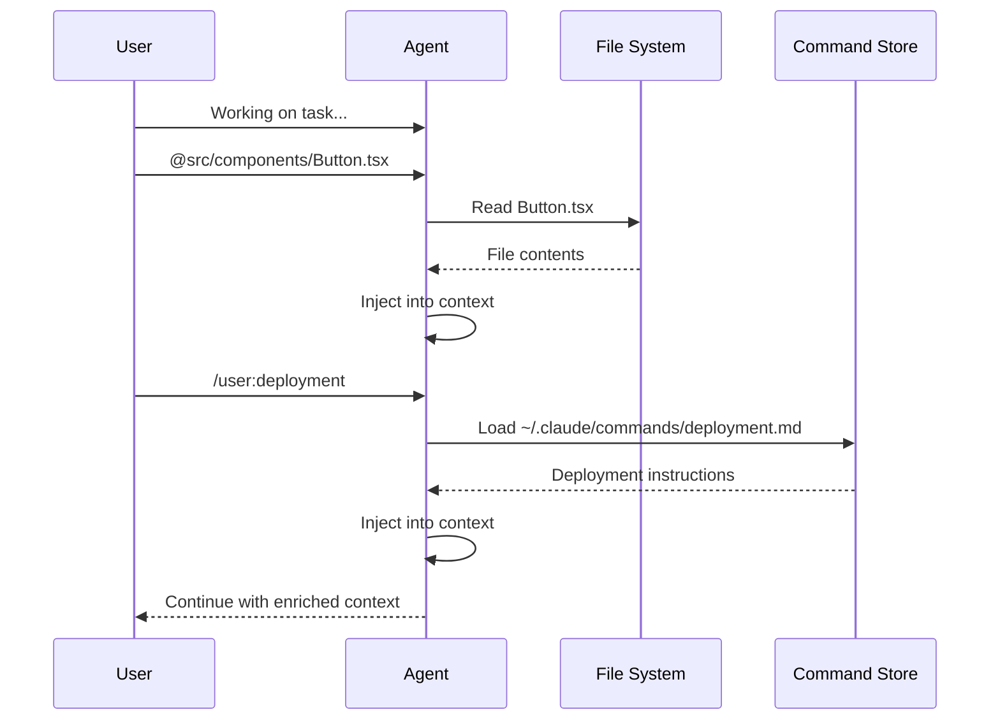

## Problem
While layered configuration files provide good baseline context, agents often need specific pieces of information (e.g., contents of a particular file, output of a script, predefined complex prompt) on-demand during an interactive session. Constantly editing static context files or pasting large chunks of text into prompts is inefficient.

## Solution
Implement mechanisms for users to dynamically inject context into the agent's working memory during a session. Common approaches include:
-   **File/Folder At-Mentions:** Allowing users to type a special character (e.g., `@`) followed by a file or folder path (e.g., `@src/components/Button.tsx` or `@app/tests/`). The agent then ingests the content of the specified file or a summary of the folder into its current context for the ongoing task.
-   **Custom Slash Commands:** Enabling users to define reusable, named prompts or instructions in separate files (e.g., in `~/.claude/commands/foo.md`). These can be invoked with a slash command (e.g., `/user:foo`), causing their content to be loaded into the agent's context. This is useful for frequently used complex instructions or context snippets.

These methods allow for a more fluid and efficient way to provide targeted context exactly when needed.

## Example (context injection flow)

## References
- Based on the at-mention and slash command features described in "Mastering Claude Code: Boris Cherny's Guide & Cheatsheet," section IV.

[Source](https://www.nibzard.com/claude-code)