## Problem
Early AI agents and models often suffered from a short "coherence window," meaning they could only maintain focus and context for a few minutes before their performance degraded significantly (e.g., losing track of instructions, generating irrelevant output). This limited their utility for complex, multi-stage tasks that require sustained effort over hours.

## Solution
Utilize AI models and agent architectures that are specifically designed or have demonstrably improved capabilities to maintain coherence over extended periods (e.g., several hours). This involves:
- Leveraging newer foundation models with larger context windows and better long-term memory.
- Implementing agentic architectures that can manage state and context effectively over time.
- Prioritizing this capability allows agents to undertake substantial projects, engage in prolonged problem-solving, and complete tasks that were previously infeasible due to coherence limitations.

The goal is to enable agents to work on tasks for as long as a human counterpart might, without a degradation in the quality or relevance of their work.

## Example (coherence over time)

```mermaid
gantt
    title Agent Coherence Capabilities Over Time
    dateFormat X
    axisFormat %s

    section Early Models
    Short coherence window (minutes) :done, early, 0, 300

    section Current Models
    Extended coherence (hours) :active, current, 300, 10800

    section Future Trend
    All-day coherence :future, 10800, 86400
```

## References
- Highlighted in "How AI Agents Are Reshaping Creation": "Every seven months, we're actually doubling the number of minutes that the AI can work and stay coherent... The latest models can maintain coherence for hours." This capability is described as a "qualitative shift."

[Source](https://www.nibzard.com/ampcode)