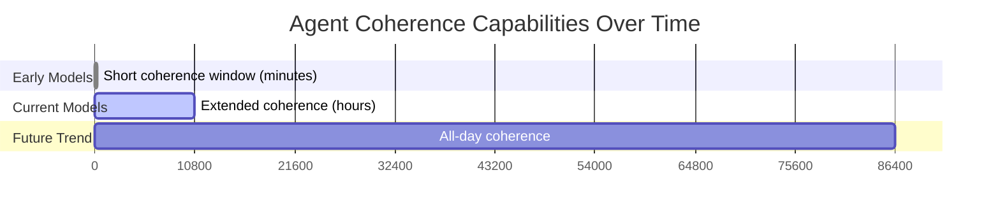

## Problem

Early AI agents and models often suffered from a short "coherence window," meaning they could only maintain focus and context for a few minutes before their performance degraded significantly (e.g., losing track of instructions, generating irrelevant output). This limited their utility for complex, multi-stage tasks that require sustained effort over hours.

## Solution

Utilize AI models and agent architectures that maintain coherence over extended periods (hours rather than minutes). This involves:

- **Model Selection**: Newer foundation models demonstrate approximately 2x coherence improvement every 7 months.
- **Context Management**: Larger context windows alone don't guarantee coherence—combine with auto-compaction, prompt caching, and curated context to mitigate the "lost in the middle" effect where models struggle with information in middle positions (Liu et al., 2023).
- **Complementary Patterns**: Works synergistically with context auto-compaction, episodic memory, filesystem-based state, and planner-worker separation.

The goal is enabling agents to work on multi-hour tasks without degradation in output quality or relevance.

## Example (coherence over time)

```mermaid
gantt
    title Agent Coherence Capabilities Over Time
    dateFormat X
    axisFormat %s

    section Early Models
    Short coherence window (minutes) :done, early, 0, 300

    section Current Models
    Extended coherence (hours) :active, current, 300, 10800

    section Future Trend
    All-day coherence :future, 10800, 86400
```

## How to use it

- Use this for complex, multi-stage tasks requiring sustained attention (multi-hour coding sessions, long-running research, autonomous workflows).
- Implement supporting patterns first: context auto-compaction, prompt caching, and filesystem-based state.
- Monitor for coherence degradation indicators—contradictory statements, goal drift, or repetitive loops after 10-15 conversation turns.

## Trade-offs

* **Pros:** Enables agents to complete complex, multi-hour tasks previously infeasible; foundational capability for autonomous workflows and planner-worker architectures.
* **Cons:** Requires supporting infrastructure (context management, state persistence, memory systems); extended sessions without prompt caching become prohibitively expensive.

## References

- Highlighted in "How AI Agents Are Reshaping Creation": "Every seven months, we're actually doubling the number of minutes that the AI can work and stay coherent... The latest models can maintain coherence for hours." Described as a "qualitative shift." [Source](https://www.nibzard.com/silent-revolution)
- Liu et al. (2023). "Lost in the Middle: How Language Models Use Long Contexts." arXiv:2307.03172—Establishes U-shaped performance curve; information at beginning/end of context is accessed 20-30% more reliably than middle positions.
- Nagaraj et al. (2023). "MemGPT: Towards LLMs as Operating Systems." arXiv:2310.08560—Hierarchical memory architecture (primary context, secondary memory, archival) for extended sessions.
