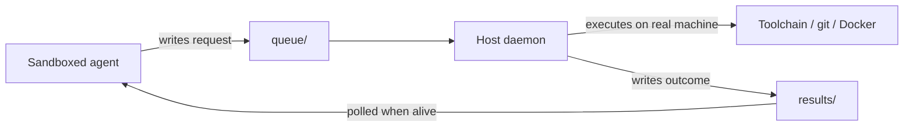

## Problem

An agent that runs inside a sandbox — a container, a hosted runtime, a cloud
workspace — is deliberately cut off from the developer's real machine. That
isolation is correct for safety, but it puts the most valuable work out of
reach: the toolchain, the local filesystem, git credentials, the Docker daemon,
and the half-configured services that only exist on someone's laptop.

The obvious fixes are worse than the problem:

- **Open a port on the host.** Now the developer's machine listens on the
  network for an agent to tell it what to run. This is the same shape as a
  remote-access backdoor, and it fails immediately behind NAT or a corporate VPN.
- **Hold a synchronous connection.** Sandboxes get suspended, hit request
  timeouts, and are reaped. A 20-minute build outlives the caller, and when the
  caller dies mid-flight the work is orphaned with no way to reclaim the result.
- **Re-issue the call on reconnect.** Without a durable identity for the
  request, a retry after a dropped connection re-runs a deploy or a migration
  a second time.

The underlying difficulty is that the two sides have *different lifetimes*. The
sandbox is ephemeral and may vanish mid-task; the host is long-lived. Any
mechanism that assumes both endpoints stay alive for the duration of the work
will drop tasks.

## Solution

Move the coupling from a connection to a **shared directory**. Neither side
talks to the other directly. Both sides only append to and read from a spool
directory that is visible to each — a bind mount, a synced folder, a mounted
volume.

The directory holds three roles:

- `queue/` — request files the sandbox writes
- `results/` — completed result files the host writes
- `inbox/` — messages travelling host → sandbox

A host-side daemon watches `queue/`, executes what it finds against a whitelist
of permitted operations, and writes the outcome to `results/` keyed by a task
id. The sandbox writes a request, gets the id back immediately, and polls for
that id whenever it happens to be alive.

```pseudo
// sandbox side — never blocks on the host
task_id = write(queue/, {op, args, timeout, idempotency_key})
...                                  // sandbox may be suspended here
result  = read(results/task_id)      // returns pending | running | done

// host side — a loop, not a server
for request in watch(queue/):
    if seen(request.idempotency_key): continue   // retries collapse
    result = execute_if_whitelisted(request)
    atomic_write(results/request.id, result)
```



Three properties do the real work:

1. **No listener.** The host opens no port and accepts no inbound connection.
   Reachability comes from the shared mount, so NAT and VPNs are irrelevant.
2. **Durability by default.** A request that has been written survives the
   sandbox dying, the host rebooting, and the poller disappearing for an hour.
   The result waits in a file until something reads it.
3. **Idempotency keys make retries safe.** A caller that cannot tell whether its
   request landed simply writes it again with the same key; the daemon
   recognises the key and returns the existing result instead of re-executing.

Polling must be a pure read with no side effects, so a nervous caller can check
as often as it likes.

## Evidence

- **Evidence Grade:** `medium`
- **Most Valuable Findings:**
  - Spool directories are a long-proven durability mechanism (Maildir, mail
    queues, CI artifact dirs); applying them to agent RPC inherits crash-safety
    without inventing a protocol.
  - Decoupling caller lifetime from work lifetime is what makes long host-side
    tasks survivable — the same reason job queues beat synchronous RPC generally.
- **Unverified / Unclear:** No published comparative benchmark of this approach
  against tunnel- or socket-based host bridges. Polling latency versus a
  filesystem-watch trigger is implementation-specific and unmeasured here.

## How to use it

Reach for this when **the agent and the work live in different trust or
lifetime domains** and the work must happen on specific hardware:

- Cloud or sandboxed agents that need to build, test, or run something locally
- Agents whose runtime imposes a short request timeout but whose tasks do not
- Any case where opening an inbound port on a developer machine is unacceptable

Prerequisites: a directory both sides can reach, atomic file writes (write to a
temp name, then rename), and a whitelist on the host defining what may run.

Because the host executes real commands, pair the transport with a per-task
safety envelope — a spend ceiling, a permission scope (read-only versus
mutating), and optional human plan-approval before anything runs. The transport
gives durability; it gives no safety on its own.

## Trade-offs

- **Pros:**
  - Survives reboots, sandbox suspension, and caller death without losing work
  - No inbound port, no tunnel, no NAT traversal
  - Trivially debuggable and auditable — the protocol is files you can read
  - Retries are safe when keyed
- **Cons:**
  - Polling adds latency; unsuitable for tight interactive loops
  - Requires a shared mount, which not every sandbox offers
  - The daemon holds real execution authority, so the whitelist and permission
    scope become the security boundary
  - Concurrent writers need atomic rename discipline or results interleave
  - Spool directories grow and need reaping

## References

- [Maildir](https://cr.yp.to/proto/maildir.html) — the canonical crash-safe
  spool-directory design this borrows from.
- [LangGraph — Human-in-the-Loop](https://langchain-ai.github.io/langgraph/concepts/human_in_the_loop/)
  — pausing and resuming long-running work across process lifetimes.
- [cowork-to-code-bridge](https://github.com/abhinaykrupa/cowork-to-code-bridge)
  — a working implementation, maintained by this pattern's author.
