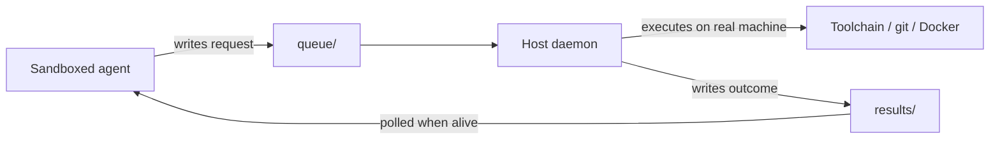

## Problem

An agent that runs inside a sandbox — a container, a hosted runtime, a cloud
workspace — is deliberately cut off from the developer's real machine. That
isolation is correct for safety, but it puts the most valuable work out of
reach: the toolchain, the local filesystem, git credentials, the Docker daemon,
and the half-configured services that only exist on someone's laptop.

The obvious fixes are worse than the problem:

- **Open a port on the host.** Now the developer's machine exposes another
  network service that must be authenticated, authorized, and reachable through
  NAT or a corporate VPN.
- **Hold a synchronous connection.** Sandboxes get suspended, hit request
  timeouts, and are reaped. A 20-minute build outlives the caller, and when the
  caller dies mid-flight the work is orphaned with no way to reclaim the result.
- **Re-issue the call on reconnect.** Without a durable identity for the
  request, a retry after a dropped connection re-runs a deploy or a migration
  a second time.

The underlying difficulty is that the two sides have *different lifetimes*. The
sandbox is ephemeral and may vanish mid-task; the host is long-lived. Any
mechanism that assumes both endpoints stay alive for the duration of the work
will drop tasks.

## Solution

Move the coupling from a connection to a **shared directory**. Both sides append
to and read from a spool directory that is visible to each — a bind mount, a
synced folder, or a mounted volume. The directory is still an inbound
command-and-control channel, so it must be secured as deliberately as a network
API even though the host exposes no listening socket.

The directory holds three roles:

- `queue/` — request files the sandbox writes
- `results/` — completed result files the host writes
- `inbox/` — messages travelling host → sandbox

A host-side daemon watches `queue/`, executes what it finds against a whitelist
of permitted operations, and writes the outcome to `results/` keyed by a task
id. The sandbox writes a request, gets the id back immediately, and polls for
that id whenever it happens to be alive.

```pseudo
// sandbox side — never blocks on the host
key = stable_idempotency_key(op, args, caller_intent)
atomic_write(queue/key, signed_request(op, typed_args, timeout, key))
...                                  // sandbox may be suspended here
result = read(results/key)           // returns pending | running | done | uncertain

// host side — atomic rename lets only one worker claim a request
for request in claim_by_rename(queue/, running/):
    verify_signature_schema_and_permissions(request)
    key = request.idempotency_key
    if exists(results/key):
        continue                              // replay the durable result
    ledger.record(key, "running")
    result = execute_allowlisted_operation(request, idempotency_key=key)
    atomic_write(results/key, result)
    ledger.record(key, "done")

// after a crash, never blindly repeat an operation with uncertain outcome
for key in ledger.entries("running"):
    if downstream_can_lookup_or_deduplicate(key):
        reconcile_and_publish(key)
    else:
        ledger.record(key, "uncertain")       // require human reconciliation
```



Three properties do the real work:

1. **No network listener.** The host opens no port. Reachability comes from the
   shared mount, so NAT and VPN traversal are not part of this protocol. Access
   to the directory still grants authority to submit work.
2. **Durable decoupling.** On persistent storage, an atomically written and
   flushed request can outlive the sandbox or poller. Surviving a host reboot
   additionally requires a durable spool and ledger; a temporary bind mount or
   best-effort sync does not provide that guarantee.
3. **Idempotency plus reconciliation makes retries safe.** Completed requests
   replay their stored result. Requests whose outcome was uncertain at a crash
   are reconciled through a downstream idempotency key or status lookup. The
   filesystem alone cannot provide exactly-once execution for external effects.

Polling must be a pure read with no side effects, so a nervous caller can check
as often as it likes.

## Evidence

- **Evidence Grade:** `medium`
- **Most Valuable Findings:**
  - Spool directories are a long-proven durability mechanism (Maildir, mail
    queues, CI artifact dirs); applying them to agent RPC inherits crash-safety
    without inventing a protocol.
  - Decoupling caller lifetime from work lifetime is what makes long host-side
    tasks survivable — the same reason job queues beat synchronous RPC generally.
- **Unverified / Unclear:** No published comparative benchmark of this approach
  against tunnel- or socket-based host bridges. Polling latency versus a
  filesystem-watch trigger is implementation-specific and unmeasured here.

## How to use it

Reach for this when **the agent and the work live in different trust or
lifetime domains** and the work must happen on specific hardware:

- Cloud or sandboxed agents that need to build, test, or run something locally
- Agents whose runtime imposes a short request timeout but whose tasks do not
- Any case where opening an inbound port on a developer machine is unacceptable

Prerequisites: a persistent directory both sides can reach, atomic file writes
(write to a temporary name, flush, then rename), a durable idempotency ledger,
and a whitelist on the host defining fixed operations and typed arguments.

Authenticate each request with a signature or MAC. Enforce restrictive
ownership and permissions, reject symlinks and path traversal, run the daemon
with least privilege, and audit claims, execution, and results. For operations
that cannot accept an idempotency key or report prior status, surface an
`uncertain` result for human reconciliation instead of retrying automatically.

Because the host executes real commands, pair the transport with a per-task
safety envelope — a spend ceiling, a permission scope (read-only versus
mutating), and optional human plan-approval before anything runs. The transport
gives durability; it gives no safety on its own.

## Trade-offs

- **Pros:**
  - On a persistent spool, survives sandbox suspension and caller death; with a
    durable ledger and recovery, it can also survive host restarts
  - No inbound port, no tunnel, no NAT traversal
  - Trivially debuggable and auditable — the protocol is files you can read
  - Completed work is safely replayed, while uncertain work is reconciled
- **Cons:**
  - Polling adds latency; unsuitable for tight interactive loops
  - Requires a shared mount, which not every sandbox offers
  - The daemon holds real execution authority, so the whitelist and permission
    scope become the security boundary
  - A shared directory is an inbound control surface and requires request
    authentication, restrictive permissions, and path-safety checks
  - Concurrent writers need atomic rename discipline or results interleave
  - Exactly-once external effects require downstream deduplication or
    reconciliation; the filesystem cannot guarantee them by itself
  - Spool directories grow and need reaping

## References

- [Maildir](https://cr.yp.to/proto/maildir.html) — the canonical crash-safe
  spool-directory design this borrows from.
- [LangGraph — Human-in-the-Loop](https://langchain-ai.github.io/langgraph/concepts/human_in_the_loop/)
  — pausing and resuming long-running work across process lifetimes.
- [cowork-to-code-bridge](https://github.com/abhinaykrupa/cowork-to-code-bridge)
  — a working implementation, maintained by this pattern's author.
