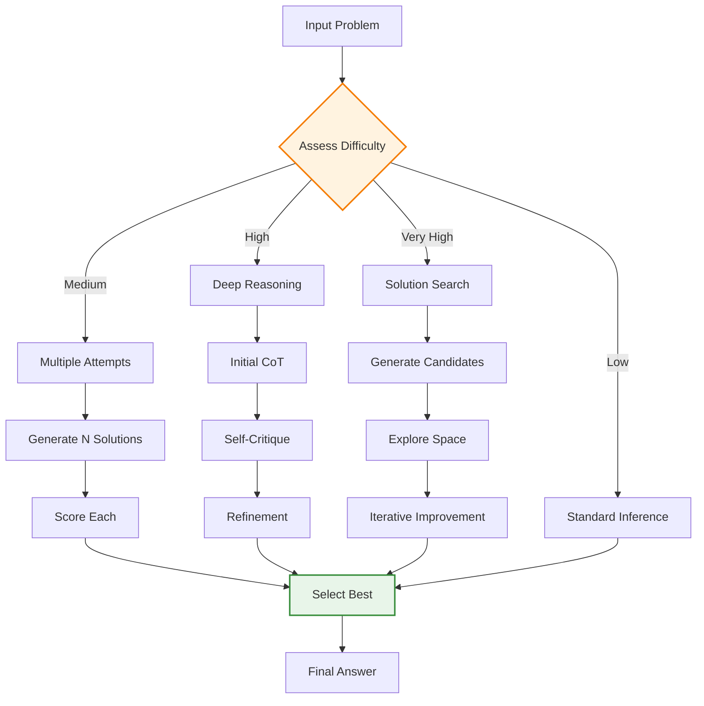

## Problem

Traditional language models are limited by their training-time capabilities. Once trained, their performance is essentially fixed, regardless of how much compute is available at inference time. This means that for particularly challenging problems, we cannot simply "think harder" by allocating more computational resources to find better solutions. This limitation becomes especially apparent in complex reasoning tasks where more deliberation could lead to better outcomes.

## Solution

Inference-Time Scaling allocates additional computational resources during inference to improve output quality. Instead of generating a single response, the system can:

1. **Generate multiple candidates** and select the best one
2. **Perform extended reasoning** chains before responding  
3. **Iterate and refine** outputs through multiple passes
4. **Search through solution spaces** more thoroughly
5. **Verify and validate** answers before returning them

This approach trades compute time for solution quality, allowing smaller models with inference-time scaling to outperform larger models using standard inference.

## Example

```python
class InferenceTimeScalingAgent:
    def __init__(self, base_model, scaling_strategy='adaptive'):
        self.base_model = base_model
        self.scaling_strategy = scaling_strategy
        
    def solve_with_scaling(self, problem, max_compute_budget=100):
        if self.scaling_strategy == 'adaptive':
            # Estimate problem difficulty
            difficulty = self.estimate_difficulty(problem)
            compute_budget = min(difficulty * 10, max_compute_budget)
        else:
            compute_budget = max_compute_budget
            
        # Try different scaling approaches based on budget
        solutions = []
        
        # Approach 1: Multiple attempts with different prompting
        if compute_budget >= 10:
            solutions.extend(self.multiple_attempts(problem, n=5))
        
        # Approach 2: Step-by-step reasoning with verification
        if compute_budget >= 30:
            solutions.append(self.deep_reasoning(problem))
        
        # Approach 3: Solution space search
        if compute_budget >= 50:
            solutions.append(self.solution_search(problem))
        
        # Select best solution
        return self.select_best_solution(solutions, problem)
    
    def multiple_attempts(self, problem, n=5):
        """Generate multiple solutions with different approaches"""
        prompting_strategies = [
            "Think step by step",
            "Consider edge cases",
            "Work backwards from the goal",
            "Break into subproblems", 
            "Use analogical reasoning"
        ]
        
        solutions = []
        for i in range(n):
            strategy = prompting_strategies[i % len(prompting_strategies)]
            prompt = f"{strategy}: {problem}"
            solution = self.base_model.generate(prompt)
            solutions.append({
                'solution': solution,
                'strategy': strategy,
                'confidence': self.evaluate_confidence(solution)
            })
        
        return solutions
    
    def deep_reasoning(self, problem):
        """Extended chain-of-thought with self-verification"""
        # Initial reasoning
        cot_prompt = f"""
        Problem: {problem}
        
        Let me work through this systematically:
        1. Understanding: What exactly is being asked?
        2. Approach: What methods could work?
        3. Solution: Work through the chosen approach
        4. Verification: Double-check the answer
        """
        
        initial_solution = self.base_model.generate(cot_prompt)
        
        # Self-critique
        critique_prompt = f"""
        Problem: {problem}
        Proposed solution: {initial_solution}
        
        Critically evaluate this solution:
        - Are there any errors?
        - What assumptions were made?
        - Could the approach be improved?
        """
        
        critique = self.base_model.generate(critique_prompt)
        
        # Refined solution
        refine_prompt = f"""
        Problem: {problem}
        Initial solution: {initial_solution}
        Critique: {critique}
        
        Provide an improved solution addressing the critique:
        """
        
        refined = self.base_model.generate(refine_prompt)
        
        return {
            'solution': refined,
            'strategy': 'deep_reasoning',
            'iterations': 3,
            'confidence': self.evaluate_confidence(refined)
        }
    
    def solution_search(self, problem):
        """Search through solution space systematically"""
        # This could implement beam search, A*, or other algorithms
        # Simplified example using breadth-first exploration
        
        candidates = PriorityQueue()
        initial = self.generate_initial_solutions(problem, n=3)
        
        for sol in initial:
            candidates.put((-self.score_solution(sol), sol))
        
        best_solution = None
        iterations = 0
        
        while not candidates.empty() and iterations < 10:
            score, current = candidates.get()
            
            if self.is_complete_solution(current, problem):
                if best_solution is None or score < best_solution[0]:
                    best_solution = (score, current)
            
            # Generate variations
            variations = self.generate_variations(current, problem)
            for var in variations:
                var_score = self.score_solution(var)
                candidates.put((-var_score, var))
            
            iterations += 1
        
        return {
            'solution': best_solution[1] if best_solution else current,
            'strategy': 'solution_search', 
            'iterations': iterations,
            'candidates_explored': iterations * len(variations)
        }
```



## Real-World Evidence

- **Google DeepMind (August 2024)**: Research showing that inference-time compute scaling allows smaller models to outperform 14x larger models
- **OpenAI's o1 model**: Implements "chain of thought reasoning" with extended inference time, showing significant improvements on complex tasks
- Models can dynamically adjust compute based on problem difficulty, spending more time on harder problems

## Trade-offs

**Pros:**
- Can dramatically improve performance on complex tasks
- More cost-effective than training larger models
- Allows dynamic resource allocation based on task difficulty
- Enables "System 2" thinking in AI systems

**Cons:**
- Increased latency for responses
- Higher inference costs for complex problems
- Diminishing returns beyond certain compute thresholds
- Not beneficial for simple tasks
- Requires careful tuning of scaling strategies

## References

- [Google DeepMind Research on Test-Time Compute Scaling (August 2024)](https://deepmind.google/research/)
- [OpenAI o1 System Card](https://openai.com/research/)
- [Inference-Time Scaling Laws](https://arxiv.org/)