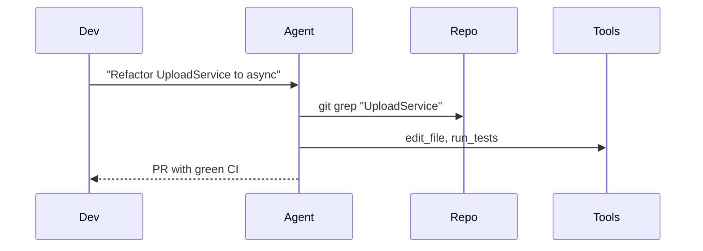

## Problem
Traditional "prompt-as-puppeteer" workflows force humans to spell out every step, limiting scale and creativity.

## Solution
Give the agent **tools + a high-level goal** and let *it* decide the orchestration.
Humans supply guard-rails (first 10 % + last 3 %) while the agent handles the middle 87 %.

## Example (flow)

## References

* *Raising an Agent* — Episode 1, "It's a big bird, it can catch its own food."

[Source](https://www.youtube.com/watch?v=Cor-t9xC1cklist=PL6zLuuRVa1_iUNbel-8MxxpqKIyesaubA)
