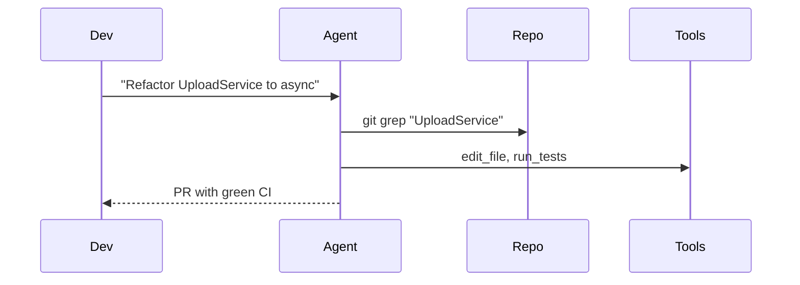

## Problem

Prompt-as-puppeteer workflows force humans to micromanage each step, turning agents into expensive autocomplete tools. This limits throughput, creates brittle instructions that break on small context changes, and prevents agents from using their own planning capability.

## Solution

Give the agent tools and a clear high-level objective, then let it own execution strategy inside explicit guardrails. Humans define intent, constraints, and review criteria; the agent decides sequencing, decomposition, and local recovery steps.

This implements a three-layer architecture: Policy Layer (human-defined objectives and constraints), Control Layer (automated guardrail enforcement), and Execution Layer (agent-owned task decomposition and tool selection).

This flips control from "human scripts every move" to "human sets policy, agent performs." The result is higher leverage while preserving oversight at critical checkpoints.

## Example (flow)

```mermaid
sequenceDiagram
  Dev->>Agent: "Refactor UploadService to async"
  Agent->>Repo: git grep "UploadService"
  Agent->>Tools: edit_file, run_tests
  Agent-->>Dev: PR with green CI
```

## Evidence

**Evidence Grade:** `high`

**Most Valuable Findings:**
- Academic validation from multiple 2025 papers (MI9 governance framework, Beurer-Kellner et al. security patterns) confirms external control layers are essential for agent safety
- Production implementations report 2-10x developer leverage gains through autonomous execution with guardrails

## How to use it

- Start with bounded tasks where success criteria are objective (tests pass, migration complete, docs generated).
- Give explicit constraints: allowed tools, time budget, and escalation conditions.
- Require checkpoints at risky boundaries (schema changes, deploy steps, external write actions).
- Measure autonomy win-rate (target >80%) and human intervention rate per task class.

## Trade-offs

* **Pros:** Higher developer leverage, faster execution loops, and better use of model planning ability.
* **Cons:** Requires strong guardrails and telemetry to prevent silent drift or overreach.

## References

* Raising An Agent - Episode 1, "It's a big bird, it can catch its own food."
* MI9: Runtime Governance Framework (arXiv:2508.03858v3, 2025)
* Beurer-Kellner et al., Design Patterns for Securing LLM Agents (arXiv:2506.08837, 2025)

[Source](https://www.nibzard.com/ampcode)
