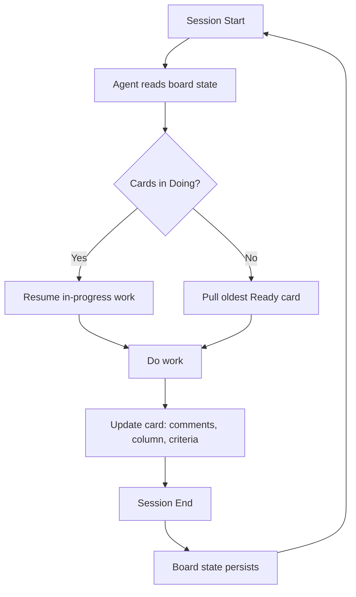

## Problem

AI agents are stateless between sessions.  Each new conversation starts from scratch: no memory of what was in progress, what decisions were made, or what remains to be done.  The standard workarounds -- system prompts, memory files, handoff documents -- have a shared failure mode: they are written by agents and read by agents, with no natural human visibility layer and no mechanism for enforcing capacity constraints.

In multi-agent systems the problem compounds.  When multiple agents work across the same domain, they have no shared state by default.  Coordination requires either a shared context window (impossible across separate sessions) or a human routing messages between them (bottleneck).

The specific failure this pattern addresses: work that exists only in an agent's context window disappears at session end.  Work that exists only in files is invisible to humans without tooling.  Work that exists only in a human's head cannot be picked up autonomously.

## Solution

Use a **Kanban board with a REST API** as the single source of truth for all work state.  The board is not a reporting tool or a management dashboard: it is the agent's memory between sessions.

Every unit of work lives as a card.  Cards encode:

- The work to be done (description, acceptance criteria, "done when" conditions)
- The current state (which column the card is in)
- How long it has been in that state (work item age, the earliest signal that something is stuck)
- Who or what is working on it (WIP assignment)
- What was tried, decided, or discovered (card comments as the audit trail)

At session start, the agent reads the board: what is in progress, what is aging, what is waiting for capacity.  This state was written by a previous session, a different agent, or the human product owner.  The agent does not need to be told what to do; the board tells it.



**WIP limits as flow enforcement:** The board enforces capacity constraints mechanically.  An agent cannot start a new card if the Doing column is at its WIP limit.  This is not an instruction the agent might forget; it is a board-level constraint the agent checks via the API.  WIP limits prevent the most common agentic failure mode: starting everything and finishing nothing.

**Work item age as the priority signal:** Cards that have been in Doing the longest surface first.  The agent does not need heuristics for what to work on next; age-based prioritisation is deterministic and visible to both agents and humans.

**Human visibility by design:** Unlike filesystem state, the board is human-readable without tooling.  The product owner can see what is in flight, what is stuck, and what is waiting, at a glance.  This is not a side effect; it is a design constraint.  The board must be something the human can read and redirect without developer access.

## Evidence

- **Evidence Grade:** `low` (single production system; not yet independently replicated)
- **Most Valuable Findings:**
  - Session continuity across 50+ sessions across multiple agents and projects, without context loss, using this pattern in production
  - WIP limits enforced via board state eliminated concurrent conflicts between agents working in the same codebase
  - Work item age as the pull signal reduced the average time a card spent waiting for capacity by surfacing the oldest ready work rather than the most recently created
- **Unverified / Unclear:** Whether the pattern generalises to larger agent estates (10+ concurrent agents) without board-level performance degradation; optimal WIP limit sizing for agentic vs human teams

## How to use it

**Prerequisites:**

- A Kanban board tool with a REST API.  Native WIP limits are strongly preferred; without them, WIP enforcement requires agent self-discipline, which is unreliable.  Businessmap, Linear, and Jira support WIP limits to varying degrees.  Trello and GitHub Projects do not enforce WIP natively.
- A board CLI or thin API wrapper that agents can call from the terminal.  The reference implementation at the source repo uses a bash CLI (`bmap`) wrapping the Businessmap API.
- An explicit startup routine: agents MUST read the board at session start before doing any work.  Without this, the pattern degrades to a reporting tool.

**Card anatomy:**

Cards should encode enough state for a fresh agent to resume without a handoff from the previous session:

```markdown
# Card: Add rate limiting to the API

**Done when:**
- All endpoints return 429 after N requests per minute
- Limits are configurable without a deploy
- Existing tests pass; new tests cover the limit boundary

**In progress:**
- Investigating middleware approach vs. edge function approach

**Decisions made:**
- Using token bucket algorithm (simpler than sliding window for this load profile)
- Limit config lives in environment variables, not database
```

**Board column structure:**

A minimal column set: `Ready` → `Doing` → `Done (PO Review)` → `Shipped/Live`.  WIP limit on `Doing` (typically 1-3 per agent, or 1 per agent type).  An `On Hold` column for blocked cards that should not count against WIP.

**Agent startup routine:**

```pseudo
on_session_start():
    wip_age = board.get_cards_in_doing(sort_by="age_desc")
    if wip_age:
        resume(wip_age[0])  # oldest in-progress card
    else:
        ready = board.get_cards_in_ready(sort_by="age_desc")
        if ready and board.wip_capacity_available():
            pull(ready[0])
```

**Multi-agent coordination:** When multiple agents work from the same board, card assignment (via column, label, or custom field) prevents conflicts.  Agents check WIP state before pulling; they cannot accidentally take a card already in Doing by another agent.

## Trade-offs

**Pros:**

- **Persistent across everything:** Session resets, context window compaction, agent switches, model upgrades.  The board state survives all of them.
- **Human visibility included:** The product owner sees the same state the agent sees.  No translation layer needed.
- **Flow semantics built in:** WIP limits and work item age are native Kanban concepts that enforce good delivery practice without agent self-discipline.
- **Audit trail:** Card comments create a durable log of decisions, discoveries, and blockers.  Post-session analysis is possible.
- **Multi-agent by design:** Multiple agents reading from the same board share state without a shared context window.

**Cons:**

- **API dependency:** The agent needs reliable network access to the board tool.  Offline or air-gapped environments are not compatible.
- **Tool selection matters:** Not all board tools have APIs with WIP enforcement, event triggers, or the two-level structure (initiatives + cards) that maps well to strategic and tactical planning.  Choosing the wrong tool limits the pattern.
- **Startup overhead:** Reading board state at session start adds latency (typically seconds).  For very short sessions this may be disproportionate.
- **Card hygiene required:** Cards that are stale, mis-labelled, or lacking acceptance criteria give the agent bad signals.  The pattern amplifies board hygiene problems.
- **Not a replacement for knowledge systems:** The board is work memory, not learning memory.  Lessons learned, promoted rules, and hypotheses need a separate knowledge system (see: Memory Synthesis from Execution Logs).

## References

- [Agentic Kanban Blueprint](https://github.com/AgileSmagile/smagile-agentic-kanban-blueprint) -- reference architecture and production implementation, including board CLI, agent startup routines, WIP enforcement, and multi-agent coordination
- [AKB Series: How the Board Functions as Memory](https://smagile.co/resources/blog/series/akb) -- nine-part series documenting the operating model behind this pattern
- [Kanban Guide](https://kanbanguides.org/html-kanban-guide/) -- foundational Kanban principles; WIP limits and flow metrics are documented here as first principles, not novelties
