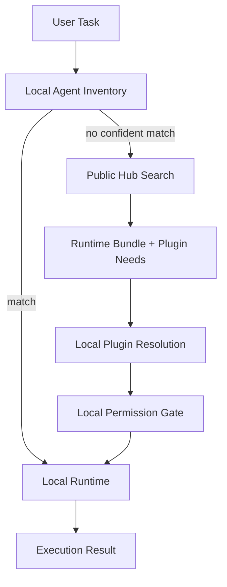

## Problem

Agent platforms often need both private local context and public reuse:

- Local agents need access to project files, personal memory, credentials, and installed skills.
- Public hubs make discovery, sharing, and installation easier across teams and clients.
- Sending the whole local inventory to a remote router creates privacy and security risk.
- Keeping everything local prevents reuse, search, and ecosystem distribution.

The result is a routing dilemma: useful agent selection wants a broad public catalog, but safe execution depends on local trust boundaries.

## Solution

Split agent operation into a local-first runtime and a narrow public hub fallback.

1. **Local inventory first**: keep private agent cards, memory, credentials, and project-specific rules on the user's machine or inside the tenant boundary.
2. **Routing-grade manifests**: describe each agent or skill with a small card: name, purpose, capabilities, required tools, permissions, runtime type, and install source.
3. **Public hub fallback**: when local search cannot satisfy a task, query a public hub for matching public agents, runtime bundles, and plugin dependencies.
4. **Bundle, do not execute**: the hub returns a portable runtime bundle or install plan. The user's local model/client executes the work under local permissions.
5. **Permission gate**: any tool, credential, write, network, or paid action is resolved and approved locally before execution.

The public service is used for discovery and packaging, not as the authority over private state.

## How to use it

- Define a minimal agent-card schema that is useful for routing but does not expose private prompt text, secrets, paths, or memories.
- Search local cards before remote catalogs. Treat public hub results as candidates, not commands.
- Return runtime bundles in a portable format that the client can inspect before execution.
- Resolve missing plugins against both local inventory and public package indexes.
- Make destructive or credentialed tools require a local approval step even when the bundle is public.
- Cache public hub results, but invalidate them when package hashes, versions, or permission manifests change.

This pattern works well for coding-agent ecosystems where the same agent bundle may be invoked from Claude Code, Codex, Cursor, Gemini CLI, or another MCP-compatible host.

## Trade-offs

- **Pros:** Preserves private local context; enables public agent discovery; reduces vendor lock-in; lets users inspect bundles before execution; works across multiple agent clients.
- **Cons:** Requires manifest discipline; local and public search quality can diverge; package hashes and plugin dependencies need validation; users may see more approval prompts; offline behavior depends on local cache coverage.

## References

- [Agentlas Hephaestus](https://github.com/agentlas-ai/Hephaestus) - affiliated implementation of a local-first Agent OS with hub-backed discovery and Hephaestus Network MCP
- [Model Context Protocol](https://modelcontextprotocol.io) - protocol surface for exposing tools and resources to LLM clients
- Related patterns: [Cross-Protocol Agent Discovery](cross-protocol-agent-discovery.md), [Progressive Tool Discovery](progressive-tool-discovery.md), [Policy-Gated Tool Proxy](policy-gated-tool-proxy.md), [Static Service Manifest for Agents](static-service-manifest-for-agents.md)
