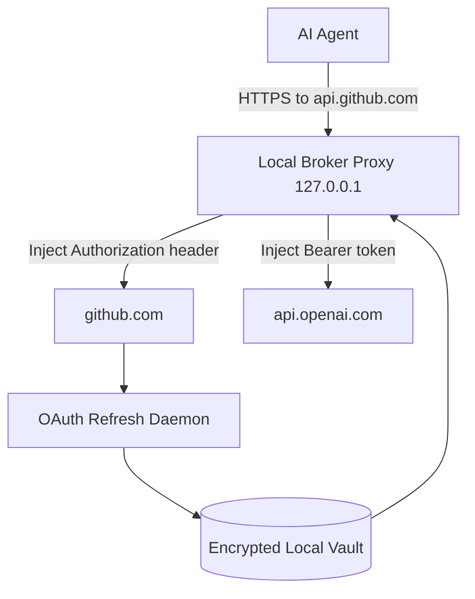

## Problem

AI agents increasingly need to call authenticated third-party APIs: post a Slack message, create a Linear issue, charge a Stripe customer, write to a GitHub repo. The dominant pattern today is to hand the agent raw credentials through environment variables, `.env` files, or per-tool config blocks. That breaks in several ways:

- **Token leakage through context.** Agents that read environment variables can echo them into logs, prompts, error traces, or shared conversation transcripts. One careless `os.environ` printout in a tool call is enough to leak a long-lived API key.
- **No OAuth refresh.** Static API keys never expire and can be reused indefinitely if exposed; OAuth access tokens need refresh logic the agent shouldn't be writing per-provider.
- **Per-tool drift.** Every CLI, every framework, every skill builds its own credential bootstrap. The result is the same secret in `~/.config/foo/`, `~/.bar/credentials`, `.env`, and shell history.
- **Hosted credential services trade one problem for another.** Routing credentials through a SaaS broker fixes the leakage problem but requires sending OAuth refresh tokens to a third party, creates a new audit surface, and adds a network dependency at runtime.

The pattern below keeps credentials local to the user's machine while still keeping them out of the agent's process.

## Solution

Introduce a local **credential broker** process that owns the credentials. The agent talks to providers through a loopback HTTPS proxy run by the broker. The broker matches outbound requests against a provider registry, picks the right credential, and injects it into the request just before the request leaves the host.



**Core components:**

- **Encrypted local vault.** Stored on the user's machine (for example under `~/.credentials/` or OS keychain). Holds access tokens, refresh tokens, API keys, and metadata about which provider each one belongs to. Never touches a remote service.
- **Loopback proxy.** A short-lived process the agent's outbound HTTPS traffic is routed through. Matches the request hostname against the provider registry and inserts the right `Authorization` header. Modifies headers only; never modifies the request body.
- **Refresh daemon.** Watches access tokens for upcoming expiry and contacts the provider's own token endpoint to refresh. Refresh tokens go directly from the local vault to the provider, never through any third party.
- **First-time login flow.** Browser PKCE, OAuth device code, or a one-shot bridge that captures an API key the user pastes once. After the initial login the agent never sees the user's credential entry process.
- **Provider registry.** A JSON-driven manifest mapping provider hostnames (`api.github.com`, `api.openai.com`) to credential type, refresh endpoint, and any provider-specific headers.

**Implementation sketch (Python-ish pseudocode):**

```python
class LocalCredentialBroker:
    def __init__(self, vault_path):
        self.vault = EncryptedVault(vault_path)        # local file, encrypted at rest
        self.providers = load_provider_registry()
        self.refresh_daemon = RefreshDaemon(self.vault, self.providers)

    def proxy_request(self, req):
        provider = self.providers.match(req.host)
        if provider is None:
            return req                                  # pass through unmodified
        cred = self.vault.get(provider.id)
        if cred is None:
            raise NotLoggedIn(provider.id)
        if cred.expires_soon():
            cred = self.refresh_daemon.refresh(cred)
        req.headers["Authorization"] = provider.format_auth(cred)
        return req

# Outside the agent process, runs as a local daemon
async def serve_loopback_proxy(broker, port=39473):
    async with HTTPSProxy(port=port, ca=local_self_signed_ca()) as proxy:
        async for req in proxy.incoming():
            yield broker.proxy_request(req)
```

The agent itself only needs to know that its `HTTPS_PROXY` (or equivalent client config) points at `127.0.0.1:<port>`. From the agent's point of view its outbound calls just succeed; it never sees a real token.

## Evidence

- **Evidence Grade:** `medium`
- **Most Valuable Findings:**
  - Several open-source implementations of this pattern shipped during 2025–2026 ([authsome](https://github.com/agentrhq/authsome), [OneCLI](https://github.com/onecli/onecli), Infisical [Agent Vault](https://github.com/Infisical/agent-vault)), independently converging on the same broker + loopback proxy shape.
  - Cloud Security Alliance's [Agentic AI Identity & Access Management](https://cloudsecurityalliance.org/artifacts/agentic-ai-identity-and-access-management-a-new-approach) report (2025-08) names "credential isolation via proxy" as a recommended control for agent runtimes.
  - OWASP's [Securing Agentic Applications Guide](https://genai.owasp.org/resource/securing-agentic-applications-guide-1-0/) lists "agent process never holds raw API keys" as a hardening principle.
- **Unverified / Unclear:**
  - Long-term behavior in shared developer machines (multi-user POSIX hosts, dev containers with shared loopback)
  - Operational data on whether refresh failures in long-running workloads cause real outage incidents

## How to use it

1. **Pick a vault location.** Default to a per-user directory the OS already restricts (`~/.config/<broker>/` on Linux, `~/Library/Application Support/<broker>/` on macOS). Encrypt at rest with a key derived from OS keychain or user passphrase.
2. **Define the provider registry.** Start with the providers the agent calls most ( GitHub, Google, OpenAI, Slack, Notion, Stripe). Each entry needs hostname match, auth header format, and token endpoint URL.
3. **Pick first-login flow per provider.** OAuth2 providers: browser PKCE for desktop, device code for headless. API-key providers: one-shot bridge page the user pastes the key into. Never ask the user to paste secrets into the agent chat.
4. **Run the broker as a long-lived local process.** Start with the agent session, keep running across multiple invocations. The refresh daemon needs to be alive to refresh tokens before they expire.
5. **Configure the agent to use the loopback proxy.** Set `HTTPS_PROXY=https://127.0.0.1:<port>` (or framework-specific config) and install the broker's local CA so the agent's HTTPS client trusts it.
6. **Audit the seam.** Log every credential injection (provider, request path, time) inside the broker; never log the credential value. Surface those logs to the user, not the agent.

**Pitfalls to avoid:**

- **Don't proxy traffic to providers the broker doesn't know about.** Default to pass-through. A broker that swallows all outbound HTTPS becomes a debugging nightmare.
- **Don't store credentials in a global registry.** Per-user vault. Sharing one vault across users on the same host re-introduces the very leakage problem the pattern is meant to solve.
- **Don't put the broker's own admin API on a public port.** Loopback only.
- **Don't forget refresh under load.** Refresh tokens need to be retried with backoff; refresh failures need to surface as actionable errors, not as silent 401s the agent then retries forever.

## Trade-offs

**Pros:**

- Raw credentials never enter the agent's process environment, conversation context, or crash dumps.
- OAuth2 refresh works for headless workloads (cron, CI, background agents) without a human at the keyboard.
- No SaaS dependency. Credentials never leave the user's machine except to the provider they're for.
- Adding a new provider is one JSON entry, not a code change in every agent that calls it.

**Cons / Considerations:**

- Adds a local daemon to the user's setup, plus a local CA to trust.
- Multi-user hosts need careful vault permissions; not a fit for shared-developer-machine scenarios.
- The agent's HTTP client must respect the proxy config; some SDKs hardcode their own client and need adapters.
- For multi-tenant agent fleets (one machine serving many users), a hosted gateway is a better fit; this pattern is single-user by design.

## Reference implementations

Several open-source implementations exist; each makes different trade-offs:

- [agentrhq/authsome](https://github.com/agentrhq/authsome) — Python broker with encrypted vault, loopback HTTPS proxy, OAuth2 (PKCE + device code) and API key support. 45 providers bundled, agentskills.io SKILL.md, Claude Code plugin manifest.
- [onecli/onecli](https://github.com/onecli/onecli) — Rust broker with per-agent scoped tokens, AES-256-GCM at rest, full audit trail.
- [Infisical/agent-vault](https://github.com/Infisical/agent-vault) — Server-backed variant: same proxy injection pattern but credentials live in Infisical's central store rather than the local machine. Useful when the multi-tenant trade-off swings the other way.

## References

- [CSA — Agentic AI Identity & Access Management (2025-08)](https://cloudsecurityalliance.org/artifacts/agentic-ai-identity-and-access-management-a-new-approach)
- [OWASP — Securing Agentic Applications Guide](https://genai.owasp.org/resource/securing-agentic-applications-guide-1-0/)
- [RFC 6749 — OAuth 2.0 Authorization Framework](https://datatracker.ietf.org/doc/html/rfc6749)
- [RFC 8628 — OAuth 2.0 Device Authorization Grant](https://datatracker.ietf.org/doc/html/rfc8628)
- [RFC 7636 — Proof Key for Code Exchange (PKCE)](https://datatracker.ietf.org/doc/html/rfc7636)
- Related pattern: [/patterns/external-credential-sync](external-credential-sync.md) — for syncing existing CLI credentials across tools rather than brokering new ones.
- Related pattern: [/patterns/sandboxed-tool-authorization](sandboxed-tool-authorization.md) — for restricting which tools an agent can call once authenticated.
