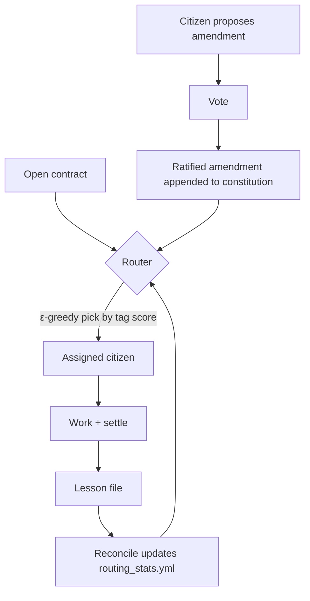

## Problem

When agents from different vendors (Claude Code, Codex, Gemini CLI, Cursor, local Ollama, etc.) work on the same long-lived project, they have no native channel for "who's good at what," "what did we already try," or "what does this team consider done." Each session starts cold. Hardcoded handoff prompts grow stale. The cheap-but-fragile alternative — declarative `AGENTS.md` rules — captures intent but never learns from outcomes.

## Solution

Treat the polis (Greek *πόλις*, "the body politic") as a folder of markdown files versioned alongside the project. Three primitives:

- **Capability card** — each agent publishes a signed YAML card declaring tags, model, tool, throughput, and historical track record.
- **Contract** — every unit of work is a structured markdown contract: tags required, acceptance criteria, status, settlement notes.
- **Routing stats** — a per-tag ε-greedy multi-armed bandit picks the citizen with the best confidence-weighted historical score on the contract's tags. Settled contracts ship lessons that update the stats on the next reconcile.

Two governance affordances on top:

- **Chavruta review** (paired review for high-stakes contracts) — any contract with `risk: high` gets a second citizen assigned as reviewer before settlement.
- **Amendments** — citizens propose changes to the constitution itself; ratified amendments are appended (never overwritten) and update the rules of routing or review.

## Evidence

- **Evidence Grade:** `low` (pattern in early production use; one open-source reference implementation)
- **Most Valuable Findings:** A worked example with three citizens, a real routing leader-shift after a lesson, and a ratified amendment is published at `examples/research-team/` in the reference repo. Settlement-driven routing learning is the smallest unit of compounding the pattern produces — capability cards alone aren't enough.
- **Unverified / Unclear:** Whether the amendment-vote mechanism scales past ~10 active citizens; whether bandit routing's exploration rate (default 15%) is right for low-volume contract streams.

## How to use it

Use when:

- You have ≥ 3 long-running agent sessions touching the same codebase or knowledge base.
- Coordination cost is currently routed through humans (you Slack one agent's output to another).
- You want process rules (review thresholds, routing weights) to evolve from real outcomes, not vibes.

Implementation outline:

1. Add a `_polis/` directory to your project root with `CONSTITUTION.md`, `citizens/`, `contracts/open/`, `contracts/settled/`, `lessons/`, `routing_stats.yml`, `amendments/`, and `chronicle.md`.
2. Each agent reads its own citizen card on session start, scans `contracts/open/`, and routes via the router (or runs the supplied `route_contract.py --explain` for an audit-trail decision).
3. After completing a contract, the agent writes a settlement note + a lesson with `quality_impact: <int>` so the next reconcile shifts routing scores.
4. Bridge files (`CLAUDE.md`, `AGENTS.md`, `GEMINI.md`) point each vendor's native pre-prompt to the polis, keeping the protocol vendor-agnostic.

## Trade-offs

- **Pros:** Vendor-agnostic — works across any tool that reads markdown. Audit trail is git-native. Routing improves with use. Governance changes (amendments) are first-class, not retrofitted comments. Low operational overhead — no daemon, no database.
- **Cons:** Markdown-only loop has higher latency than direct RPC. Bandit routing under low contract volume is noisy. The amendment process is overkill for small teams. Trust model assumes citizens don't lie about their own capability cards — fine for cooperating-vendor teams, weaker for adversarial settings.

## References

- Reference implementation: [polis-protocol](https://github.com/yehudalevy-collab/polis-protocol) (MIT)
- Worked example with 3 citizens, leader-shift after a lesson, and a ratified amendment: [`examples/research-team/`](https://github.com/yehudalevy-collab/polis-protocol/tree/main/examples/research-team)
- Routing math: [`references/routing.md`](https://github.com/yehudalevy-collab/polis-protocol/blob/main/references/routing.md)
