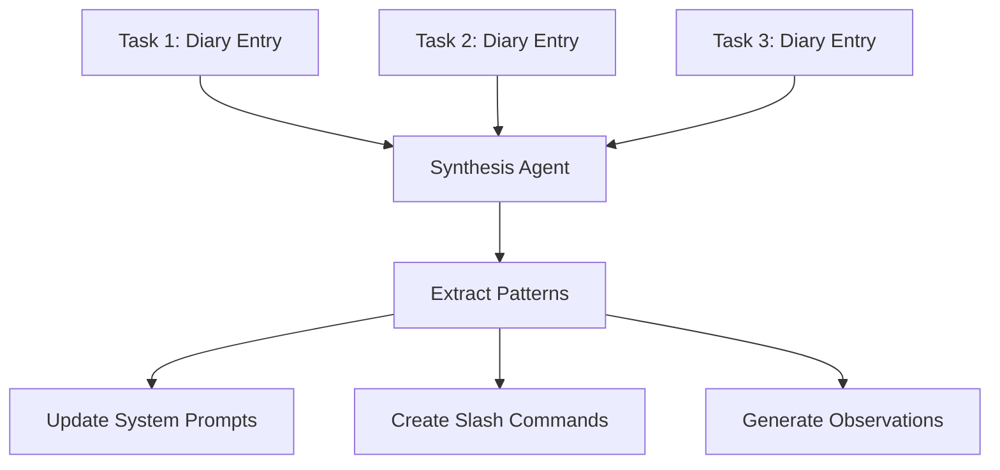

## Problem

Individual task execution transcripts contain valuable learnings, but:

- **Too specific**: "Make this button pink" isn't useful as general guidance
- **Unknown relevance**: Hard to predict which learnings apply to future tasks
- **Scattered knowledge**: Insights buried across hundreds of conversation logs
- **Abstraction challenge**: Difficult to know the right level of generality

Simply memorizing everything creates noise; ignoring everything loses valuable patterns.

## Solution

Implement a **two-tier memory system**:

1. **Task diaries**: Agent writes structured logs for each task (what it tried, what failed, why)
2. **Synthesis agents**: Periodically review multiple task logs to extract reusable patterns

The synthesis step identifies recurring themes across logs, surfacing insights that aren't obvious from any single execution.



**Example diary entry format:**

```markdown
## Task: Add authentication to checkout flow
### Attempted approaches:
1. JWT tokens in localStorage - failed due to XSS concerns
2. HTTP-only cookies - worked but needed CORS config
3. Session tokens with Redis - chosen solution

### What worked:
- Redis session store with 24hr expiry
- CORS whitelist in production config

### Mistakes made:
- Forgot to handle token refresh initially
- Missed error handling for expired sessions

### Patterns discovered:
- Auth changes always need CORS update
- Need both client and server-side expiry checks
```

## How to use it

**Implementation approach:**

### Phase 1: Structured logging

Configure agents to write task diaries in consistent format:

- What was attempted and why
- What failed and the error messages
- What succeeded and why it worked
- Edge cases discovered
- Patterns that might generalize

### Phase 2: Periodic synthesis

Run synthesis agents over recent logs (weekly, after N tasks, etc.):

```pseudo
synthesis_agent.prompt = """
Review these 50 task diaries.
Identify patterns that appear in 3+ tasks.
For each pattern, suggest:
- A general rule to add to CLAUDE.md
- A potential slash command
- A test case to prevent regression
"""
```

### Phase 3: Knowledge integration

Feed synthesized insights back into:

- System prompts (CLAUDE.md)
- Reusable commands
- Automated checks/hooks
- Test suites

**Real usage at Anthropic (from transcript):**

> "There are some people at Anthropic where for every task they do, they tell Claude Code to write a diary entry in a specific format... they even have these agents that look over the past memory and synthesize it into observations."

## Trade-offs

**Pros:**

- **Pattern detection**: Finds recurring issues humans might miss
- **Right abstraction level**: Synthesis across multiple tasks reveals what's general
- **Automatic knowledge extraction**: Don't rely on humans remembering to document
- **Evolving memory**: System learns and improves over time
- **Evidence-based**: Patterns backed by multiple occurrences, not speculation

**Cons:**

- **Storage overhead**: Must persist all task logs
- **Synthesis complexity**: Requires sophisticated agents to extract good patterns
- **False patterns**: May identify coincidental correlations
- **Maintenance burden**: Synthesized rules need periodic review
- **Privacy concerns**: Logs may contain sensitive information
- **Token costs**: Synthesis over many logs is expensive

**Open questions:**

- How many occurrences validate a pattern?
- How to prune outdated or wrong patterns?
- What's the right synthesis frequency?
- How to handle conflicting patterns across logs?

## References

* Cat Wu: "Some people at Anthropic where for every task they do, they tell Claude Code to write a diary entry in a specific format. What did it try? Why didn't it work? And then they even have these agents that look over the past memory and synthesize it into observations."
* Boris Cherny: "Synthesizing the memory from a lot of logs is a way to find these patterns more consistently... If I say make the button pink, I don't want you to remember to make all buttons pink in the future."
* [AI & I Podcast: How to Use Claude Code Like the People Who Built It](https://every.to/podcast/transcript-how-to-use-claude-code-like-the-people-who-built-it)
