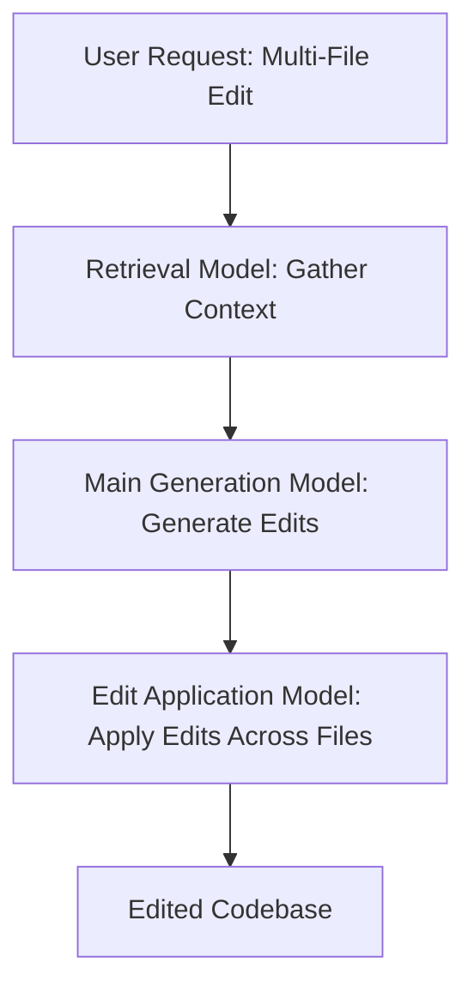

## Problem
A single large language model, even if powerful, may not be optimally suited for all sub-tasks involved in a complex operation like multi-file code editing. Tasks such as understanding broad context, generating precise code, and applying edits might benefit from specialized model capabilities.

## Solution
Employ a pipeline or orchestration of multiple AI models, each specialized for different parts of a complex task. For code editing, this could involve:

1.  A **retrieval model** to gather relevant context from the codebase.
2.  A **large, intelligent generation model** (e.g., Claude 3.5 Sonnet) to understand the user's intent and generate the primary code modifications based on the retrieved context.
3.  Potentially other **custom or smaller models** to assist in applying these generated edits accurately across multiple files or performing fine-grained adjustments.

This approach leverages the strengths of different models in a coordinated fashion to achieve a more robust and effective outcome for complex operations than a single model might achieve alone.

## Example

## References
- Aman Sanger (Cursor) discusses this at 0:01:34: "...when you kind of mix the intelligence of a model like 3.5 Sonnet with a few other kind of custom models we use for retrieval and then applying the edits made by this larger model, you now have the ability to do kind of multi-file edits."