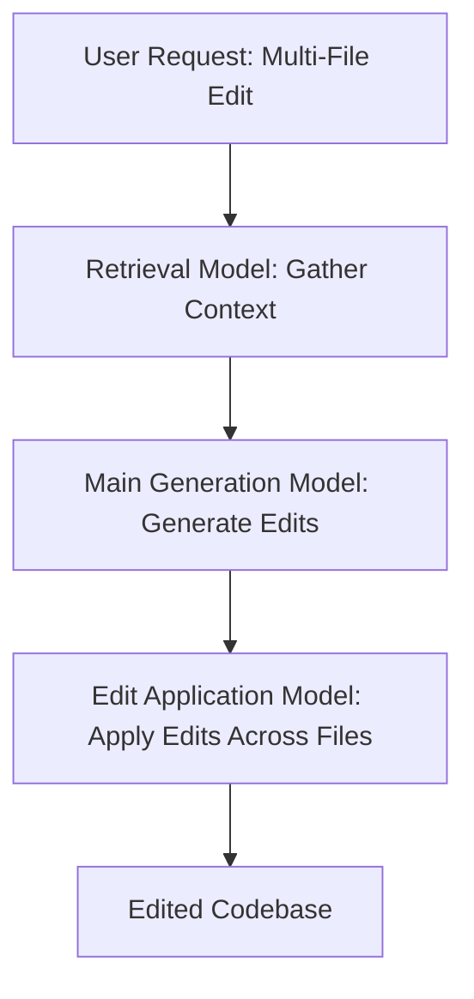

## Problem

A single large language model, even if powerful, may not be optimally suited for all sub-tasks involved in a complex operation like multi-file code editing. Tasks such as understanding broad context, generating precise code, and applying edits might benefit from specialized model capabilities.

## Solution

Employ a pipeline or orchestration of multiple AI models, each specialized for different parts of a complex task. Different models excel at different cognitive tasks—specialization beats generalization. For code editing, this could involve:

1.  A **retrieval model** to gather relevant context from the codebase.
2.  A **large, intelligent generation model** (e.g., Claude 3.5 Sonnet) to understand the user's intent and generate the primary code modifications based on the retrieved context.
3.  Potentially other **custom or smaller models** to assist in applying these generated edits accurately across multiple files or performing fine-grained adjustments.

Pass only distilled conclusions between models, not full conversation histories. This reduces token costs and maintains clean phase boundaries. This approach leverages the strengths of different models in a coordinated fashion to achieve a more robust and effective outcome for complex operations than a single model might achieve alone.

## Example

```mermaid
flowchart TD
    A[User Request: Multi-File Edit] --> B[Retrieval Model: Gather Context]
    B --> C[Main Generation Model: Generate Edits]
    C --> D[Edit Application Model: Apply Edits Across Files]
    D --> E[Edited Codebase]
```

## How to use it

- Use this when tasks need explicit control flow between planning, execution, and fallback.
- Start with one high-volume workflow before applying it across all agent lanes.
- Define ownership for each phase so failures can be routed and recovered quickly.
- Pass only distilled conclusions between model phases, not full conversation histories.

## Trade-offs

* **Pros:** Improves coordination across multi-step workflows, reduces hidden control flow, and enables cost optimization through right-sized model selection.
* **Cons:** Adds orchestration complexity and more states to debug.

## References

- Aman Sanger (Cursor) discusses this at 0:01:34: "...when you kind of mix the intelligence of a model like 3.5 Sonnet with a few other kind of custom models we use for retrieval and then applying the edits made by this larger model, you now have the ability to do kind of multi-file edits."
- [Building Companies with Claude Code](https://claude.com/blog/building-companies-with-claude-code) - Model-specific task delegation: Opus 4.1 for research and complex planning, Sonnet 4.5 for implementation execution
- Chen, L., Zaharia, M., & Zou, J. (2023). [FrugalGPT: How to Use Large Language Models More Cheaply](https://arxiv.org/abs/2305.05176) - LLM cascading achieves cost reduction through multi-model orchestration
- Lewis, P., Perez, E., Piktus, A., et al. (2020). [Retrieval-Augmented Generation for Knowledge-Intensive NLP Tasks](https://arxiv.org/abs/2005.11401) - Separating retrieval from generation improves performance
- Related pattern: [Discrete Phase Separation](discrete-phase-separation.md) - Extends multi-model orchestration to separate conversation phases
