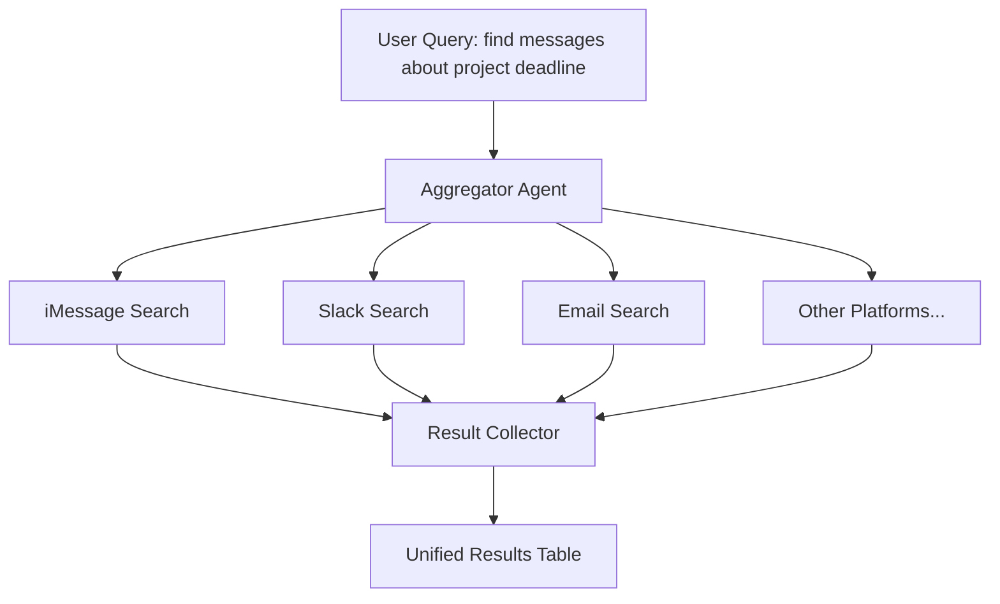

## Problem

Users communicate across multiple platforms (email, Slack, iMessage, etc.) and need to search for information that might exist in any of them. Searching each platform manually is slow and error-prone. An agent tasked with "find what X said about Y" must know which platform to check—or check all of them.

## Solution

Create a unified search interface that queries all communication platforms in parallel and aggregates results into a single, consistent format.



**Key components:**

1. **Platform Adapters**: Each platform has a CLI/API wrapper with consistent interface
2. **Parallel Dispatcher**: Spawns searches concurrently (sub-agent pattern or background jobs)
3. **Result Normalizer**: Converts platform-specific formats to unified schema
4. **Aggregator**: Combines, deduplicates, and ranks results

```bash
# Example: Unified search skill implementation
search_all() {
    query="$1"

    # Spawn parallel searches
    messages search "$query" > /tmp/messages.json &
    slack-messages search "$query" > /tmp/slack.json &
    fastmail.sh search "$query" > /tmp/fastmail.json &
    gmail.sh search "$query" > /tmp/gmail.json &

    wait  # All complete

    # Aggregate and normalize
    aggregate_results /tmp/*.json
}
```

## How to use it

**When to apply:**

- User asks "where did someone mention X"
- User needs to find a conversation but doesn't remember the platform
- Cross-platform audit or compliance searches
- Building unified inbox or communication hub features

**Implementation steps:**

1. Create CLI wrappers for each platform with consistent output format (JSON)
2. Define a common schema: `{platform, sender, timestamp, content, url}`
3. Build parallel dispatch mechanism (bash background jobs, sub-agents, or async)
4. Implement result ranking (by recency, relevance, or platform priority)
5. Present in unified table format with platform badges

**Skill definition example:**

```markdown
## Unified Communication Search

**Proactive triggers:** "search everywhere", "find across all", "where did someone say"

Searches in parallel:

- Apple Messages
- Slack
- Fastmail
- Gmail

Results presented in unified table, grouped by platform.
```

## Trade-offs

**Pros:**

- Single query searches all platforms—no context switching
- Parallel execution minimizes latency (total time ≈ slowest platform)
- Unified format makes comparison and filtering easy
- Extensible: add new platforms without changing interface
- Reduces "which platform was that on?" friction

**Cons:**

- Requires maintaining adapters for each platform
- Rate limits may apply across platforms simultaneously
- Result ranking across platforms is subjective (is a Slack message more relevant than an email?)
- Privacy/security: aggregating data across platforms increases exposure
- Some platforms have poor search APIs (result quality varies)

## References

* Sub-Agent Spawning pattern for parallel execution
* LLM Map-Reduce pattern for result aggregation
* Claude Code `/search-all` skill implementation
